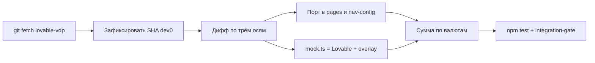

# Выравнивание UI alpha с Lovable `dev0`

## Решения (уже приняты)

- **UI / навигация:** источник истины — Lovable (`lionss888/vdp@dev0`). Наш репозиторий — домен, роли, JWT, `lib/api/*`.
- **Seed:** `mock.ts` возвращаем к байтовому совпадению с Lovable; наши правки — overlay (форма `ВЭД-2026-0120a`, почты `@demo.vdp.local`).
- **Документы:** как у Lovable — пункт в «Справочниках» для всех ролей, включая Provider.

Оба контура (`/demo/*` и JWT app) шарят [`VedAppShell.tsx`](vdp/fe/src/components/ved/VedAppShell.tsx) и [`components/ved/pages/*`](vdp/fe/src/components/ved/pages). Правка UI делается один раз.



## Сверка с `.cursor/rules`

Обязательные: `чистая-архитектура` / `детали-как-плагины` (overlay только в demo-store, не в app), `ui-web-практики` / `ux-формы-навигация-онбординг` (IA меню как у Lovable), `честность-готовности` (не объявлять паритет без матрицы), `правила-построения` / `тесты-архитектуры` / `playwright-e2e` / `typescript-clean-code`, `vdp-fe-docker-пересборка` (перед `compose-fe-refresh` — спросить).

Вне scope: `go-*`, `serverless-и-faas`, `машинное-обучение`, смена статусной машины, деплой alpha (отдельный шаг после зелёного gate).

Гейты: `cd vdp/fe && npm test`; `cd vdp && make integration-gate`; Playwright по существующим спекам обоих контуров. Коммиты — только по явной просьбе.

---

## Волна 0. Актуализация `lovable-vdp/dev0`

Remote уже есть: `lovable-vdp` → `https://github.com/lionss888/vdp.git`. Локальный ref: `d4289683` (записан в [`vdp/fe/AGENTS.md`](vdp/fe/AGENTS.md)).

1. Из корня репозитория: `git fetch lovable-vdp` (при 401 — SSH/`gh`).
2. Зафиксировать новый SHA: `git rev-parse lovable-vdp/dev0`.
3. Распаковать дерево во временный каталог (`git archive lovable-vdp/dev0`) и сравнить с [`vdp/fe`](vdp/fe). Три оси, не один общий diff:
   - **Shell / nav:** `src/components/ved/AppShell.tsx` → живые [`nav-config.ts`](vdp/fe/src/lib/ved/nav-config.ts) + [`VedAppShell.tsx`](vdp/fe/src/components/ved/VedAppShell.tsx). `AppShell.tsx` у нас — мёртвая копия, её не править как live UI.
   - **Экраны:** инлайн `src/routes/*.tsx` Lovable → [`routes/demo/*`](vdp/fe/src/routes/demo) и [`components/ved/pages/*`](vdp/fe/src/components/ved/pages). Root-роуты (`/dashboard.tsx` и т.п.) — тонкие обёртки, разметку туда не тащить.
   - **Seed:** `src/lib/ved/mock.ts` должен стать идентичен Lovable (волна 2).
4. Не трогать без re-run gate (список из AGENTS.md): `src/lib/api/*`, `src/lib/auth/*`, `platform-store.ts`, `action-bridge.ts`, `app-actions.ts`, `vitest.config.ts`, `e2e/`.

Если `dev0` не ушёл дальше `d4289683` — порт волны 1 всё равно делаем по известной дельте (Документы в справочниках + responsive, уже частично портированы). Если ушёл — сначала полный порт новой разметки, потом наши независимые фиксы.

---

## Волна 1. Порт UI и навигации

Известная дельта `d4289683` (плюс всё, что придёт с fetch):

- В [`nav-config.ts`](vdp/fe/src/lib/ved/nav-config.ts) убрать `{ segment: "/documents", ... }` из `MAIN_NAV`, поставить первым в `REFERENCE_NAV` с теми же ролями `user | manager | provider | root`.
- Перенести в page-компоненты любые новые классы/карточки/фильтры из свежего `dev0` (дашборд, реестр, карточка заявки, документы). Ориентир уже портированного при `d4289683` — блок в AGENTS.md.
- После синка обновить в AGENTS.md SHA и список «Ported from …».

Не делать: правки `src/routes/dashboard.tsx` и прочих app-обёрток ради вёрстки; копирование Lovable `AppShell` поверх `VedAppShell` (сломает JWT, `/demo` prefix, ссылку «Войти через API»).

---

## Волна 2. Seed overlay

Вернуть [`vdp/fe/src/lib/ved/mock.ts`](vdp/fe/src/lib/ved/mock.ts) к содержимому `lovable-vdp/dev0`.

Новый [`vdp/fe/src/lib/ved/demo-seed-overlay.ts`](vdp/fe/src/lib/ved/demo-seed-overlay.ts):

- ремап `manager2@bdui.local` / `provider2@bdui.local` → `@demo.vdp.local`;
- добавить форму `ВЭД-2026-0120a` (как сейчас в нашем mock).

Подключить overlay **только** в [`store.tsx`](vdp/fe/src/lib/ved/store.tsx) при сборке `initialState` (demo localStorage). [`platform-store.ts`](vdp/fe/src/lib/ved/platform-store.ts) overlay не импортирует — моки не протекают в core.

[`roles.ts`](vdp/fe/src/lib/ved/roles.ts) и контракт [`credential-contract.test.ts`](vdp/fe/src/lib/ved/credential-contract.test.ts) (`*@demo.vdp.local`) не откатывать: это уже overlay учёток, не seed сделок.

Тесты: unit на overlay (число заявок, почты); скрипт/цель `make lovable-seed-check` в [`vdp/Makefile`](vdp/Makefile) — `git show lovable-vdp/dev0:src/lib/ved/mock.ts` vs `vdp/fe/src/lib/ved/mock.ts` должен быть пустым. Без guard seed разъедется на следующем синке.

---

## Волна 3. «Сумма в работе»

В [`dashboard-page.tsx`](vdp/fe/src/components/ved/pages/dashboard-page.tsx) сейчас:

```201:205:vdp/fe/src/components/ved/pages/dashboard-page.tsx
    const sum = active.reduce((acc, f) => acc + f.amountMinor, 0);
    return { active: active.length, sum, currency: active[0]?.currency ?? "USD" };
```

Складывать minor units разных валют нельзя; курса в домене нет — конвертацию не вводить.

Показ: группировка `Map<currency, sum>`; крупно — валюта с максимальной суммой; остальные — мелким списком под карточкой. Unit на смешанный набор CNY/USD/TRY. Страница общая → чинит demo и app.

---

## Волна 4. Честная граница demo ↔ app в UI

Не паритет 100%. В app-контуре оставить явное disabled + причина (guided action), не кнопку с throw:

- удаление документа — `platform-store.ts` ~405, нет core API;
- загрузка без файла — ~393;
- неизвестные `action.id` — ~210;
- селектор роли — только demo.

Минимально: на экране документов в app скрыть/disable delete; не раздувать help-статьи. Короткий список — в том же AGENTS.md, без нового markdown в `заметки/`.

---

## Волна 5. Проверка

- `cd vdp/fe && npm test` (включая overlay, totals, credential-contract, nav-refs-open).
- `cd vdp && make integration-gate`.
- Playwright: существующие спеки; при смене меню — убедиться, что нет хрупких кликов по «Документы» в основном списке (сейчас e2e на этот пункт не завязаны).
- Перед любым `make compose-fe-refresh` — спросить. Деплой на alpha — отдельно, после вашего «да».
