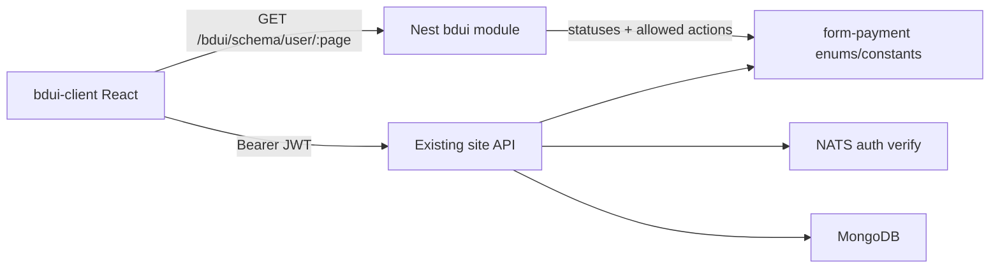

# План: BDUI-эксперимент (роль User)

## Контекст и решения (зафиксировано)

- Рабочая зона: [`fe-experiment/`](fe-experiment/) (бэк уже скопирован в [`fe-experiment/backend-for-ved/`](fe-experiment/backend-for-ved/)).
- Опора: вердикт [`заметки/вердикт-fea-stage-vf2.txt`](заметки/вердикт-fea-stage-vf2.txt) — REST-кабинеты есть, screen-schema нет; Nuxt не берём.
- **Клиент:** Vite + React + TypeScript (`fe-experiment/bdui-client/`) — лёгкий SPA-рендерер.
- **API:** реальные site endpoints + docker-compose (Mongo, Redis `:6380`, **NATS обязателен** для JWT).
- **Роль:** только `USER`. Остальные роли ВИ — вне эксперимента.
- AMG BDUI ([`amg-bdui-system`](кастомные модули для адаптации и переиспользования/AMG-Banking-Gateway/amg-bdui-system/), [`AMG-Core-Platform`](кастомные модули для адаптации и переиспользования/AMG-Core-Platform/)) — только как референс контракта (`GET …/schema/{role}/{page}`), без копирования банковских ролей/виджетов.

## Цель эксперимента

Измерить скорость и качество BDUI на одном вертикальном срезе, не полное покрытие кабинета.

**Критерии успеха (демо):**
1. Логин User → JWT → загрузка схемы экрана с бэка.
2. Список своих заявок (данные с `GET /api/1.0/form-payment`).
3. Создание заявки (упрощённая форма → `POST /api/1.0/form-payment` + `PATCH …/form` при необходимости).
4. Карточка заявки: статус + CTA «Отправить» (`PUT …/form/accept`) / «Отменить» (`PUT …/cancel`) по статусу.
5. Юнит-тесты на сборщик схем и резолвер доступных действий.

## Архитектура



- Клиент **не** знает поля форм жёстко: рендерит `screen.schema` (layout + widgets + actions).
- Действия из схемы мапятся на уже существующие REST-пути (`auth`, `form-payment`, …).
- Доменные статусы остаются источником истины; схема только отражает, что User может нажать.

## Контракт схемы (минимальный)

Новый модуль в Nest: `fe-experiment/backend-for-ved/src/modules/bdui/`

```ts
// упрощённо
type BduiScreen = {
  id: string;           // e.g. "user.forms.list"
  role: "user";
  page: string;
  title: string;
  version: number;
  widgets: BduiWidget[];
  actions?: BduiAction[]; // screen-level CTA
};

type BduiWidget =
  | { type: "login_form"; id: string; submitAction: string }
  | { type: "data_table"; id: string; dataSource: ApiRef; columns: Column[] }
  | { type: "form"; id: string; fields: Field[]; submitAction: string }
  | { type: "status_badge"; id: string; field: string }
  | { type: "action_bar"; id: string; actions: string[] }
  | { type: "text"; id: string; content: string };

type BduiAction = {
  id: string;
  label: string;
  method: "GET" | "POST" | "PUT" | "PATCH";
  path: string;          // relative to /api/1.0
  bodyFrom?: "form" | "none";
  navigateTo?: string;   // page id after success
};
```

Эндпоинт: `GET /api/1.0/bdui/schema/user/:page` (публичный только для `login`; остальные — через тот же JWT/`AuthGuard`, что site).

Страницы эксперимента:
| page | Назначение |
|------|------------|
| `login` | форма email/password → `POST /auth/login` |
| `forms.list` | таблица заявок |
| `forms.create` | упрощённое создание |
| `forms.detail` | карточка + action_bar по статусу |

Опора на существующие контроллеры:
- Auth: [`auth-site.controller.ts`](fe-experiment/backend-for-ved/src/modules/auth/web/site/auth-site.controller.ts) — `POST /auth/login`
- Заявки: [`form-payment-site.controller.ts`](fe-experiment/backend-for-ved/src/modules/form-payment/web/site/form-payment-site.controller.ts) — `GET/POST /form-payment`, `PATCH /:_id/form`, `PUT /:_id/form/accept`, `PUT /:_id/cancel`
- Профиль: `GET /account` ([`account-site.controller.ts`](fe-experiment/backend-for-ved/src/modules/account/web/site/account-site.controller.ts))
- Статусы/StageHash: [`form-payment.enums.ts`](fe-experiment/backend-for-ved/src/lib/enums/models/form-payment.enums.ts), [`form-payment.constants.ts`](fe-experiment/backend-for-ved/src/lib/constants/models/form-payment.constants.ts)

Создание заявки в MVP: минимальный набор полей из create DTO (организация + тип сделки/условия, если обязательны) — без полного wizard ВИ (hs-code, Diadoc, инвойсы). При блокерах валидации — сузить до фактически принимаемых полей API и зафиксировать в тесте/заметке эксперимента.

## Клиент (`fe-experiment/bdui-client/`)

- Vite + React + TS.
- `SchemaRenderer` + виджеты: `LoginForm`, `DataTable`, `Form`, `StatusBadge`, `ActionBar`, `Text`.
- `apiClient`: base `/api/1.0`, Bearer из `localStorage`, refresh через `POST /auth/refresh-token` (простая реализация).
- Роутинг: `/login`, `/forms`, `/forms/new`, `/forms/:id` — каждый экран грузит схему по `page`.
- Proxy в Vite на `http://localhost:30000`.
- UI: простой, без дизайн-системы — цель эксперимента = контракт и скорость, не визуальный polish.

## Инфра эксперимента

В [`docker-compose.yml`](fe-experiment/backend-for-ved/docker-compose.yml): Mongo `27017`, Redis `6380`, NATS `4222`, Gotenberg `3333`.

Шаги подъёма (документировать коротко в `fe-experiment/README.md` — одна страница «как запустить эксперимент»):
1. `docker compose up -d` в `backend-for-ved`
2. `.env` из `.env.example` + `REDIS_URL`/`REDIS_QUEUE_PORT=6380`
3. `npm i && npm run dev` (порт **30000**)
4. тестовый User (`create-test-user.js` или регистрация)
5. `bdui-client`: `npm i && npm run dev`

## Вне скоупа

- Роли Internal/External CO, Manager, Provider; TREASURER/ONE_C/ROOT.
- Полный wizard заявки ВИ, Diadoc, hs-code, шаблоны документов.
- Копирование AMG Vue/Go BDUI as-is.
- Прод-готовый дизайн, E2E Playwright (допустим 1 smoke позже — не в MVP-срезе).
- Изменения в исходном [`кастомные модули…/backend-for-ved`](кастомные модули для адаптации и переиспользования/backend-for-ved) — только копия в `fe-experiment/`.

## Порядок работ

1. Контракт типов + Nest `bdui` module (schema endpoint + builders для 4 page).
2. Резолвер User-actions по `FormPaymentStatus` (accept / cancel / none).
3. Юнит-тесты builders/resolver.
4. Scaffold `bdui-client` + renderer + 6 виджетов.
5. Связка login → list → create → detail на живом API.
6. `fe-experiment/README.md` с критериями успеха и командами запуска.
7. Короткая фиксация метрик эксперимента (время до первого экрана / до E2E среза) — в README или `fe-experiment/NOTES.md`.
