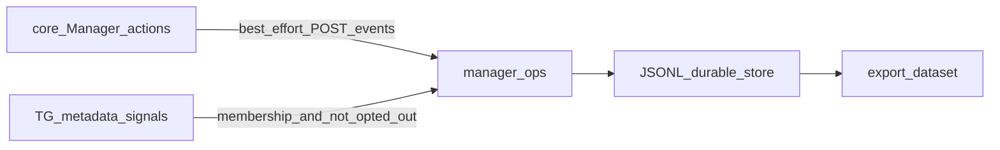

# План: поведение + TG → dataset (1A / 2B)

## Зафиксированные решения

- **1A:** первая поставка = pipeline данных (ingest → store → export). Offline train/eval и prod ML — вне scope.
- **2B:** членство в **активном/одобренном work chat** = согласие на TG-сигналы; **opt-out** через `PUT /v1/consent/{accountID}` (`enabled:false`). События из **core** пишутся всегда (кабинет — источник истины по работе).
- Документный OCR/gold ([`vdp/extraction`](vdp/extraction)) **не трогаем**. Intake-бот / `notify-mgmt` — вне scope.
- Мотивация/score/nudge live и release-выкат manager-ops как «прод» — **не** в этой программе (каркас score оставляем как есть).

## Сверка с `.cursor/rules` (MUST)

**Обязательны:**
- [`планирование-сверка-с-rules`](.cursor/rules/планирование-сверка-с-rules.mdc), [`базовые-правила-инструмента`](.cursor/rules/базовые-правила-инструмента.mdc)
- [`границы-и-контексты`](.cursor/rules/границы-и-контексты.mdc), [`чистая-архитектура`](.cursor/rules/чистая-архитектура.mdc), [`детали-как-плагины`](.cursor/rules/детали-как-плагины.mdc), [`screaming-architecture`](.cursor/rules/screaming-architecture.mdc) — отдельный сервис `manager-ops`, без shared DB с core
- [`интеграция-и-события`](.cursor/rules/интеграция-и-события.mdc) — HTTP/события; UI/бот не пишут статус заявки
- [`безопасность-ролей-и-данных`](.cursor/rules/безопасность-ролей-и-данных.mdc) — без ПДн клиента в payload; S2S на ingest
- [`машинное-обучение`](.cursor/rules/машинное-обучение.mdc) — dataset side-path; никогда auto-pay / смена статуса из score
- [`устойчивость-и-наблюдаемость`](.cursor/rules/устойчивость-и-наблюдаемость.mdc) — сбой manager-ops не ломает Transition; timeout + лог + id заявки
- [`правила-построения`](.cursor/rules/правила-построения.mdc), [`тесты-архитектуры`](.cursor/rules/тесты-архитектуры.mdc), [`go-testing`](.cursor/rules/go-testing.mdc)
- [`честность-готовности`](.cursor/rules/честность-готовности.mdc) — DoD = export + unit; не «ML готов» / не «прод 100%»

**Вне scope:** extraction train, LoRA, intake analyze, CI/deploy TG notify, live nudge product, Postgres (в пользу JSONL как у gold), fe Docker refresh, AuthZ матрицы заявки.

**Gate/DoD:** unit на consent 2B, idempotent ingest, core emit не fail Transition; `make manager-ops-export` даёт JSONL без forbidden PII keys; `go test` green для `manager-ops` + shared/managerops + core publisher test.

---

## Волна 1 — Durable store + consent 2B

Файлы: [`vdp/manager-ops/internal/store`](vdp/manager-ops/internal/store), [`behavior/service.go`](vdp/manager-ops/internal/behavior/service.go), [`roster/service.go`](vdp/manager-ops/internal/roster/service.go).

- Реализовать store на **JSONL/файлах** под `MANAGER_OPS_DATA_DIR` (паттерн [`extraction/internal/gold`](vdp/extraction/internal/gold)): `events.jsonl`, `roster.json` (people/chats/memberships), `consent.json`. Memory store оставить для unit.
- Compose volume на data dir у сервиса `manager-ops` (profile `manager-ops`).
- **Consent 2B:** для `source=telegram` принимать событие, если есть активное membership (chat active / allowlisted) **и** нет opt-out (`consent.Enabled == false`). Нет записи consent + есть membership → **разрешено**. `source=core` — без membership gate.
- Unit: TG accepted with membership; skipped_opt_out; skipped_no_membership; core always accepted.

---

## Волна 2 — S2S ingest + эмит из core

Файлы: [`vdp/manager-ops/internal/transport/http`](vdp/manager-ops/internal/transport/http), [`vdp/core`](vdp/core), контракт [`vdp/shared/managerops/events.go`](vdp/shared/managerops/events.go).

- Защитить `POST /v1/events` (и export-internal при необходимости) заголовком `X-VDP-S2S` / shared secret (как hub/core).
- В core: тонкий `ManagerOpsPublisher` (env `MANAGER_OPS_URL`, timeout). Вызов **best-effort** после успешного Transition для ролей Manager/Root на действиях, маппящихся в kinds:
  - approve / reject / assign* → `approve` | `reject` | `assign`
  - первое действие Manager по заявке в периоде (или явный first touch) → `first_touch` где однозначно из action
- Payload: `account_id`, `form_payment_id`, `kind`, `source=core`, `occurred_at`, `idempotency_key` = `formID|action|historyID` (или аналог). **Без** ПДн.
- Ошибка/таймаут manager-ops → log warn, Transition **не** откатывать.
- Unit: httptest publisher; Transition succeeds when publisher 500.

---

## Волна 3 — TG metadata ingest

Файлы: [`vdp/manager-ops/internal/adapters/telegram`](vdp/manager-ops/internal/adapters/telegram), HTTP webhook.

- `POST /v1/telegram/webhook` (или `/telegram/webhook`): из update брать только метаданные (chat_id, from.id, message_id, reply-to-bot / callback ack) → `nudge_ack` | `chat_reply`. **Не** сохранять сырой текст сообщения в store.
- Перед ingest: resolve membership + opt-out (волна 1).
- Live `ListMembers` minimally: `getChatAdministrators` при наличии token (достаточно для MVP roster sync); полный member crawl — не обязателен.
- Unit: fixture update → event; text not persisted; opt-out skip.

---

## Волна 4 — Export dataset

- CLI [`vdp/manager-ops/cmd/export-behavior`](vdp/manager-ops/cmd/export-behavior) (зеркало `extraction/cmd/export-gold`): читает events JSONL → каталог export (фильтр по since, без PII keys).
- Makefile: `manager-ops-export`.
- Короткая заметка в существующем ops/architecture doc **только если** уже есть страница manager-ops; иначе комментарий в `.env.example` — без новой простыни docs (правило «документация по запросу»).

---

## Волна 5 — Самопроверка DoD

- `cd vdp/manager-ops && go test ./...`
- shared `managerops` tests
- core publisher unit
- Ручной compose profile: sync fixture membership → core-like POST event → export строка в JSONL
- В отчёте: «pipeline данных готов»; **не** утверждать ML/прод-мотивацию

## Анти-паттерны

- Писать score/nudge в form-payment status
- Класть текст чата / passport / phone в events
- Shared Postgres с core
- Смешивать rows с extraction gold
- Ломать Transition из-за manager-ops down
