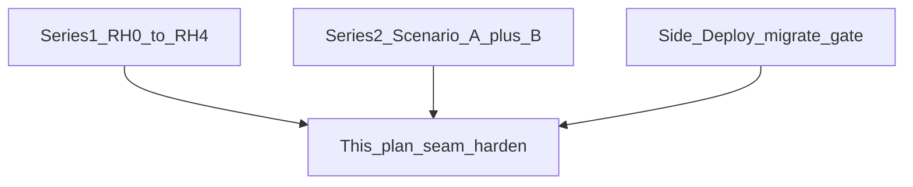
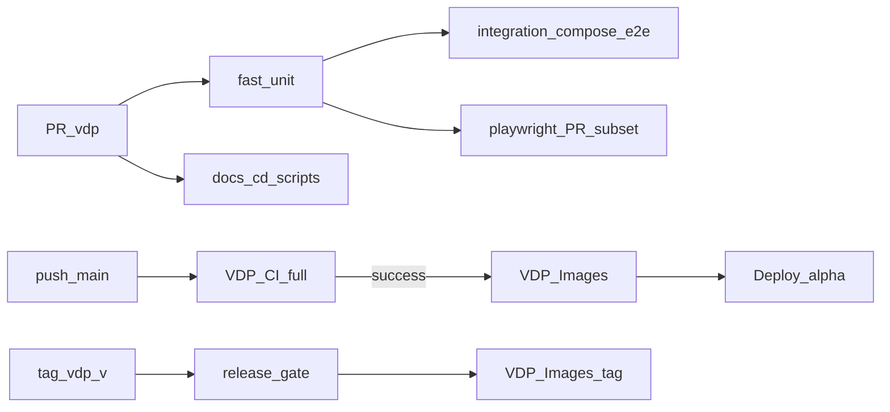

# CI seam harden: инструкция = зелёный деплой (не «фундамент с нуля»)

## Место среди двух уже сделанных серий

Слово «фундамент» в первой версии плана было неточным. Контур стабильности уже строился **двумя сериями**; этот план — **третья волна: закрытие швов**, которые всплыли после pilot process-roles (ICO/ECO off) и CD.

### Серия 1 — RH0–RH4 (Reliability Hardening)

Индекс: [vdp_reliability_master.plan.md](vdp_reliability_master.plan.md) (todos completed).

| RH | Что заложили |
|----|----------------|
| RH0 | Topology CI: fast / integration / playwright / docs |
| RH1 | Postgres integration tests |
| RH2 | Расширение E2E + матрица |
| RH3 | Adapter tests в CI |
| RH4 | `make release-gate` + pre-handover |

**Итог серии 1:** «gate'ы существуют и гоняются». Не обещала: Images ждёт CI; integration на каждом PR; E2E устойчив к смене process-policy.

### Серия 2 — Scenario verify dual track (A + B)

План: [scenario_verify_dual_track_4ed9fc47.plan.md](scenario_verify_dual_track_4ed9fc47.plan.md) (todos completed). Явно «два связанных плана»:

- **A:** каталог сценариев ↔ Playwright ↔ CI split (узкий PR / полный nightly)
- **B:** Root `/testing` + API ScenarioRunner (без браузера в кабинете)

**Итог серии 2:** один каталог ID и два потребителя (CI и Root). Не закрывала: дрейф compose-e2e/Playwright от pilot continuity; связку Images←CI.

### Рядом (не «третья серия», а CD-шов)

[deploy_db_migrate_gate_ffa659a8.plan.md](deploy_db_migrate_gate_ffa659a8.plan.md) — migrate на каждом promote. Этот план **дожимает** тот же шов для host `db-migrate` vs compose glob и для CI service Postgres.

### Что делает *этот* план

Не пересобирает RH и не дублирует Scenario A/B. Чинит **разрыв между уже построенными слоями**:

| Шов | Симптом | Волна плана |
|-----|---------|-------------|
| process-policy ↔ E2E | ECO 403 / старые title при ICO/ECO off | A (+ уже сделанный hotfix) |
| PR gate ↔ compose-e2e | integration только по label | B |
| Images ↔ VDP CI | digest/alpha при красном CI | B |
| migrate paths | список в Makefile vs glob compose | A |
| UI copy ↔ status code | хрупкие русские title | C |
| catalog ↔ specs/docs | drift docs/`PLAYWRIGHT_ARGS` | D+E |

## Сопоставление с `.cursor/rules`

**Обязательны:** `планирование-сверка-с-rules`, `базовые-правила-инструмента`, `правила-построения`, `честность-готовности`, `тесты-архитектуры`, `развертывание-и-доставка`, `devops-культура`, `интеграция-и-события`, `use-cases`, `чистая-архитектура`, `детали-как-плагины`, `безопасность-ролей-и-данных`, `устойчивость-и-наблюдаемость`, `playwright-e2e`, `go-testing`, `typescript-clean-code`, `ui-web-практики` (guided next step / статусы как проекция).

**Вне scope:** ML, serverless, Nest rename parity, k8s, полный combinatorial browser matrix, смена доменной SM, ручной ops bootstrap VM, `vdp-fe-docker-пересборка` (не трогаем fe deps без вопроса).

**Gate/DoD:** unit на continuity/migrate contract; `make test-cd-scripts` расширен; PR зелёный только при `fast`+`docs`+`integration`+`playwright`; Images на `main` не пушат digest при красном VDP CI; не утверждать «паритет 100%» / «всегда green forever» — цель: красный артефакт не доезжает до alpha.

## Решение по scope (зафиксировано)

- **Делаем:** единый migrate; continuity-дисциплина; integration обязателен на PR; связка Images←CI на main; `data-status` на badge; сверка catalog IDs; CI rate-limit profile; sync `ci.md` + `test-cd-scripts`.
- **Не делаем в этой волне:** полный `make release-gate` на каждый PR (остаётся на `vdp-v*` в [vdp-images.yml](.github/workflows/vdp-images.yml)); переписывание всего Playwright на scenario-runs API.

## Проблема сейчас

1. Pilot process-roles (017 / `DefaultProcessPolicySnapshot`) ≠ часть E2E до недавнего фикса; риск регресса без lint.
2. [vdp-ci.yml](.github/workflows/vdp-ci.yml): `integration` на PR только с label `integration` → PR green при будущем красном compose-e2e.
3. [vdp-images.yml](.github/workflows/vdp-images.yml) на push `main` **не ждёт** VDP CI; [vdp-deploy.yml](.github/workflows/vdp-deploy.yml) слушает только Images → возможен деплой digest при красном CI.
4. Два пути миграций (исторически); Makefile уже дополнен 016/017 — нужна **одна** реализация.
5. UI title статусов зависит от process-roles; ассёрты по русской строке хрупки.
6. [ci.md](vdp/docs/operations/ci.md) устарел относительно реального `PLAYWRIGHT_ARGS`.

## Волна A — единый канон миграций и continuity

1. **Migrate:** `make db-migrate` делегирует в скрипт, который применяет все `core/migrations/*.sql` + hub (тот же порядок, что [compose-db-migrate.sh](vdp/scripts/compose-db-migrate.sh)), либо host-psql обёртка с тем же glob. Убрать ручной список файлов как второй источник истины.
2. **Contract test:** в `test-cd-scripts` или Go/r0: каждый `NNN_*.sql` из `core/migrations` достижим из CI path (`db-migrate` / compose migrate).
3. **Continuity helper:** вынести bash-функции `advance_compliance` / `reject_to_corrections` из [compose-e2e.sh](vdp/scripts/compose-e2e.sh) в `vdp/scripts/lib/e2e-continuity.sh`; compose-e2e только source’ит.
4. **Lint gate (docs job или test-cd-scripts):** fail, если в `compose-e2e.sh` / e2e есть `auth_put "$ECO_T"` / жёсткий `/eco/form-payment` **без** `try_` / fallback (whitelist: helper lib + scenarioverify Go).

## Волна B — CI gate = путь на сервер

1. **[vdp-ci.yml](.github/workflows/vdp-ci.yml):** `integration` на **каждый** PR (убрать условие label); label `integration` больше не нужен для gate.
2. **Playwright PR:** оставить узкий набор (login/user-submit/provider-acl/reject-path) — пирамида; full suite на main/schedule как сейчас.
3. **CI env:** в integration + playwright jobs задать `GATEWAY_RATE_LIMIT` ≥ 600 (или `ENVIRONMENT=ci` в core config), чтобы длинный suite не ловил 429/502.
4. **Images ← CI (критично для критерия):** на `push` в `main` job `build-push` в Images ждёт успешный VDP CI для того же SHA (workflow_run или `gh run list` + explicit check). На `workflow_dispatch`/tag — без блокировки CI (tag уже имеет release-gate).
5. **Branch protection (ops чеклист в ci.md):** required checks: `fast (unit)`, `docs format`, `integration (postgres + compose-e2e)`, `playwright (browser E2E)`.

## Волна C — стабильный UI-контракт статусов

1. В [StatusBadge.tsx](vdp/fe/src/components/ved/StatusBadge.tsx): `data-testid="status-badge"` + `data-status={status}` (канонический код домена).
2. Playwright: критичные ассёрты (`happy-path`, `reject-path`, `completed-journey`, `manager-payment`) перевести на `getByTestId('status-badge')` + `data-status`, title/regex — вторично.
3. Unit: уже есть continuity labels; добавить короткий тест, что badge получает `data-status`.

## Волна D — каталог сценариев без big-bang

1. Расширить [scenario-catalog.test.ts](vdp/fe/src/lib/ved/scenario-catalog.test.ts) / `test-cd-scripts`: каждый ID из FE `SCENARIO_IDS` / UI_SCENARIO_SPECS существует в Go `scenarioverify` catalog; каждый Playwright spec из матрицы упомянут.
2. Не переписывать suite на admin scenario-runs в этой волне.

## Волна E — документация = код

1. Обновить [ci.md](vdp/docs/operations/ci.md): реальные jobs, PR vs main Playwright args, Images ждёт CI на main, required checks.
2. Assert в `test-cd-scripts.sh`: grep `PLAYWRIGHT_ARGS` / `integration` if-условия в workflow соответствуют задокументированному контракту (минимум: integration без label-only на PR).

## Порядок исполнения (рекомендуемые PR)

| PR | Содержание |
|----|------------|
| 1 | Wave A migrate + continuity lib + lint |
| 2 | Wave B CI/Images wiring + rate limit |
| 3 | Wave C data-status + Playwright assert update |
| 4 | Wave D catalog sync + Wave E docs/test-cd-scripts |

Локальная проверка перед merge каждого PR: `make test-cd-scripts`; для 1–2 ещё `./scripts/compose-e2e.sh`; для 3 — `PLAYWRIGHT_ARGS=... make playwright-e2e`.

## Честность готовности

После волны: merge в main при зелёном PR + Images на main только после green CI ≈ **деплой alpha не уезжает с красной регрессией**. Это не замена prod vendor UAT и не «CI никогда не падает». Full `release-gate` по-прежнему на теге `vdp-v*` перед gamma.