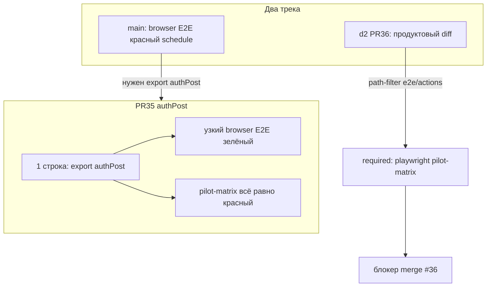

# Образ ситуации: CI / PR / green gate

## Что происходит (коротко)

Работы остановлены правильно: сейчас нет «ещё одного мелкого фикса ради галочки». Красный крест у [#36](https://github.com/lionss888/viletech-platform/pull/36) и [#35](https://github.com/lionss888/viletech-platform/pull/35) — **разные истории**, склеенные в одном ощущении «всё красное».

## Три класса сигналов (не путать)

| Класс | Пример | Смысл | Действие |
|---|---|---|---|
| A. Cancelled | VDP CI [#105](https://github.com/lionss888/viletech-platform/actions/runs/35084246956) | concurrency `vdp-ci-${{ github.ref }}` + `cancel-in-progress: true` в [vdp-ci.yml](.github/workflows/vdp-ci.yml) | Не чинить тесты. Не пушить поверх длинного run. Re-run один раз и ждать. |
| B. Hotfix main | PR [#35](https://github.com/lionss888/viletech-platform/pull/35) **7/9** | Playwright грузит все e2e; на main `authPost` был без `export`, а [pilot-matrix-export.spec.ts](vdp/fe/e2e/pilot-matrix-export.spec.ts) его импортирует → падает **узкий** browser job | На `d2` export уже есть. #35 разблокирует **main**, не #36. |
| C. Настоящий блокер | VDP CI [#104](https://github.com/lionss888/viletech-platform/actions/runs/35081431624) **failure** | Узкий E2E/unit/docs/integration **зелёные**; красный только **`playwright (pilot-matrix)`** | Чинить лестницу / seed / модалку по аннотациям, не timeouts. |

Кнопка Merge у #36 «зелёная» = нет конфликтов. **Это не green gate.**

## Что красное в #104 по факту (аннотации)

Пять упавших сценариев `@pilot-matrix` (не «одна кнопка»):

1. **export** — нет кнопки `/Сформировать (доп\. )?поручение/` при ожидании на `form_accepted` ([pilot-matrix-export.spec.ts](vdp/fe/e2e/pilot-matrix-export.spec.ts)). CTA в матрице есть ([actions.ts](vdp/fe/src/lib/ved/actions.ts) `mgr_advance_signing`), но показ режется направлением/условием в [ActionPanel.tsx](vdp/fe/src/components/ved/ActionPanel.tsx) + [manager-payment.ts](vdp/fe/src/lib/ved/manager-payment.ts).
2. **full-ladder / postpay** — `confirmModal`: кнопка `Подтвердить` **остаётся visible** 30s (действие API/UI не закрыло модалку — ошибка или зависание, не «медленный UI»).
3. **full-ladder** (другой retry) — timeout 420s на `Выйти` ([auth.fixture.ts](vdp/fe/e2e/fixtures/auth.fixture.ts)) — **следствие** застрявшего шага, не корневая причина.
4. **refund** — `seed.email` undefined при `loginAs` ([auth.fixture.ts](vdp/fe/e2e/fixtures/auth.fixture.ts)): роль не найдена в [app-seed-accounts.ts](vdp/fe/src/lib/ved/app-seed-accounts.ts) (новые refund-specs на `d2` раздули `@pilot-matrix` до 5 файлов / ~9 тестов).

Узкий PR smoke гоняет 4 коротких файла и **не** `@pilot-matrix` — поэтому локально/на PR можно видеть «E2E зелёный» и одновременно required check красный.

## Почему «сделал всё что можно» не даёт green

- Hotfix `authPost` и правки smoke **не покрывают** required job pilot-matrix.
- Copilot-советы (`networkidle`, fallback logout, +timeout) маскируют класс C, не чинят статус/CTA/модалку/seed.
- Push во время прогона даёт класс A → в UI PR «3/9 cancelled», ощущение хаоса без новой информации.
- На `d2` в matrix попали **export / refund / shipment** поверх старых full-ladder + postpay → поверхность шире, чем «починить одну ветку».

## Образ «где мы»

- **Продукт на `d2`**: большой diff (#36, ~59 файлов). Unit/docs/узкий E2E в успешных прогонах живы.
- **Качество доставки**: required gate = `ci-pr` **плюс** `playwright (pilot-matrix)` при path-filter ([честность-готовности](.cursor/rules/честность-готовности.mdc), [vdp-ci-local-gate](.cursor/rules/vdp-ci-local-gate.mdc)).
- **main**: schedule [#103](https://github.com/lionss888/viletech-platform/actions/runs/35072446696) красный на browser E2E, пока не влит export `authPost` (#35 или merge `d2`).
- **Остановка работ**: корректная пауза перед «ещё одним наугад коммитом».

## Что делать (рекомендуемый порядок)

Зафиксированный приоритет: **сначала класс C на `d2` (#36) до зелёного `make ci-pr-pilot`**, параллельно не трогать #35 без нужды (на `d2` `authPost` уже экспортирован).

1. **Стабилизировать сигнал**  
   Не пушить в `d2`, пока идёт VDP CI. Один Re-run failed jobs или один целевой push после фикса. Иначе снова cancelled (#105).

2. **Разбор по аннотациям #104 (не гипотезы)**  
   - Export: на карточке `form_accepted` + `direction=export` — какая кнопка реально в DOM / что скрывает ActionPanel.  
   - Full-ladder / postpay: текст ошибки в модалке при застрявшем `Подтвердить` (Network/API).  
   - Refund: какая роль в `loginAs(...)` отсутствует в seed (или typo роли).

3. **Чинить причину в продукте или в spec**  
   - Расхождение матрицы ↔ gate направления → правка UI/моста или ожидания spec.  
   - Модалка не закрывается → чинить action/bridge/ошибку API, не logout.  
   - Seed → добавить/выровнять роль или убрать невалидный `loginAs`.

4. **Локальный gate до «готово»**  
   `make check-env-parity` → затронутые unit → **`make ci-pr-pilot`** (не только `ci-pr`). Merge #36 только после зелёного того же набора, что GitHub.

5. **main / #35**  
   После зелёного #36 — закрыть #35 как поглощённый, либо отдельно влить #35 только если нужен срочный unblock schedule на main до merge `d2`.

## Слои (эта аналитика → следующая волна фикса)

| Слой | В этой аналитике | В следующей волне фикса |
|---|---|---|
| UI / ActionPanel | диагностика CTA | правка hide/show по direction/condition |
| FE bridge / statuses | контекст | при ошибке модалки |
| Домен | вне scope, пока API не врёт | только если transition отвергает |
| Unit | вне scope | manager-payment / ActionPanel filter |
| E2E `@pilot-matrix` | инвентарь + аннотации | sync spec или seed |
| Compose repro | — | localhost compose + один упавший grep |
| Docs/notify | вне scope | — |

## QG / DoD следующей волны (когда пойдём чинить)

- `make check-env-parity`
- unit на затронутый filter/bridge
- **`make ci-pr-pilot`** зелёный
- без утверждения merge-ready по одному `ci-pr` / cancelled run
- `release-gate` не гонять

## Сверка с `.cursor/rules`

**Обязательны:** `планирование-сверка-с-rules`, `честность-готовности`, `vdp-ci-local-gate`, `тесты-архитектуры`, `playwright-e2e`, `use-cases` (матрица роли/статуса), `ui-web-практики` (CTA = доменная матрица).

**Вне scope сейчас:** ML, serverless, `vdp-fe-docker-пересборка` без спроса, `mgmt-tg-notify` как закрытие волны, полный `release-gate`, советы «увеличить timeout / goto /login».

## Анти-паттерны (явно не делать)

- Мержить #36 при 3/9 cancelled или красном pilot-matrix.
- Лечить logout / networkidle вместо статуса и модалки.
- Считать зелёный узкий Playwright паритетом GitHub PR.
- Параллельно пушить #35 и #36 без понимания, какой job чиним.

## Следующий шаг после approve этого плана

Исполнение = волна фикса класса C по логу #104 (Agent mode), DoD = зелёный `ci-pr-pilot`, затем чистый push на #36 без cancel.

> **Status-sync 2026-09-24:** cancelled as obsolete/superseded — see todo notes / overview. Do not execute this plan as a product wave.
