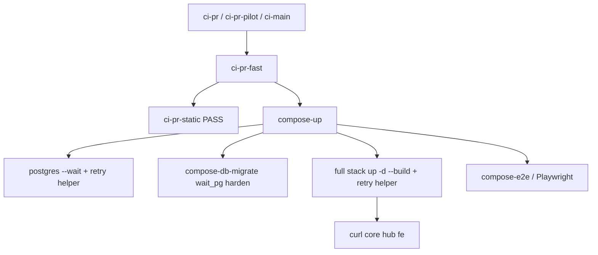

# Harden compose-up для стабильного pre-push / Local QG

## Контекст

Локальный gate (`ci-pr-fast` → `compose-e2e` → `compose-up`) и pre-push падают по гонкам Docker Compose Desktop:

1. `postgres-hub` / `postgres-core` `exited (0)` во время `--wait` (recreate).
2. `Error response from daemon: No such container: …` на полном `docker compose up -d --build` (после migrate).
3. **Наблюдено 2026-09-23 Local QG `ci-pr-pilot`:** static PASS → `compose-db-migrate` → `FAIL: postgres postgres-core not stable after init (need 5 consecutive ready probes)` — post-initdb / recreate / нагрузка диска сбрасывает consecutive ready до таймаута; браузер не стартовал.

Частичный фикс в working tree: retry только на postgres `--wait` в Makefile / `vdp-compose-up.sh`. Полный стек и `wait_pg` ещё не закрыты.

## Сверка с `.cursor/rules`

**Обязательны:**
- `планирование-сверка-с-rules` / `базовые-правила-инструмента` — слои + имя QG в DoD
- `vdp-ci-local-gate` — `check-env-parity` первым; Shell для make с `all`; после e2e вне smoke — `ci-main`; **дополнить** секцией compose flake
- `честность-готовности` — не «CI ok / merge-ready» без зелёного заявленного gate; не `SKIP_PREPUSH_GATE` как «готово»
- `правила-построения` — тесты к изменённому контракту (`test-cd-scripts`)
- `устойчивость-и-наблюдаемость` — ограниченные ретраи на ожидаемые сбои оркестрации
- `развертывание-и-доставка` / `devops-культура` — воспроизводимый локальный gate = сигнал до remote

**Вне scope:**
- UI кабинетов / product Playwright specs / домен / AuthZ / ML / OCR product logic
- `mgmt-tg-notify` (не закрытие продуктовой волны)
- Docling OOM / UAT W6/W7 product WIP — не смешивать в compose-commit

## Слои

| Слой | Scope |
|---|---|
| UI / FE / домен / API | вне scope |
| Compose | [vdp/Makefile](vdp/Makefile), [vdp/scripts/vdp-compose-up.sh](vdp/scripts/vdp-compose-up.sh), [vdp/scripts/compose-up-with-retry.sh](vdp/scripts/compose-up-with-retry.sh), [vdp/scripts/compose-db-migrate.sh](vdp/scripts/compose-db-migrate.sh) |
| Contract | [vdp/scripts/test-cd-scripts.sh](vdp/scripts/test-cd-scripts.sh) |
| E2E journey | вне scope правок; gate учитывает уже лежащий e2e в ветке |
| Docs | [vdp/docs/development/makefile-reference.md](vdp/docs/development/makefile-reference.md) |
| Rules | [.cursor/rules/vdp-ci-local-gate.mdc](.cursor/rules/vdp-ci-local-gate.mdc) — compose flake prevention |

## Решение

1. **Helper** `scripts/compose-up-with-retry.sh`: до 3 попыток переданной команды; sleep 3; финальный non-zero.
2. **Makefile** `compose-up` / `compose-up-prod`: postgres `--wait` и полный `up -d --build` через helper; порядок postgres → migrate → stack.
3. **vdp-compose-up.sh**: postgres `--wait` и stack `up -d --no-build` через helper.
4. **compose-db-migrate.sh**: `WAIT_PG_MAX` по умолчанию 180; при долгом not-ready — `dc up -d $svc` nudge; короткий settle перед первым probe; сохранить retry apply на shutting down / starting up.
5. **test-cd-scripts**: bash -n helper; assert Makefile + vdp-compose-up вызывают helper для wait и stack; порядок postgres → migrate → stack (паттерн совместим с helper); assert wait_pg nudge / длинный max.
6. **Rules**: в `vdp-ci-local-gate` — красный `postgres not stable` / `No such container` / `--wait` race → чинить compose retry/wait_pg, не продукт; не SKIP_PREPUSH_GATE.
7. Не ослаблять health curl timeout.

## DoD / QG

- [ ] `make check-env-parity`
- [ ] `make test-cd-scripts`
- [ ] `make docs-format-check` после makefile-reference
- [ ] `make compose-up` — core/hub/fe healthy
- [ ] `make ci-main` (e2e вне smoke в ветке) или явно оговорить пробел
- [ ] Pre-push без `SKIP_PREPUSH_GATE` (push по запросу)
- [ ] Rule `vdp-ci-local-gate` обновлён секцией compose flake
