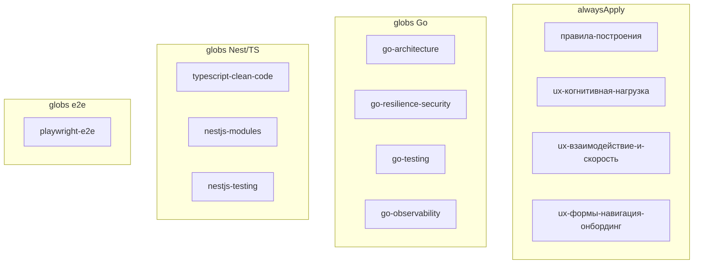

# План: Cursor rules из проработки

## Принципы

- **Не урезать длинные источники** — делить на несколько `.mdc` по одной теме каждое (цель: обычно &lt;50–80 строк на файл, полный смысл сохраняется).
- **Стек платформы** (из [заметки/анализ-вводных-и-репозиториев.txt](заметки/анализ-вводных-и-репозиториев.txt) и смежных анализов): NestJS, Go-микросервисы, Nuxt/Next UI, E2E.
- **Уже есть** (не трогать без нужды): [`.cursor/rules/базовые-правила-инструмента.mdc`](.cursor/rules/базовые-правила-инструмента.mdc), [`.cursor/rules/лучшие-практики.mdc`](.cursor/rules/лучшие-практики.mdc).
- **Согласование с базовыми правилами**: в Go/Nest правилах формулировки «пиши ARCHITECTURE.md / README на каждый сервис» заменить на «документация — только по явному запросу пользователя» (смысл практик оставить, конфликт с «не плодить доки» убрать).
- **NestJS**: один набор из двух почти идентичных файлов ([nestjs-clean…](заметки/проработка-правил/правила/nestjs-clean-typescript-cursor-rules.md) + [clean-nestjs…](заметки/проработка-правил/правила/clean-nestjs-typescript-cursor-rules.md)); взять TypeScript+Nest структуру и блок `@app/common` из второго. **ORM не фиксировать на MikroORM** — «persistence через выбранный в проекте ORM (entities + service на сущность)». Убрать `admin/test` smoke-эндпоинт (риск для финтеха).

## Что создаём

### 1. Always-apply: процесс

| Файл | Источник | Содержание |
|------|----------|------------|
| `правила-построения.mdc` | [Правила построения](заметки/проработка-правил/Правила построения) | Самопроверка после реализации; не плодить доки; тесты к сервисам/модулям/функциям |

### 2. Always-apply: UX (полный Laws of UX → 3 правила)

Источник: [laws-of-ux.md](заметки/проработка-правил/правила/laws-of-ux.md) — **весь** набор законов, без выкидывания; плюс блок «Как применять».

| Файл | Законы / блоки |
|------|----------------|
| `ux-когнитивная-нагрузка.mdc` | Choice Overload, Chunking, Cognitive Bias/Load, Hick, Miller, Working Memory, Selective Attention, Occam, Pareto, Parkinson, Tesler |
| `ux-взаимодействие-и-скорость.mdc` | Aesthetic-Usability, Doherty, Fitts, Flow, Goal-Gradient, Peak-End, Von Restorff, Zeigarnik, Serial Position |
| `ux-формы-навигация-онбординг.mdc` | Jakob, Mental Model, Postel, Paradox of Active User, Gestalt (Proximity, Common Region, Similarity, Prägnanz, Uniform Connectedness) + секция «Как применять в разработке» |

`alwaysApply: true` — кабинеты ролей и wizard заявки затрагивают UI почти в каждой задаче.

### 3. Go (globs: `**/*.go`)

Источник: [go-microservices.md](заметки/проработка-правил/правила/go-microservices.md) — полный текст по частям.

| Файл | Секции источника |
|------|------------------|
| `go-architecture.mdc` | Responsibilities, Architecture Patterns, Project Structure, Development Best Practices, Key Conventions, Tooling |
| `go-resilience-security.mdc` | Security and Resilience, Concurrency and Goroutines, Performance |
| `go-testing.mdc` | Testing (+ согласование с правилами построения) |
| `go-observability.mdc` | OpenTelemetry, Tracing and Monitoring |

**Не включать** [go-api-standard-library-1-22.md](заметки/проработка-правил/правила/go-api-standard-library-1-22.md): дублирует REST-идеи, пин Go 1.22 устарел, стек — микросервисы шире stdlib. При появлении чистого stdlib-сервиса — отдельным шагом.

### 4. NestJS / TypeScript (globs по зоне)

| Файл | globs | Источник |
|------|-------|----------|
| `typescript-clean-code.mdc` | `**/*.{ts,tsx}` | TypeScript General Guidelines (оба Nest-файла) |
| `nestjs-modules.mdc` | `**/*.ts` в Nest-контексте: `**/src/**/*.ts` или узже `**/*.{module,controller,service,dto,entity,guard,interceptor,filter}.ts` — зафиксировать `**/*.{module,controller,service}.ts` + общий `**/apps/**/*.ts` / `**/src/**/*.ts` как `**/src/**/*.ts` если монорепо ещё нет | Nest-specific: modules, DTO/class-validator, common/core, ORM-агностично |
| `nestjs-testing.mdc` | `**/*.{spec,e2e-spec,test}.ts` | Nest Testing (Jest, controller/service/e2e) без admin smoke |

### 5. Playwright (когда пишем E2E)

| Файл | globs | Источник |
|------|-------|----------|
| `playwright-e2e.mdc` | `**/*.{spec,e2e}.ts`, `**/e2e/**/*`, `**/playwright/**/*`, `playwright.config.*` | [playwright-cursor-rules.md](заметки/проработка-правил/правила/playwright-cursor-rules.md) целиком |

## Что не переносим в `.cursor/rules`

- Django (оба), Bootstrap, htmx, RSpec, python-testing-generator — чужой стек / пустой промпт.
- Второй NestJS-файл как отдельная копия.
- Исходники в `заметки/проработка-правил/правила/` оставить как архив ссылок; в новые `.mdc` в шапке указать источник (URL/путь).

## Порядок работ

1. Создать `правила-построения.mdc`.
2. Разбить и создать 3× UX.
3. Разбить и создать 4× Go.
4. Разбить и создать 3× Nest/TS (с правками ORM / smoke / docs).
5. Создать Playwright.
6. Короткая сверка: список файлов в `.cursor/rules/`, нет дублей alwaysApply по одной теме, globs не конфликтуют бессмысленно с базовыми правилами.

## Критерии готовности

- Все релевантные смыслы из выбранных длинных MD сохранены (через split), не «сжаты до тезисов».
- Каждое правило: YAML frontmatter (`description`, `alwaysApply` или `globs`), формат `.mdc`.
- Нет Django/Bootstrap/htmx/RSpec в `.cursor/rules`.
- Нет требования плодить проектную документацию на каждый сервис.
- Нет MikroORM-only и `admin/test` smoke.