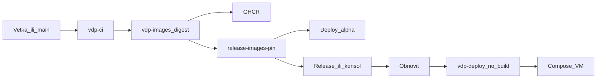

# Поставка VDP и клиент управления

Интерпретация ответов 1–8: шесть именованных VM (консоль + alpha/beta/gamma + demo + test); PR-preview — эфемерные контейнеры на VM `test` (тот же IP, что `*.preview.vedy.io`); DNS только предложенные имена, консоль `delivery.vedy.io`; в волне 2 сначала GitHub OAuth, в том же эпике GitLab OAuth и свои учётки; gamma — только пронумерованный тег и тот же digest; расписание с умолчаниями по среде; до handover владелец delivery — текущая команда разработки; UI консоли как у VDP (шелл, токены, статусы), но **отдельное приложение**, не кабинет заявки. Self-hosted git — холд.

RH0 ([`.cursor/plans/rh0_ci_pipeline.plan.md`](.cursor/plans/rh0_ci_pipeline.plan.md)) и текущие workflow уже дают CI + Images + Deploy на GitHub; этот план **не дублирует RH0**, а закрывает пробелы: сборка с ветки, каталог обновлений, расписание, Playwright как гейт, консоль, GitLab CD.

## Сверка с `.cursor/rules`

Обязательны: `планирование-сверка-с-rules`, `базовые-правила-инструмента`, `честность-готовности`, `развертывание-и-доставка`, `devops-культура`, `тесты-архитектуры`, `playwright-e2e`, `безопасность-ролей-и-данных`, `границы-и-контексты`, `screaming-architecture`, `чистая-архитектура`, `solid`, `детали-как-плагины`, `use-cases`, `интеграция-и-события`, `устойчивость-и-наблюдаемость`, `команды-и-закон-конвея`, `ui-web-практики`, `ux-взаимодействие-и-скорость`, `ux-когнитивная-нагрузка`, `ux-формы-навигация-онбординг`, `поддержка-и-обратная-связь`, `правила-построения`, `typescript-clean-code`, `go-architecture` / `go-testing` (API консоли), `vdp-fe-docker-пересборка` только если трогаем Docker FE VDP — **спросить** перед `compose-fe-refresh`.

Вне scope: `машинное-обучение` (модель не жмёт gamma), `serverless-и-faas` как носитель статуса релиза, `nestjs-modules`, Kubernetes ([`vdp/docs/operations/k8s-roadmap.md`](vdp/docs/operations/k8s-roadmap.md)), self-hosted git.

Gate/DoD из rules: CI ≠ CD ≠ автовыкат в прод; на хосте нет `--build`; промоут digest; AuthZ на API и GitHub/GitLab Environments; секреты деплоя не в браузере; unit на «кто катит куда»; Playwright — узкие journey; нет `admin/test`; после выката health; консоль — контекст delivery, UI не оркестрирует заявку.

Политика gamma (продуктовый текст): на прод попадает только обновление с тегом `vdp-v*`, уже собранное; кнопка не собирает код заново; по желанию digest уже стоит на beta.

## Топология сред и DNS (vedy.io)

- `delivery.vedy.io` — консоль (волна 2), отдельная VM.
- `alpha.vedy.io` / `beta.vedy.io` / `gamma.vedy.io` — контуры продукта, отдельные VM, GitHub Environments уже есть для alpha/beta/gamma в [`vdp-deploy.yml`](.github/workflows/vdp-deploy.yml).
- `demo.vedy.io` — именованный слот для заказчика.
- `test.vedy.io` + `*.preview.vedy.io` — одна VM: слот test и PR-preview (compose-проект на PR, TTL, без отдельного сервера на каждый PR).
- На каждой VM: [`vdp/scripts/bootstrap-host.sh`](vdp/scripts/bootstrap-host.sh), Caddy, `.env.deploy` только на хосте, [`vdp/scripts/deploy-compose-release.sh`](vdp/scripts/deploy-compose-release.sh).

Учёт preemptible: runbook «после разморозки compose up по текущему pin» уже из handover; не считать VM вечной.

## Волна 0 — гигиена (иначе волны врут)

- Отозвать PAT из переписки; дальше только секреты тайника ([`vdp/docs/operations/handover-secrets-checklist.md`](vdp/docs/operations/handover-secrets-checklist.md) — gate передачи **не** закрываем).
- Починить красный job `playwright` в [`vdp-ci.yml`](.github/workflows/vdp-ci.yml) (сейчас после `integration` на push/main и nightly). Сделать **обязательным** на `main` (branch protection: fast + docs + playwright). Journey: login + 1–2 top-task User, role locators, без всей матрицы.
- `vdp-images` `workflow_dispatch` сейчас без выбора ветки ([`.github/workflows/vdp-images.yml`](.github/workflows/vdp-images.yml) строки 3–10) — в волне 1 добавить input `ref`.
- Честно: hybrid alpha (ручной FE) не считать каноном; канон — pin из GHCR.

## Волна 1 — GitHub как каталог и страховка

Цель: человек видит название обновления и жмёт «обновить»; сборка с любой ветки; автомат и ручник; расписание.

Изменения в существующих файлах:

- [`vdp-images.yml`](.github/workflows/vdp-images.yml): `workflow_dispatch.inputs.ref` (ветка/SHA); checkout этого ref; тег образа `sha-<7>` или `vdp-v*`; pin artifact как сейчас (`release-images-pin`). Сборка уже в [`vdp/scripts/image-build-push.sh`](vdp/scripts/image-build-push.sh) (core/hub/docs/mail/sms/fe).
- [`vdp-deploy.yml`](.github/workflows/vdp-deploy.yml): расширить choice сред: `alpha`, `beta`, `gamma`, `demo`, `test` (новые Environments + секреты `DEPLOY_*`). `workflow_run` авто только **alpha** после Images на `main` (как сейчас). Остальные — dispatch. Gamma: Environment required reviewers; список ревьюеров настраиваемый (разработчик по умолчанию, можно заказчик / оба).
- Новый workflow `vdp-release-notes.yml` (или шаг в Images): GitHub Release с заголовком обновления, телом digest’ов из pin, ссылкой на Images run id.
- Новый workflow `vdp-deploy-schedule.yml`: cron по среде **или** ручной; читает политику (позже из консоли; в W1 — GitHub Variables `DEPLOY_MODE_ALPHA=on_ready`, `DEPLOY_MODE_BETA=button_or_window`, `DEPLOY_MODE_GAMMA=button`). Умолчания: alpha по готовности после green Images на main; beta — кнопка или окно; gamma — только кнопка + ревьюеры.
- Новый workflow `vdp-lovable-sync.yml`: fetch `lionss888/vdp`, открыть PR в `vdp/fe` (не merge в main). Опираться на договор из [`align_fe_with_lovable_a8de7ec3.plan.md`](.cursor/plans/align_fe_with_lovable_a8de7ec3.plan.md): Lovable — UI, этот репо — домен.
- Preview: workflow на PR `vdp/**` — собрать (или взять pin с branch Images) и deploy на `test` VM в изолированный compose-проект `pr-N`; Caddy `pr-N.preview.vedy.io`. Не билдить на VM.
- Docs: обновить [`vdp/docs/operations/ci.md`](vdp/docs/operations/ci.md) и [`deploy-rollback.md`](vdp/docs/operations/deploy-rollback.md) человеческим языком + короткая памятка «как обновить» (формат docs-format-check). Help в том же релизе (`поддержка-и-обратная-связь`).
- GitLab в W1: зеркало как сейчас ([`vdp-mirror-gitlab.yml`](.github/workflows/vdp-mirror-gitlab.yml), [`.gitlab-ci.yml`](.gitlab-ci.yml) без deploy).

DoD волны 1: Images с выбранной ветки; Release с именем; dispatch обновляет alpha/demo/test без `--build`; rollback по прошлому digest; playwright зелёный и required на main; GitHub-путь остаётся после волны 2.

Не утверждать «100% поставки»: нет своего UI, нет GitLab CD, нет всех шести VM пока не прогнаны bootstrap.

## Волна 2 — контекст `delivery` (свой клиент)

Отдельное приложение, визуал как VDP: переиспользовать паттерны [`VedAppShell.tsx`](vdp/fe/src/components/ved/VedAppShell.tsx), [`StatusBadge.tsx`](vdp/fe/src/components/ved/StatusBadge.tsx), токены/Tailwind из `vdp/fe`, **не** вшивать экраны поставки в кабинеты User/CO/Provider.

Предлагаемые пакеты (screaming):

- `vdp/delivery/` — Go API: use cases listReleases, getEnvironment, promote, rollback, setSchedule, setApprovers. Порты: GitHub Actions/Releases (адаптер), позже GitLab. Секреты: GitHub App с `actions:write` / `contents:read`, **без** `DEPLOY_SSH_KEY` (ключ остаётся в GitHub Environments).
- `vdp/delivery-console/` — Vite UI «как VDP»: список сред и текущий digest; перечень обновлений + primary «Обновить»; откат; расписание; кто approver на gamma. Disabled CTA с причиной. Один primary на экран.

Auth волны 2 (порядок внутри эпика): (1) GitHub OAuth; (2) GitLab OAuth; (3) локальные учётки консоли. Роли консоли: viewer, deployer-alpha-preview, deployer-beta, deployer-gamma, policy-admin. Проверка на API, не только скрытие кнопки.

Хост: отдельная VM, Caddy `delivery.vedy.io`, образ консоли тоже по digest из CI. Консоль не ходит SSH на продуктовые VM.

Тесты: table-driven на матрицу роли × среда × действие; service-тест адаптера GitHub со smart stub (таймаут, 409); Playwright консоли — один journey «список → обновить alpha» (после появления UI).

DoD волны 2: сценарий без захода в Actions; чужая роль на gamma — 403; GitHub dispatch всё ещё работает.

## Волна 3 — GitLab авто и ручной деплой

Сейчас явно: «GitLab не деплоит» ([`gitlab-setup.md`](vdp/docs/operations/gitlab-setup.md)). W3: те же pin (crane copy уже в Images); GitLab Environments + SSH; job promote без пересборки; авто alpha по правилам зеркала; ручник beta/gamma. Консоль вызывает GitLab API как второй адаптер. Канон merge по-прежнему GitHub, пока не смените политику.

DoD: один pin с GitHub и GitLab даёт один состав контейнеров.

## Честность готовности

- После волны 1: поставка через GitHub — рабочая; своего клиента нет.
- После волны 2: клиент есть; GitLab CD нет.
- После волны 3: двойной CD. Не писать «паритет 100%» без матрицы сред × workflow × тестов и без закрытого handover-gate.
