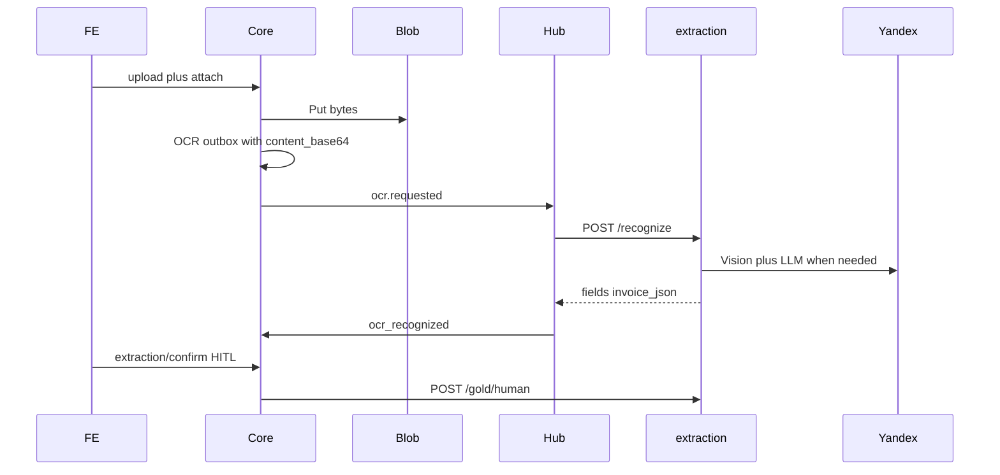

# Демо: живое распознавание документов

## Контекст (что есть)

- [`vdp/docs/`](vdp/docs/) — политика и ops, не рантайм.
- [`vdp/docs-service/`](vdp/docs-service/) — **генерация PDF** (`DOCS_URL`), к OCR не относится.
- [`vdp/extraction/`](vdp/extraction/) — OCR/IE side-path (`OCR_URL` → `POST /recognize`), PRIMARY yandex|fixture|own, HITL gold, schema в [`vdp/shared/extraction`](vdp/shared/extraction).

Целевой journey (1B + полный цикл local + alpha):

## Решение по внешним OCR (ваши ссылки)

| Репозиторий | Суть | Для VDP-демо |
|---|---|---|
| [tesseract.js](https://github.com/naptha/tesseract.js) | WASM OCR в браузере; **без PDF** в scope проекта | Не PRIMARY |
| [client-ocr](https://github.com/siva-sub/client-ocr) | ONNX/PaddleOCR в браузере, privacy-first | Не PRIMARY; идея для будущего optional local-assist вне gold |
| [DigitalSE-OCR-Python](https://github.com/gomesrocha/DigitalSE-OCR-Python) | Queue + MinIO + Tesseract microservice | Паттерн уже закрыт outbox→hub→extraction |
| [OCR-examples](https://github.com/leejunyeol/OCR-examples) / [OCR-Forge-CLI](https://github.com/DewashishCodes/OCR-Forge-CLI) | Примеры/CLI + LLM | Вне product path |

**Выбор для демо (зафиксировано):** не внедрять браузерный OCR и не менять PRIMARY на Tesseract. Довести уже заложенный commercial path: **байты файла в `/recognize` + `EXTRACTION_PRIMARY=yandex` + HITL**. Статус/деньги по-прежнему только в core ([`машинное-обучение`](.cursor/rules/машинное-обучение.mdc), [`docs/architecture/extraction.md`](vdp/docs/architecture/extraction.md)).

## Корневой баг

[`AttachFileToForm`](vdp/core/internal/service/docs.go) и [`StartExtraction`](vdp/core/internal/service/extraction_confirm.go) кладут в outbox только `{status, kind}` — **без** `content_base64` / mime / file_id. Extraction уже умеет bytes ([`buildInput`](vdp/extraction/internal/service/service.go)); Yandex Vision вызывается при коротком layout text и наличии `Content` ([`engines.go`](vdp/extraction/internal/engine/engines.go)). Corpus-скрипт шлёт base64 — прод-attach нет.

## Подход реализации

### 1. Core: обогащение OCR payload байтами

При enqueue `TypeOCRRequested` (first_attach и manual_restart):

- Взять первый (или последний для restart) `DocFileRef` → `FileByID` → `Blobs().Get(storage_key)`.
- В payload добавить: `file_id`, `file_name`, `mime`, `content_base64`, `kind`, `organization_id` (если есть).
- Лимит: уважать существующий upload cap (~15MB); при пустом blob — enqueue без bytes + warning в лог (fixture/fallback, не 500).
- Каталог/FormPaymentService: доступ к blob store для OCR enqueue (через CatalogService / shared store уже есть в attach path).

Не менять матрицу статусов и AuthZ (Provider по-прежнему без start/confirm).

### 2. Hub

[`hub/internal/adapters/ocr/ocr.go`](vdp/hub/internal/adapters/ocr/ocr.go) уже пробрасывает `payload` as-is — правки не нужны, кроме unit на наличие `content_base64` в contract при интеграции-тесте.

### 3. Extraction

Без смены API. Smoke на тексте + отдельный smoke с `content_base64` PDF/изображения (расширить [`scripts/extraction-yandex-smoke.sh`](vdp/scripts/extraction-yandex-smoke.sh) или добавить `extraction-file-smoke`).

### 4. FE / journey (app, не `/demo/*`)

- App: wizard upload → poll `invoice_json` → [`ExtractionReviewPanel`](vdp/fe/src/components/ved/ExtractionReviewPanel.tsx) → confirm.
- `/demo/documents` — localStorage, **не** backend OCR ([`app-vs-demo.md`](vdp/docs/architecture/app-vs-demo.md)); демо заказчику = **app contour** на compose/alpha.
- При необходимости: жест upload по [`fe-interaction-contracts`](.cursor/rules/fe-interaction-contracts.mdc); копирайт «распознавание…» без обещания 100% accuracy.

### 5. Ops: local + alpha (полный цикл)

**Local**

1. `vdp/.env`: `EXTRACTION_PRIMARY=yandex`, `FALLBACK=fixture`, `YANDEX_*`.
2. `make compose-up` → `make extraction-yandex-smoke` → ручной upload PDF с известной суммой → confirm.
3. Fixture-режим остаётся default без ключей (регресс UI).

**Alpha / demo VM**

1. В `/opt/vdp/.env.deploy`: те же `EXTRACTION_*` / `YANDEX_*` (сейчас bootstrap их не кладёт).
2. `EXTRACTION_BIND=127.0.0.1` (не светить 8093 наружу).
3. Redeploy image с фиксом payload (`VDP_EXTRACTION_IMAGE` + core image).
4. On-host: `EXTRACTION_SMOKE_URL=http://127.0.0.1:8093 make extraction-yandex-smoke` (нужен рабочий SSH / `DEPLOY_SSH_KEY` — известный leftover Phase 3).
5. Расширить чеклист: [`staging-checklist.md`](vdp/docs/operations/staging-checklist.md), [`deploy-env.example`](vdp/docs/operations/deploy-env.example) — OCR vars; `staging-smoke` **не** заменяет OCR smoke (явно в docs).

### 6. Честность docs

Обновить [`known-gaps.md`](vdp/docs/pilot/known-gaps.md) / [`readiness-and-limits.md`](vdp/docs/pilot/readiness-and-limits.md): после фикса — «live recognize uploaded bytes when Yandex configured»; без claim own PRIMARY / auto-pay. Ops how-to с командами — в `docs/development/` или runbook (format.md).

## Слои и QG (сверка с rules)

**Обязательные rules:** `планирование-сверка-с-rules`, `vdp-ci-local-gate`, `честность-готовности`, `машинное-обучение`, `serverless-и-faas`, `интеграция-и-события`, `безопасность-ролей-и-данных`, `тесты-архитектуры`, `go-testing`, `playwright-e2e`, `fe-interaction-contracts`, `ui-проблема-сразу-воспроизведи` (живой repro upload→OCR на localhost до «готово»).

**Вне scope:** замена PRIMARY на tesseract/client-ocr; Wave E LoRA; Diadoc; правки `docs-service`; `/demo/*` backend OCR; auto-approve/pay.

| Слой | Работа |
|---|---|
| UI | App HITL confirm; без смены IA |
| FE | При необходимости poll/controls; E2E gesture upload |
| Домен | Без смены SM; side-path only |
| API | Outbox payload enrichment; routes extraction без breaking |
| Unit | Core: OCR payload содержит base64; AuthZ; hub adapter contract |
| E2E | Spec upload→invoice_json→confirm (fixture CI; live Yandex — manual/ops) |
| Compose/repro | Local compose + yandex smoke + browser journey |
| Docs/ops | Runbook, staging-env/deploy-env, known-gaps |

**DoD / gate**

1. `make check-env-parity`
2. Unit: core OCR payload + extraction/hub tests
3. `make extraction-yandex-smoke` (local с ключами; без ключей — fixture OK)
4. Живой localhost: upload invoice PDF → поля из документа → confirm
5. `make ci-pr-pilot` (path: formpayment / e2e / extraction surface)
6. Alpha: secrets + redeploy + on-host smoke + один ручной UI прогон
7. Без утверждения «CI ok / merge-ready» до зелёного `ci-pr-pilot`

## Порядок работ

1. Воспроизвести gap локально (attach → hub log → empty content).
2. Фикс core payload (+ unit).
3. Local Yandex smoke + browser journey.
4. Docs/ops env examples + known-gaps honesty.
5. Alpha secrets + deploy + verify.
6. `ci-pr-pilot`; при закрытии волны — mgmt notify продуктовым языком (распознавание документов / HITL), без plan id.
