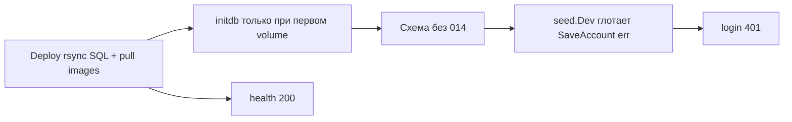

# План: миграции на каждом promote (причина 401 на alpha)

## Диагноз (проверено)

- Register на alpha: `column "telegram_notify_enabled" does not exist` → нет [`014_notifications.sql`](vdp/core/migrations/014_notifications.sql).
- Локально уже правильно: [`Makefile` `compose-up`](vdp/Makefile) делает `compose-db-migrate` + `restart core hub`.
- Release-путь ([`deploy-compose-release.sh`](vdp/scripts/deploy-compose-release.sh), [`vdp-compose-up.sh`](vdp/scripts/vdp-compose-up.sh), preview, rollback) **не** вызывает migrate → будущие `015+` снова сломают стенды.
- [`staging-smoke.sh`](vdp/scripts/staging-smoke.sh) смотрит только health → «зелёный» deploy при битом auth.

**Не делаем:** ручной one-off SQL на VM как единственное «лечение» без правки пайплайна.

**Лечение alpha:** после merge следующий VDP Deploy (или `make compose-db-migrate` + restart core на хосте) накатит `014` и перезасеет учётки. SSH из этой сессии не предполагаем.

## Сверка с `.cursor/rules`

| Обязательны | Зачем |
|---|---|
| [`планирование-сверка-с-rules`](.cursor/rules/планирование-сверка-с-rules.mdc) | секция rules в плане |
| [`развертывание-и-доставка`](.cursor/rules/развертывание-и-доставка.mdc) | один интерфейс deploy; без ручных snowflake; миграции в автоматизации |
| [`devops-культура`](.cursor/rules/devops-культура.mdc) | blameless: чиним процесс, не «дежурный накатил SQL» |
| [`устойчивость-и-наблюдаемость`](.cursor/rules/устойчивость-и-наблюдаемость.mdc) | синтетика критичного маршрута (login); fail-loud вместо тихого seed |
| [`честность-готовности`](.cursor/rules/честность-готовности.mdc) | DoD = проверяемые гейты, не «кажется починили» |
| [`тесты-архитектуры`](.cursor/rules/тесты-архитектуры.mdc) / CD-контракт | расширить `test-cd-scripts` |

Вне scope: Nest/k8s, FE UI, смена модели auth, удаление seed с gamma (отдельный security-эпик).

**Gate/DoD:** `make test-cd-scripts` green; bash -n на затронутых скриптах; seed возвращает ошибку и main падает; smoke логинит seed на не-gamma; доки описывают migrate на каждом promote.

---

## Декомпозиция

### D1. Единый migrate для любого compose-контекста

Файл: [`vdp/scripts/compose-db-migrate.sh`](vdp/scripts/compose-db-migrate.sh)

- Принимать `COMPOSE_FILES` / `COMPOSE_PROJECT_NAME` (как на release и preview `-p pr-N`).
- Порядок файлов миграций сохранить (сортировка `*.sql`).
- Идемпотентность уже есть (`IF NOT EXISTS`) — без schema_migrations table в этом эпике.

### D2. Release bring-up = локальный compose-up (паритет)

Целевой порядок (зеркало Makefile):

1. `up -d` postgres-core + postgres-hub  
2. `compose-db-migrate`  
3. `up -d` остального стека (`--no-build`)  
4. `restart core hub` (seed после актуальной схемы)  
5. `wait-release-health`

Вшить в:

- [`vdp/scripts/vdp-compose-up.sh`](vdp/scripts/vdp-compose-up.sh) — reboot/thaw и основной remote path  
- fallback-ветку в [`deploy-compose-release.sh`](vdp/scripts/deploy-compose-release.sh)  
- [`rollback-compose-release.sh`](vdp/scripts/rollback-compose-release.sh) — migrate перед up (аддитивные SQL безопасны при откате образа)  
- remote-блок [`deploy-preview.sh`](vdp/scripts/deploy-preview.sh) — migrate с `-p "$PROJECT"`

### D3. Fail-loud seed (будущий drift не маскируется 401)

- [`seed.Dev`](vdp/core/internal/repository/seed/seed.go) → `error`; не глотать `SaveAccount` / org / work_chat.
- [`main.go`](vdp/core/cmd/api/main.go): при ошибке seed — `log.Error` + `os.Exit(1)` (core unhealthy → deploy/health ловит).
- Тесты: `if err := seed.Dev(store); err != nil { t.Fatal(err) }` (или тонкий `MustDev` в test helper) на существующих вызовах.

### D4. Семантический smoke: seed login

В [`staging-smoke.sh`](vdp/scripts/staging-smoke.sh) после health:

- `POST $BASE/api/v1/auth/login` с `user@vdp.local` / `user`
- ожидать 2xx + наличие token
- на gamma по-прежнему skip всего smoke (уже в deploy) — поведение не меняем

Так health-only «успех» при битой схеме невозможен на alpha/beta/demo/test.

### D5. Контракт CD не регрессирует

[`test-cd-scripts.sh`](vdp/scripts/test-cd-scripts.sh):

- syntax `compose-db-migrate.sh`
- `grep` что `vdp-compose-up.sh` / `deploy-compose-release.sh` вызывают migrate
- `grep` что `staging-smoke` бьёт `/auth/login`

### D6. Документация (один источник правды)

Кратко обновить:

- [`vdp/docs/operations/docker-compose.md`](vdp/docs/operations/docker-compose.md) — initdb ≠ migrate на volume; promote всегда migrate  
- [`vdp/docs/operations/ci.md`](vdp/docs/operations/ci.md) / [`deploy-rollback.md`](vdp/docs/operations/deploy-rollback.md) — шаг migrate в promote/rollback  
- [`vdp/docs/operations/how-to-update.md`](vdp/docs/operations/how-to-update.md) — при новой SQL-миграции достаточно merge; стенд подтянет на Deploy  

### D7. Выкат и проверка alpha (после кода)

1. Merge → Images → Deploy alpha (или ручной `workflow_dispatch`).  
2. Проверка снаружи: health 200; `POST /api/v1/auth/login` seed → 2xx.  
3. Если Deploy ещё не прошёл — ops one-liner на VM (следствие пайплайна, не замена): `cd /opt/vdp && ./scripts/compose-db-migrate.sh && docker compose … restart core hub`.

---

## Порядок исполнения

1. D1 → D2 (скрипты bring-up)  
2. D4 (smoke) + D5 (контракт)  
3. D3 (seed + main + правки тестов core) + `go test` затронутых пакетов  
4. D6 доки  
5. `make test-cd-scripts`  
6. Отчёт: что смержено локально / что осталось на Deploy alpha  

## Вне этой сессии (явно)

- Фактический SSH/Deploy на alpha без секретов Environment — после merge владельцем среды.  
- Отдельный эпик: schema version table / запрет seed на gamma — не блокирует этот fix.
