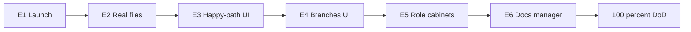

# E1–E6 — UI readiness до образа результата

## Строгий критерий (Definition of Done всей программы)

Оператор без Swagger/curl может:

1. Поднять стенд по инструкции/скрипту.
2. Залогиниться под каждой из 5 ролей ВИ (User, ICO, ECO, Manager, Provider).
3. Создать заявку и провести её по **всему** каноническому lifecycle `import + аванс + товар` до `COMPLETED` **только через UI** (`http://localhost:5173`).
4. В UI пройти corrections, cancel и postpay до `COMPLETED` (без API-обходов).
5. Работать с заявками: список → карточка → CTA по статусу для каждой роли.

Текущая база: BDUI matrix/catalog P0–P7, seed [`scripts/seed-bdui-lifecycle.js`](fe-experiment/backend-for-ved/scripts/seed-bdui-lifecycle.js), клиент [`bdui-client`](fe-experiment/bdui-client). Главный разрыв: lifecycle CTA сидят на `staticBody` + stubs ([`lifecycle-action.catalog.ts`](fe-experiment/backend-for-ved/src/modules/bdui/service/lifecycle-action.catalog.ts), [`ScreenPage.tsx`](fe-experiment/bdui-client/src/pages/ScreenPage.tsx)), а не на file picker в [`ActionBarWidget.tsx`](fe-experiment/bdui-client/src/components/widgets/ActionBarWidget.tsx).

Зависимости жёсткие: E(n+1) только после зелёного QA gate E(n). После каждого этапа — чеклист в [`LIFECYCLE.md`](fe-experiment/LIFECYCLE.md) и gaps в [`NOTES.md`](fe-experiment/NOTES.md).

---

## E1 — One-click запуск

**Цель:** новый человек поднимает стенд ≤15 мин.

**Scope**
- Скрипт `fe-experiment/start-local.sh`: docker compose up → проверка Redis/NATS/Mongo → seed → подсказка `npm run dev` backend + client (или параллельный старт, если стабильно).
- Обновить [`fe-experiment/README.md`](fe-experiment/README.md): 5 ролей, порты, seed-аккаунты, ссылка на LIFECYCLE; убрать устаревшее «вне скоупа другие роли».
- Smoke-скрипт: login 5 seed → `GET /bdui/schema/{role}/login` и `forms.list` → 200.

**Вне:** прод-деплой, CI E2E.

**QA gate**
1. Чистый клон/каталог: compose + seed без ручной правки портов (документированный `.env` из example).
2. Smoke 5 логинов зелёный.
3. UI открывается на `:5173`, role picker работает.

---

## E2 — Реальные файлы вместо stubs

**Цель:** lifecycle-действия с файлами идут через upload в UI.

**Подход (зафиксирован)**
- Расширить `BduiAction`: `requiresFileUpload?: { uploadPath; bodyField; accept? }` (и при необходимости массив полей).
- В catalog для User/Manager/Provider file-CTA убрать обязательный seed `staticBody` file id; клиент: file input → `apiUploadFile` → подставить `_id` в body.
- Seed stub ids оставить только в seed/data и unit-тестах catalog mapping, не как единственный путь UI.

**Файлы:** [`bdui.types.ts`](fe-experiment/backend-for-ved/src/modules/bdui/bdui.types.ts), catalog, [`ActionBarWidget.tsx`](fe-experiment/bdui-client/src/components/widgets/ActionBarWidget.tsx), [`client.ts`](fe-experiment/bdui-client/src/api/client.ts) (upload уже есть), зеркало типов в [`bdui-client/src/types/bdui.ts`](fe-experiment/bdui-client/src/types/bdui.ts).

**Покрыть CTA:** upload contract/order/order-advance/payments/report/shipment; provider proof; manager contract attach / order attach / report-shipment где нужен file.

**QA gate**
1. Unit: actions с `requiresFileUpload` без жёсткого stub id в schema для UI-пути.
2. Ручной: User загружает PDF поручения с диска → статус двигается.
3. Manager/Provider аналогично хотя бы по одному file-CTA.
4. Без выбранного файла CTA не уходит с пустым/чужим stub id.

---

## E3 — Сквозной happy-path UI (5 ролей)

**Цель:** одна заявка `import + аванс + товар` → `COMPLETED` только в UI.

**Scope**
- Чеклист-скрипт оператора в LIFECYCLE (шаги по ролям + ожидаемый статус после каждого CTA).
- Починить UI-блокеры happy-path, всплывшие на E2 (refresh schema после action, `direction=import` по умолчанию в wizard, assign provider без сырого prompt где возможно — seed provider id в hint/default для demo).
- После `COMPLETED`: пустой mutate action_bar у User/Manager/Provider.

**QA gate**
1. Полный прогон 5 аккаунтов в браузере до `COMPLETED`.
2. Регрессия unit BDUI matrix.
3. Самопроверка: финальный переход только Manager shipment accept / completed.

---

## E4 — Ветки lifecycle в UI

**Цель:** corrections, cancel, postpay без curl.

**Scope**
- Corrections: ECO reject (текст в UI) → User list/detail с `accept_corrections` → снова ECO queue.
- Cancel: User + ECO (+ ICO/Manager если CTA уже в matrix) → terminal hint, 0 mutate CTA.
- Postpay: wizard постоплата → стабильный UI-путь до `COMPLETED` (жёстко: `direction=import` + порядок payment_received → report → shipment; при необходимости правка schema hints / disable невалидных CTA по StageHash из NOTES).
- Не чинить весь доменный `checkTransit` шире, чем нужно для одного зелёного postpay UI-прогона.

**QA gate**
1. Corrections round-trip только UI.
2. Cancel User и ECO только UI.
3. Postpay → `COMPLETED` только UI.
4. Регрессия E3 happy-path.

---

## E5 — Кабинеты ролей как во вводных

**Цель:** ручной тест интерфейса каждой роли ВИ на очередях и карточках.

**Scope**
- List: понятные intro/hint, колонки (id, status, org/amount), фильтр статусов уже в dataSource — проверить читаемость.
- Detail: status badge, detail_fields (сделка, комментарий reject), вложения/ids файлов если API отдаёт, action_bar.
- Provider: поля без ПДн клиента (опереться на [`FormPaymentProviderViewDto`](fe-experiment/backend-for-ved/src/modules/form-payment/dto/form-payment-provider.view.dto.ts)); UI не показывает лишнее.
- Role picker / logout / смена роли задокументированы в README.

**Файлы:** [`role-cabinet.builders.ts`](fe-experiment/backend-for-ved/src/modules/bdui/service/role-cabinet.builders.ts), [`user-screen.builders.ts`](fe-experiment/backend-for-ved/src/modules/bdui/service/user-screen.builders.ts), при необходимости виджеты detail/table.

**QA gate**
1. Чеклист «роль × экраны login/list/detail» для 5 ролей — руками, без Swagger.
2. Unit builders на ключевые hints/columns.
3. Чужой кабинет не видит чужую заявку (404/пустой list) — smoke.

---

## E6 — Документы и менеджерский контур

**Цель:** договор/поручение/отчёт как артефакты в UI, не только статусные кнопки.

**Scope**
- User: загрузка подписанного договора/поручения/отчёта с диска (закрывает остаток E2, если что-то отложено).
- Manager: `mgr_contract_attach` с file picker + number/date в UI (prompt или маленькая form), без ручной подстановки seed ObjectId.
- Advance-order: один UI end-to-end на postpay/advance ветке (signing → user upload → accept).
- Hints «скачать/подписать/загрузить» текстом в schema (реальная генерация PDF шаблона — использовать существующий `order/generate` где API уже есть; S3-сбой → явный fallback message, не молчаливый stub).

**Вне программы 100%:** Diadoc, шаблоны по ПА, субагент, refund, Bank API.

**QA gate**
1. Manager прикрепляет договор файлом в UI → заявка уходит к поручению.
2. User видит наличие договора/поручения на detail (поля/hint).
3. Advance-order цикл в UI один раз.
4. Финальный приёмочный прогон DoD программы (все 5 пунктов сверху) — зелёный.

---

## Артефакты на выходе каждого этапа

| Этап | Код | Доки | Приёмка |
|------|-----|------|---------|
| E1 | start/smoke scripts | README | 5 login smoke |
| E2 | requiresFileUpload + ActionBar | NOTES stub→upload | PDF с диска |
| E3 | UI blockers | LIFECYCLE happy-path UI | 5 ролей → COMPLETED |
| E4 | postpay CTA/hints | LIFECYCLE branches UI | 3 ветки UI |
| E5 | builders columns/hints | чеклист ролей | 5 кабинетов |
| E6 | contract attach UI | LIFECYCLE E6 DONE | полный DoD |

После E6: **100%** только относительно образа результата выше; расширения FigJam (refund/bank/субагент) остаются отдельным эпиком.
