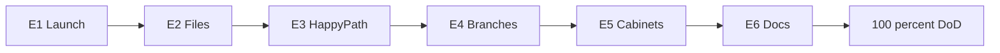

# Программа UI readiness (индекс E1–E6)

## Строгий критерий (DoD всей программы)

Оператор без Swagger/curl может:

1. Поднять стенд по инструкции/скрипту.
2. Залогиниться под каждой из 5 ролей ВИ (User, ICO, ECO, Manager, Provider).
3. Создать заявку и провести её по всему каноническому lifecycle `import + аванс + товар` до `COMPLETED` только через UI.
4. В UI пройти corrections, cancel и postpay до `COMPLETED`.
5. Работать с заявками: список → карточка → CTA по статусу для каждой роли.

## Планы (выполнять строго по порядку)

| План | Файл | Фокус |
|------|------|--------|
| E1 | [`e1_one_click_launch.plan.md`](e1_one_click_launch.plan.md) | Запуск ≤15 мин, smoke 5 login |
| E2 | [`e2_real_file_uploads.plan.md`](e2_real_file_uploads.plan.md) | PDF с диска вместо stubs |
| E3 | [`e3_happy_path_ui.plan.md`](e3_happy_path_ui.plan.md) | 5 ролей → COMPLETED в UI |
| E4 | [`e4_branches_ui.plan.md`](e4_branches_ui.plan.md) | Corrections / cancel / postpay UI |
| E5 | [`e5_role_cabinets_ui.plan.md`](e5_role_cabinets_ui.plan.md) | Кабинеты ролей ВИ |
| E6 | [`e6_docs_manager_ui.plan.md`](e6_docs_manager_ui.plan.md) | Документы + финальный DoD = 100% |

E(n+1) только после зелёного QA gate E(n). После E6 образ результата = **100%**; FigJam-расширения (refund/bank/субагент) — отдельный эпик.
