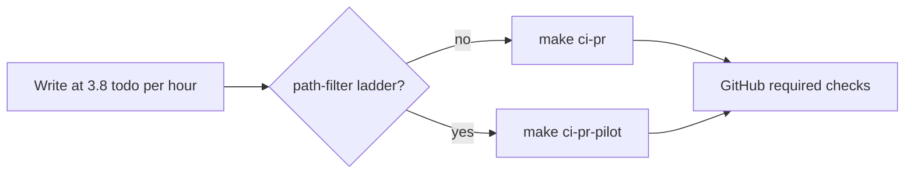

# E2E suite health (TEST_STALE)

## Сначала ответ на уточнение (это не отдельный план)

Подход **не** делает тесты «самообновляющимися». Он даёт уверенность другого рода: **если UI/CTA разъехались со spec, gate красный на той же поверхности, что GitHub**, и красный **быстро**. Spec всё равно правит человек вместе с UI.

Два разных механизма, их нельзя смешивать в одном коэффициенте:

1. **Уже в правилах (и уже на GitHub):** при касании `vdp/fe/e2e/**` / `@pilot-matrix` / ActionPanel / rate-commission / formpayment — локально `make ci-pr-pilot`. GitHub это уже гоняет (`detect-pilot-matrix` в [`.github/workflows/vdp-ci.yml`](.github/workflows/vdp-ci.yml)). Локальный `ci-pr` этого не делает — отсюда ложное «зелёно».
2. **Этот план:** инвентарь stale, `data-testid`, fail-fast вместо `test.setTimeout(420_000)` как ожидания пропавшей кнопки, один helper мастера. **Не** «весь suite на каждый коммит» и **не** `release-gate` каждый день.

### Уверенность: да, с оговоркой

Да: для **лестницы пилота** (сейчас 3 теста с тегом `@pilot-matrix` в [`pilot-matrix-full-ladder.spec.ts`](vdp/fe/e2e/pilot-matrix-full-ladder.spec.ts) и [`pilot-matrix-postpay-rate.spec.ts`](vdp/fe/e2e/pilot-matrix-postpay-rate.spec.ts)) нельзя честно сказать «готово», пока локальный gate не совпал с required check.

Нет: это не покрывает весь Playwright (21 spec). PR smoke по-прежнему узкий (4 файла в `make ci-pr`). Остальные spec — вне повседневного path-filter.

### Удлинение срока: коэффициент

Базис письма: [`заметки/ориентир-скорости-2026-08-25.md`](заметки/ориентир-скорости-2026-08-25.md) — **3.8 todo/ч**. Это скорость **написания**. Календарь merge = написание + петля QG.

Считать нужно **не ко всем коммитам**, а к PR, которые попадают в path-filter.

| Сравнение | Что происходит со сроком |
|---|---|
| Честный паритет с GitHub | Коэффициент **~1.0** на такие PR: время уже заложено в CI (job timeout 45 мин; красный PR #32 съел ~17 мин из-за retry на stale locator). Локальный прогон **переносит** это ожидание до push. |
| Наивный «только `ci-pr` / unit» | Локальный цикл короче, календарь merge **длиннее**: stale × retry × повторный push. На #32 это уже съело больше, чем один зелёный `ci-pr-pilot`. |
| Добавка `ci-pr-pilot` поверх зелёного `ci-pr` | В Makefile: ещё **65s sleep** + `@pilot-matrix`. Ориентир стены: **~10–20 мин** к уже потраченному `ci-pr` (compose + узкий browser). На волну «10 todos / 2.5–3 ч» это **~+10–20%** календарного времени **этой** волны, не ×2 и не ×3. |
| `release-gate` каждый день (вне scope навсегда) | Полный browser + postgres integration. Это уже **другой порядок** (handover / `vdp-v*`). Не закладывать в повседневную доставку. |

Fail-fast из этого плана **уменьшает** хвост: красный за секунды–десятки секунд вместо 7+7 мин timeout+retry.

Итог для решения: платишь **~1.1–1.2×** на PR с лестницей относительно честного `ci-pr`; выигрываешь относительно текущего антипаттерна «локально зелёно → GitHub 17 мин красный». На PR без path-filter коэффициент **1.0**.

## Цель этого плана

Закрыть известный `TEST_STALE` (кнопка «Создать черновик») системно, чтобы следующий rewrite UI не оставлял мёртвый locator в `@pilot-matrix`.

Срок исполнения (базис 3.8 todo/ч): **~6 todos → ~1.5–2 ч** плюс один прогон `make ci-pr-pilot` (~10–20 мин стены).

## Слои

- UI / домен / API — не менять (продукт OCR и статусная машина вне scope).
- E2E — inventory, helper, fail-fast, testid.
- Unit — не требуется, кроме если выносится крошечный helper без политики.
- Rules / static — маркер `STALE` + grep в static/precommit (секунды, не минуты).
- QG — `make check-env-parity` затем **`make ci-pr-pilot`**.
- Docs/notify — вне scope (не плодить ops-markdown).

## Работы

1. **Инвентарь `@pilot-matrix` vs CTA UI**  
   Сверить финальные клики с [`forms-new-page.tsx`](vdp/fe/src/components/ved/pages/forms-new-page.tsx) (`wizard-save-draft`, `wizard-send-manager`, `wizard-review-step`). Канон жеста уже в [`wave2-wizard.spec.ts`](vdp/fe/e2e/wave2-wizard.spec.ts). Не переписывать 21 spec.

2. **Один helper мастера**  
   Вынести `Далее` → `wizard-review-step` → `wizard-save-draft` из wave2; postpay и (если дубль) full-ladder используют его. Не третий путь копирайта.

3. **Fail-fast**  
   Перед финальным CTA: `expect(...).toBeVisible({ timeout: 15_000 })` с явным сообщением. `setTimeout(420_000)` не использовать как ожидание пропавшей кнопки. То же для full-ladder, если там тот же класс wait.

4. **Контракт stale**  
   Комментарий `// STALE:` запрещён на файлах `@pilot-matrix` в merge: короткий grep в [`vdp/scripts/ci-pr-static.sh`](vdp/scripts/ci-pr-static.sh) (или соседний check, который уже входит в `precommit-gate` / `ci-pr-fast`). Предпочитать `getByTestId` над русским label в ladder-тестах.

5. **Связь с другими планами**  
   В [`normalize_delivery_ci_92601189.plan.md`](.cursor/plans/normalize_delivery_ci_92601189.plan.md) пункт B3 закрывается этим планом. В [`import_growth_series_f8b557b2.plan.md`](.cursor/plans/import_growth_series_f8b557b2.plan.md) prerequisite TEST_STALE больше не «удалить spec», а «держать в sync с UI».

## DoD

- Нет locator «Создать черновик» в `@pilot-matrix`.
- Postpay и wave2 идут одним helper-путём review + `wizard-save-draft`.
- Fail-fast на финальном CTA.
- Static/precommit падает на `STALE` внутри `@pilot-matrix` specs.
- Зелёные: `make check-env-parity` → `make ci-pr-pilot`.
- Не утверждать merge-ready без этого gate (`честность-готовности`).

## Вне scope

- Переписывание всего Playwright / полный suite на каждый коммит.
- `release-gate` как повседневный gate (остаётся handover / тег).
- Смена статусной машины и OCR product logic.
- Расширение PR smoke (4 spec) до полной лестницы.

## Rules сверка

**Обязательны:** `планирование-сверка-с-rules`, `vdp-ci-local-gate`, `честность-готовности`, `тесты-архитектуры`, `playwright-e2e`, `правила-построения`.

**Вне scope:** ML, `vdp-fe-docker-пересборка` без спроса, `mgmt-tg-notify` (не закрытие продуктовой волны), UI OCR.
