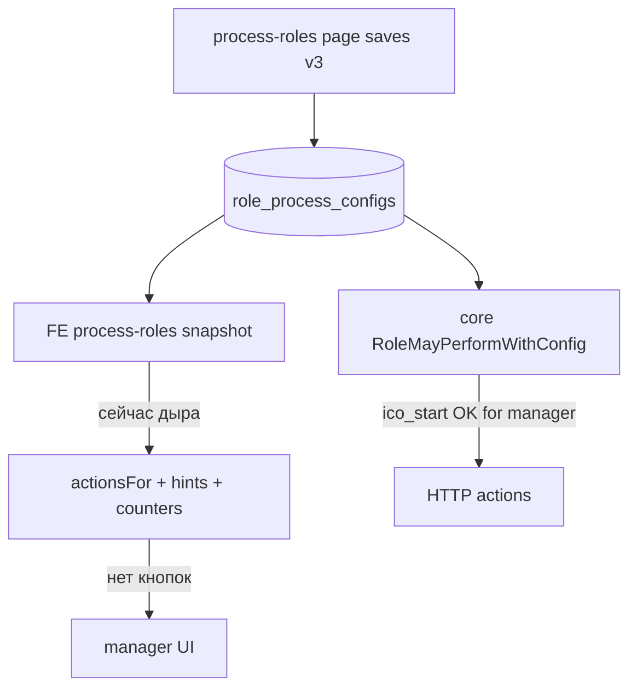

# FE: process-roles runtime + continuity + хронология + участники

## Главный вывод по вашему тесту (скрин «Роли процесса» v3)

Конфиг **сохранён и показывается** (ICO/ECO `В процессе: нет`, manager `да`).  
Но **кабинет менеджера этот snapshot почти не использует** — поэтому тест «выключили комплаенс → менеджер ведёт слот» **провален в UX**, хотя core continuity уже умеет bypass.

Итог: раздел «Роли процесса» сейчас влияет в основном на **API AuthZ** (и частично на *скрытие* CTA у самой выключенной роли в ActionPanel), но **не** на:

- текст «Сейчас действует: Внутренний комплаенс»;
- пустые «Доступные действия» у менеджера;
- фильтр/счётчик «Требуют моего действия»;
- ожидание, что выключенный слот закрывает **менеджер**.

**MUST волны:** process-roles = обязательный вход для всех effective CTA / next-step / waiting-actor / mine-counters в app-контуре. Иначе админ-страница остаётся «декоративной» с точки зрения менеджера.

## Контекст скринов менеджера (без изменений смысла)

1. Hint/actions ждут ICO при ICO off.
2. Участники: manager_id пуст («не назначен») ≠ роль зрителя.
3. Хронология: актор угадывается, не `actor_id`.
4. «Файл не найден» — blob; recreate core + re-upload.
5. «Демо без бэкенда» — линк, не режим.

---

## Блок 0 (новый, обязательный) — runtime-контракт «Роли процесса»

### Факт сегодня

| Место | Читает process-roles? | Эффект |
|-------|----------------------|--------|
| [`process-roles-page.tsx`](vdp/fe/src/components/ved/pages/process-roles-page.tsx) | да (CRUD) | сохранение в core |
| [`ActionPanel`](vdp/fe/src/components/ved/ActionPanel.tsx) | да | только **фильтр** CTA своей роли (`roleAllowsUiAction`) — ICO off → у ICO пусто; **manager не получает inject** |
| [`forms-list-page`](vdp/fe/src/components/ved/pages/forms-list-page.tsx) | частично | только подпись «На проверке» |
| `nextStepHint` / `waitingActorLabel` | **нет** | всегда матрица ICO |
| dashboard / shell todo badge | **нет** | mine без continuity |
| form detail «Следующий шаг» | **нет** | врёт про ICO |

### Что сделать

1. **Один источник snapshot в app:** React Query hook / store (`useProcessRolesSnapshot`) → `GET /api/v1/process-roles`, staleTime короткий или invalidate после сохранения на admin-странице.
2. **Все** вызовы `actionsFor(role, status)` в app-контуре передают snapshot (ActionPanel, detail hint, list, dashboard, shell).
3. **Continuity inject** в `actionsFor` (см. блок A) — единственный способ, чтобы `В процессе: нет` у ICO/ECO **переносило** работу на manager с `manager.ops`.
4. После `PUT` на process-roles — `invalidateQueries(['process-roles'])`, чтобы кабинет не жил на кэше до F5.

### Admin UX ([`process-roles-page.tsx`](vdp/fe/src/components/ved/pages/process-roles-page.tsx))

Копирайт сейчас: «порядок ≠ этапы» — верно, но **не говорит**, что `В процессе: нет` для ICO/ECO = continuity на менеджера.

Добавить явный блок эффекта (без ложной «этапы исчезают»):

- ICO/ECO off → «Слот проверки org/form закрывает менеджер (manager.ops); этапы заявки остаются».
- ICO/ECO on → «CTA у соответствующей роли комплаенса».

Это закрывает confused support: «я выключил — почему этап Организация ещё есть?» vs «кто действует».

---

## Блок A — continuity CTA (следствие process-roles)

В [`actions.ts`](vdp/fe/src/lib/ved/actions.ts):

- При snapshot: если ICO не enabled+actor и manager имеет `manager.ops` → inject `ico_*` на текущий status (ids для bridge).
- То же для ECO → `eco_*`.
- Continuity **не** резать через `org.compliance` в `roleAllowsUiAction`.

Core: без смены политики; уже [`canAdvanceDisabledSlot`](vdp/core/internal/domain/formpayment/role_config.go).

## Блок B — hints / counters

`nextStepHint` / `waitingActorLabel` + snapshot; list/dashboard/shell с `actionsFor(..., snapshot)`.

## Блок C — хронология

`mapComplianceHistory`: актор из `actor_id` → имя/роль; infer по статусу — только fallback.

## Блок D — участники

Resolve `manager_id` → ФИО; claim `ManagerID` на continuity take в core; копирайт «назначенный менеджер».

## Блок E — сайдбар

Линк «Демо без бэкенда» → «Открыть демо-контур».

## Тесты (включая «как на скрине v3»)

Фикстура snapshot как на alpha v3: ICO/ECO `enabled: false`, manager `enabled: true` + `manager.ops`.

| Тест | Ожидание |
|------|----------|
| actionsFor(manager, organization_waiting_verification, v3) | есть `ico_form_start` |
| nextStepHint(..., manager, v3) | CTA менеджера, **нет** «Внутренний комплаенс» как ожидающий актор |
| actionsFor(ico, ..., v3) | [] |
| invalidate path | документирован / unit на hook key |
| chronology actor_id | имя/роль из fixture |
| claim ManagerID | Go unit |

## Сверка с `.cursor/rules`

**Обязательны:** `планирование-сверка-с-rules`, `базовые-правила-инструмента`, `правила-построения`, `use-cases`, `безопасность-ролей-и-данных` (политика на сервисе + UI проекция), `чистая-архитектура`, `детали-как-плагины`, `интеграция-и-события`, `ui-web-практики`, `поддержка-и-обратная-связь`, `честность-готовности` (не обещать «этапы исчезли»), `тесты-архитектуры`, `typescript-clean-code`, `go-testing`.

**Вне scope:** включение ICO обратно; удаление статусов org/form; Nest; silent `compose-fe-refresh`; воскрешение старых in-memory blob.

## DoD

- [ ] Сохранение «Роли процесса» **меняет** кабинет без ручного «угадывания матрицы» (CTA/hint/counters)
- [ ] v3-фикстура: ICO/ECO off → менеджер ведёт org/form слот в UI
- [ ] Admin-страница объясняет эффект `В процессе: нет`
- [ ] Invalidate snapshot после PUT
- [ ] Хронология по actor_id; участники с ФИО + claim
- [ ] Vitest (+ Go claim) зелёные; ручной проход manager на org-waiting после смены ролей
