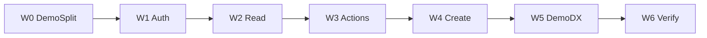

# Программа: интеграция vdp/fe ↔ vdp/core (W0–W6)

## Цель программы

Подключить FE как **тонкий UI-адатер** к политике в `vdp/core`; demo на моках `/demo/*` для показов. Не BDUI schema engine и не паритет Nest UI.

Архитектурно ([`чистая-архитектура`](.cursor/rules/чистая-архитектура.mdc), [`детали-как-плагины`](.cursor/rules/детали-как-плагины.mdc)): TanStack/React — Frameworks & Drivers; `lib/api` + mappers — Interface Adapters; Entities/Use Cases статусов — **только в core**.

## Зафиксированные решения

- App (корень): JWT → `POST/GET /api/v1/...` на core.
- Demo (`/demo/*`): mock + `localStorage` (`ved-demo-state-v1`) — отдельный контур, явно помечен как демо.
- Actions: `POST /api/v1/forms/{id}/actions/{action}` (domain / use-case ids), не Nest path API на этом этапе.
- Dev: Vite proxy `/api` → `:8080`. Токен app: `sessionStorage` `vdp-auth-v1`.
- Seed: `*@vdp.local` / пароль = local-part ([`seed.go`](vdp/core/internal/repository/seed/seed.go)).
- Структура FE по домену (`lib/ved`, `lib/api`, `components/ved`), не «всё по слоям фреймворка» ([`screaming-architecture`](.cursor/rules/screaming-architecture.mdc)).

## Правила (все волны)

Опираться на актуальный набор [`.cursor/rules`](.cursor/rules) (снимок `6c4a525`):

**Архитектура и границы**

- [`чистая-архитектура`](.cursor/rules/чистая-архитектура.mdc) / [`детали-как-плагины`](.cursor/rules/детали-как-плагины.mdc) — UI не носитель истины статуса; Humble Object на краю
- [`use-cases`](.cursor/rules/use-cases.mdc) — каждое CTA app = команда/use case id в core
- [`границы-и-контексты`](.cursor/rules/границы-и-контексты.mdc) — fe ≠ hub; браузер только к core
- [`интеграция-и-события`](.cursor/rules/интеграция-и-события.mdc) — REST-команды; статус из домена; HATEOAS-идея: допустимые действия из матрицы/роли, не выдуманы UI
- [`solid`](.cursor/rules/solid.mdc) — узкие порты API-клиента; не god-store для app+demo

**Безопасность и устойчивость**

- [`безопасность-ролей-и-данных`](.cursor/rules/безопасность-ролей-и-данных.mdc) — JWT; app без role-switch; Provider без ПДн
- [`устойчивость-и-наблюдаемость`](.cursor/rules/устойчивость-и-наблюдаемость.mdc) — `X-Request-ID` / id заявки в клиенте

**UI / продукт**

- [`ui-web-практики`](.cursor/rules/ui-web-практики.mdc) — top tasks по роли; один primary CTA; иерархия статус→сумма→действие
- [`поддержка-и-обратная-связь`](.cursor/rules/поддержка-и-обратная-связь.mdc) — «статус» + «что дальше» на карточке; demo/app не путать с продом
- [`ux-взаимодействие-и-скорость`](.cursor/rules/ux-взаимодействие-и-скорость.mdc) / [`ux-когнитивная-нагрузка`](.cursor/rules/ux-когнитивная-нагрузка.mdc) / [`ux-формы-навигация-онбординг`](.cursor/rules/ux-формы-навигация-онбординг.mdc)

**Качество и процесс**

- [`правила-построения`](.cursor/rules/правила-построения.mdc) — тесты; самопроверка переходов/ролей; docs только по запросу
- [`тесты-архитектуры`](.cursor/rules/тесты-архитектуры.mdc) — unit mapper/actions в основании; узкий journey smoke; не «мороженое» E2E; без Playwright-suite в программе
- [`typescript-clean-code`](.cursor/rules/typescript-clean-code.mdc)
- [`базовые-правила-инструмента`](.cursor/rules/базовые-правила-инструмента.mdc)
- DoD-дисциплина (без отдельного rule-файла): `completed` только после измеримого DoD волны; stub = частично + явный %; не закрывать W0–W6 пачкой; запрещены claims «prod-ready» / «паритет 100%»

**Вне фокуса FE-программы:** ML-ядро, serverless hub, Nest module rules как шаблон FE.

## Серия планов

| ID | Файл | DoD (кратко) |
|----|------|----------------|
| W0 | [w0_fe_demo_routes_a1b2c3d4.plan.md](w0_fe_demo_routes_a1b2c3d4.plan.md) | `/demo/*` mock; явная развилка demo/app |
| W1 | [w1_fe_api_auth_b2c3d4e5.plan.md](w1_fe_api_auth_b2c3d4e5.plan.md) | JWT login seed; proxy; Auth adapter |
| W2 | [w2_fe_forms_read_c3d4e5f6.plan.md](w2_fe_forms_read_c3d4e5f6.plan.md) | list/get проекция; mapper unit; без client visibility |
| W3 | [w3_fe_domain_actions_d4e5f6a7.plan.md](w3_fe_domain_actions_d4e5f6a7.plan.md) | CTA→use case action; статус из ответа; % матрицы |
| W4 | [w4_fe_create_form_e5f6a7b8.plan.md](w4_fe_create_form_e5f6a7b8.plan.md) | POST create; stub справочников |
| W5 | [w5_fe_demo_dx_f6a7b8c9.plan.md](w5_fe_demo_dx_f6a7b8c9.plan.md) | demo↔app; изоляция сессий; честный копирайт |
| W6 | [w6_fe_verify_gate_a7b8c9d0.plan.md](w6_fe_verify_gate_a7b8c9d0.plan.md) | unit + journey smoke; честный % / дыры |

Каждый W* — отдельный plan; закрывать только после gate волны.

## Вне программы

Upload/docs, SSE, hub из браузера, Nest form-payment paths, CORS в core, compose-сервис fe, BDUI engine, Playwright full suite, claim «prod-ready».

## Gate «программа интегрирована» (после W6)

- Demo офлайн на `/demo` работает.
- App journey: login → list → action меняет статус в core → create.
- Формулировка: «FE = UI-адатер (auth+read+actions partial+create); политика в core; demo mock; не prod».
