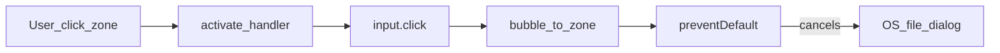

# FE interaction quality: file pick и контракты жеста

## Контекст (индикатор качества)

Баг мастера «Документы»: `input[type=file]` внутри кликабельной зоны + `preventDefault` на том же жесте отменял OS-диалог. E2E при этом был зелёным из‑за `setInputFiles` на hidden input ([`vdp/fe/e2e/wave2-wizard.spec.ts`](vdp/fe/e2e/wave2-wizard.spec.ts)), минуя клик пользователя. Фикс в [`forms-new-page.tsx`](vdp/fe/src/components/ved/pages/forms-new-page.tsx) уже есть локально; его нужно **закрепить архитектурно и проверяемо**, а не оставить как разовый патч.

## Сверка с `.cursor/rules` (MUST)

**Обязательны для этой работы:**
- [`планирование-сверка-с-rules`](.cursor/rules/планирование-сверка-с-rules.mdc) / [`базовые-правила-инструмента`](.cursor/rules/базовые-правила-инструмента.mdc) — план со сверкой
- [`ui-web-практики`](.cursor/rules/ui-web-практики.mdc) — загрузка документов, узнаваемый паттерн, не изобретать ad-hoc
- [`ux-формы-навигация-онбординг`](.cursor/rules/ux-формы-навигация-онбординг.mdc) / [`ux-взаимодействие-и-скорость`](.cursor/rules/ux-взаимодействие-и-скорость.mdc) — жест и обратная связь
- [`playwright-e2e`](.cursor/rules/playwright-e2e.mdc) — critical paths, real user behavior, testid
- [`тесты-архитектуры`](.cursor/rules/тесты-архитектуры.mdc) — unit/быстрые + узкий E2E journey
- [`честность-готовности`](.cursor/rules/честность-готовности.mdc) — DoD проверяемыми критериями; bypass-тест ≠ готовность
- [`правила-построения`](.cursor/rules/правила-построения.mdc) — тесты к изменениям
- [`vdp-ci-local-gate`](.cursor/rules/vdp-ci-local-gate.mdc) — перед заявлением merge-ready: `ci-pr` / хотя бы `ci-pr-fast` + целевой Playwright
- [`typescript-clean-code`](.cursor/rules/typescript-clean-code.mdc) — один export на файл, типы
- [`create-rule` skill](~/.cursor/skills-cursor/create-rule/SKILL.md) — формат `.mdc`

**Вне scope этой волны:** ML/serverless, Nest/Go rules, mirror/deploy secrets, `mgmt-tg-notify` (кроме косвенно через test-cd-scripts), полный рефактор всех `type=file` в demo/admin.

**Gate/DoD-чеки из rules:**
- [ ] Новый/обновлённый rule с MUST/антипаттернами
- [ ] Shared компонент + тесты (vitest structural + Playwright gesture)
- [ ] Стат-проверка не даёт вернуть nested+preventDefault
- [ ] Не утверждать готовность без прогона затронутых FE unit + wizard e2e; для «готово к CI» — `make ci-pr` из `vdp/`
- [ ] Перед `compose-fe-refresh` — спросить ([`vdp-fe-docker-пересборка`](.cursor/rules/vdp-fe-docker-пересборка.mdc)); **в этой волне новых npm-зависимостей не добавляем** (нет jsdom/RTL), чтобы не требовать refresh

## Решения (зафиксированы)

1. **Новый rule** [`.cursor/rules/fe-interaction-contracts.mdc`](.cursor/rules/fe-interaction-contracts.mdc) с `alwaysApply: true` (короткий, как `честность-готовности`) — класс «жест пользователя обязан работать без test-bypass».
2. **Не добавлять** `@testing-library` / `jsdom` в этой волне: vitest остаётся `environment: node`; клик ловим Playwright `filechooser`.
3. **Вынести** `FilePickButton` (+ `useIsMobileViewport` при необходимости) в [`vdp/fe/src/components/ved/file-pick-button.tsx`](vdp/fe/src/components/ved/file-pick-button.tsx); wizard только импортирует. Миграция ActionPanel / RegistryManager / demo — **не в этой волне**.
4. **Статика** — grep-контракты в [`vdp/scripts/test-cd-scripts.sh`](vdp/scripts/test-cd-scripts.sh) (уже в precommit/CI контрактах), без отдельного eslint-плагина.

## Работы

### A. Правило и перекрёстные ссылки

Создать `fe-interaction-contracts.mdc` с MUST:
- File upload: `label htmlFor` **или** input **вне** click-зоны; запрет `input[type=file]` внутри `onClick`/`role=button`, который делает `preventDefault` + `input.click()`.
- Mouse-путь открытия picker: без `preventDefault`; keyboard Space — ok.
- Один shared pick для кабинетных PDF-зон; ad-hoc div+sr-only — запрещён для новых мест.
- DoD: хотя бы один автотест на поверхность загрузки идёт через **клик → filechooser**, не только `setInputFiles` на hidden input.
- `setInputFiles` допустим для ускорения длинных сценариев **после** отдельного gesture-теста.

Короткие пункты-ссылки:
- в [`ui-web-практики.mdc`](.cursor/rules/ui-web-практики.mdc) (секция «Ввод / загрузка документов») → `fe-interaction-contracts`
- в [`playwright-e2e.mdc`](.cursor/rules/playwright-e2e.mdc) → MUST `page.waitForEvent('filechooser')` для upload UI

Без новых markdown-доков в `vdp/docs/**` (документация только по запросу).

### B. Shared компонент

- Перенести исправленный `FilePickButton` из [`forms-new-page.tsx`](vdp/fe/src/components/ved/pages/forms-new-page.tsx) в `file-pick-button.tsx` (один export).
- Сохранить testid-контракт: `${testId}`, `${testId}-zone`, `${testId}-button`, sheet ids.
- Инвариант DOM: input — **sibling** зоны, не потомок; `stopPropagation` на input click.

### C. Тесты

1. **Vitest (node):** [`file-pick-button.test.tsx`](vdp/fe/src/components/ved/file-pick-button.test.tsx) через `renderToStaticMarkup` (как [`StatusBadge.test.tsx`](vdp/fe/src/components/ved/StatusBadge.test.tsx)): в разметке input с `data-testid` есть, и **нет** вложенности `…-zone` containing file input (проверка порядка/отсутствия input внутри zone-разметки — структурный контракт).
2. **Playwright:** в [`wave2-wizard.spec.ts`](vdp/fe/e2e/wave2-wizard.spec.ts) для docs-first:
   - `Promise.all([page.waitForEvent('filechooser'), zone.click()])` по `wizard-invoice-file-zone`
   - затем `chooser.setFiles(...)`
   - аналогично короткий smoke на `wizard-contract-file-zone` (опциональный файл) или отдельный focused test «zone click opens filechooser»
3. Длинные сценарии могут по-прежнему использовать `setInputFiles` на input testid **после** наличия gesture-теста.

### D. Статическая страховка CI

В [`test-cd-scripts.sh`](vdp/scripts/test-cd-scripts.sh) добавить проверки:
- файл `vdp/fe/src/components/ved/file-pick-button.tsx` существует;
- в нём есть `data-testid={\`${testId}-zone\`}` / pattern zone и input **не** между открывающим тегом zone-div и его children в «запрещённом» порядке (практично: запретить regex вида zone-div … `<input` … `type="file"` до закрытия — или проще: `grep` что `type="file"` встречается **до** `*-zone` / комментарий-инвариант + проверка что в `forms-new-page` больше нет локального `function FilePickButton`);
- в `wave2-wizard.spec.ts` есть `waitForEvent("filechooser")` или `waitForEvent('filechooser')`.

### E. Приёмка

Из `vdp/`:
- `cd fe && npm test` (затронутый unit)
- `bash scripts/test-cd-scripts.sh`
- узкий Playwright: wizard gesture spec (`PLAYWRIGHT_ARGS` / makefile target как принято в репо)
- перед заявлением PR/CI-ready — `make ci-pr` ([`vdp-ci-local-gate`](.cursor/rules/vdp-ci-local-gate.mdc))

## Вне этой волны (явно)

- Унификация всех прочих `type=file` (ActionPanel, RegistryManager, demo) на shared компонент
- eslint custom rule / jsdom component click-spy
- TG notify / secrets (уже отдельный инцидент)