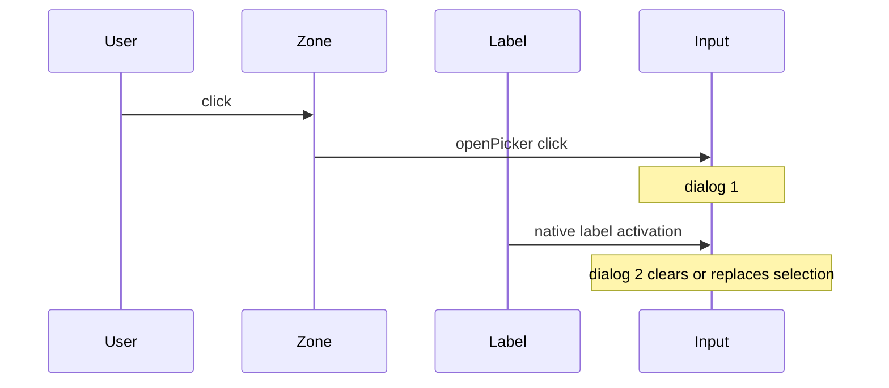

# Фикс двойного file picker в мастере заявки

## Repro (alpha)

- Залогинен `user@vdp.local` / `user` → [https://alpha.vedy.io/forms/new](https://alpha.vedy.io/forms/new).
- DOM: `input[data-testid=wizard-invoice-file]` и zone — **оба внутри** `<label>` (родитель Field).
- Симптом: первый жест открывает picker повторно / выбор сбрасывается при отмене второго диалога.



## Root cause

В [`forms-new-page.tsx`](vdp/fe/src/components/ved/pages/forms-new-page.tsx) `Field` — wrapping `<label>`:

```847:861:vdp/fe/src/components/ved/pages/forms-new-page.tsx
    <label className="flex h-full flex-col">
      <span className={cn("label-caps", invalid && "text-destructive")}>{label}</span>
      <div ...>{children}</div>
      ...
    </label>
```

Инвойс/контракт рендерятся так:

```456:470:vdp/fe/src/components/ved/pages/forms-new-page.tsx
                <Field label="Инвойс ...">
                  <FilePickButton ... />
                </Field>
```

[`FilePickButton`](vdp/fe/src/components/ved/file-pick-button.tsx) уже вынес input **из** click-zone (фикс preventDefault), но input всё ещё **потомок label** → второй синтетический click на тот же file input.

## Подход (зафиксировано)

Узкий structural fix без перелома `getByLabel` у текстовых полей мастера:

1. **Не оборачивать** `FilePickButton` в wrapping `<label>`.
2. Добавить локальный `FileField` (или `Field` с `as="div"`) — визуально тот же `label-caps` + invalid, но корень = `<div>`.
3. Заменить обёртку только у двух мест: инвойс и контракт.
4. В [`fe-interaction-contracts.mdc`](.cursor/rules/fe-interaction-contracts.mdc): явный запрет — `FilePickButton` / `input[type=file]` не внутри wrapping `<label>` (кроме `htmlFor` на чужой id без file control внутри).
5. Regression E2E в [`wave2-wizard.spec.ts`](vdp/fe/e2e/wave2-wizard.spec.ts): после zone click — **ровно один** `filechooser`; setFiles; имя файла в zone; второй `filechooser` за ~500ms не появляется.
6. Static guard в [`test-cd-scripts.sh`](vdp/scripts/test-cd-scripts.sh): `forms-new-page` не содержит `FilePickButton` между `<label` и `</label>` на wizard docs (практично: grep что invoice/contract используют `FileField` / нет `Field` вокруг FilePick).

Не трогать глобальный `Field` для текста/select — иначе сломается `getByLabel(/Номер контракта/)` и родственные e2e.

## Слои

| Слой | Действие |
|---|---|
| UI / FE | `FileField` + 2 вызова в docs step |
| Rules | запрет label вокруг file pick |
| Unit | при необходимости: markup-тест что FilePick не в label (или static CD) |
| E2E | single-filechooser regression в wave2-wizard |
| Compose / repro | localhost `/forms/new` жест; alpha после выката |
| Docs / notify | вне scope |

## QG / DoD

1. `make check-env-parity`
2. FE unit + `make test-cd-scripts` (новый guard)
3. **`make ci-pr-pilot`** — затронуты `vdp/fe/e2e/**` и wizard upload gesture (`честность-готовности`)
4. Локальный browser repro: один диалог, файл остаётся после выбора

## Сверка с rules

**Обязательны:** `планирование-сверка-с-rules`, `fe-interaction-contracts`, `ui-проблема-сразу-воспроизведи`, `playwright-e2e`, `честность-готовности`, `vdp-ci-local-gate`, `ui-web-практики`, `правила-построения`.

**Вне scope:** домен/API статусов, ActionPanel/demo ad-hoc file inputs (отдельный долг), mgmt-notify, `compose-fe-refresh` без спроса.

## Anti-pattern не делать

- Чинить только `preventDefault` на mouse, оставляя file input внутри label.
- Считать текущий gesture-тест достаточным: он ловит «открылся», но не «открылся один раз».
