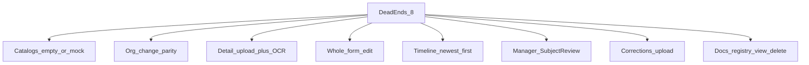

# План: тупики карточки заявки (8 пунктов со скринов)

## Почему снова

Предыдущий `api_core_ux_fixes` закрыл персист create, labels/CTA continuity и PDF на карточке, но **не** закрыл операционные тупики клиента/менеджера. Честно: W3 «Редактировать» = только сумма/валюта/HS; блок «Документы» на detail — read-only; delete в реестре FE сам отключает, хотя core уже умеет `DELETE …/files/{id}`.

## Сверка с `.cursor/rules` (MUST)

**Обязательны:** `честность-готовности`, `планирование-сверка-с-rules`, `базовые-правила-инструмента`, `правила-построения`, `use-cases`, `безопасность-ролей-и-данных`, `ui-web-практики`, `ux-взаимодействие-и-скорость`, `ux-формы-навигация-онбординг`, `поддержка-и-обратная-связь`, `тесты-архитектуры`, `интеграция-и-события`, `устойчивость-и-наблюдаемость`, `mgmt-tg-notify`, `playwright-e2e` / `go-testing` / `nestjs-testing` (по стеку), `solid` / `чистая-архитектура` (тонкий UI, политика в core).

**Вне scope:** ML-ядро, serverless FaaS, Nest↔vdp rename, CI seam harden (`ci_foundation_green_deploy`), FE Docker refresh без вопроса.

**Gate/DoD:** unit (vitest + Go) на mapper/order/OCR endpoints/patch org/delete file; Playwright journeys: empty counterparties CTA, org change, upload on draft+corrections, OCR controls, timeline newest-first, manager SubjectReview actions, registry preview+delete; после закрытия — `notify-mgmt.sh` kind `done`.

---

## 1. Моки / пустой справочник — не ставить клиента в тупик

**Факт:** Shenzhen/Anadolu/Emirates — из [`mock.ts`](vdp/fe/src/lib/ved/mock.ts) (demo). App должен брать API. Сейчас FE зовёт глобальный `GET /api/v1/counterparties` ([`catalog.ts`](vdp/fe/src/lib/api/catalog.ts)), а scoped уже есть: `GET /api/v1/counterparty/list` → `ListCounterpartiesFor`.

**Сделать:**
- FE `listCounterparties` → scoped list (`items`), без mock fallback.
- Empty state в [`RegistryManager`](vdp/fe/src/components/ved/RegistryManager.tsx) / страница контрагентов: «Справочник пуст — добавьте контрагента» + primary «Добавить»; в мастере create ([`forms-new-page.tsx`](vdp/fe/src/components/ved/pages/forms-new-page.tsx)) при 0 CP — не тупик: CTA в справочник + подсказка «или создайте заявку и догрузите документы на карточке».
- E2E: app `/counterparties` не показывает Shenzhen; empty или API-записи.

---

## 2. Смена организации клиента = паритет с контрагентом

**Факт:** org на detail — read-only ([`form-detail-page.tsx`](vdp/fe/src/components/ved/pages/form-detail-page.tsx)); `NestPatchInput` **без** `organization_id` ([`form_payment_nest.go`](vdp/core/internal/service/form_payment_nest.go)).

**Решение (зафиксировано):** те же роли/статусы, что у смены CP — `user|manager|root` на `draft|creating|*corrections*`.

**Сделать:**
- Core: поле `organization_id` в `NestPatchInput` + AuthZ (user — только свои доступные org; manager/root — шире).
- FE: `OrganizationPickDialog` по образцу `CounterpartyPickDialog`; ссылка «Сменить организацию» рядом с карточкой org; в мастере select остаётся editable (список из API).

---

## 3 + 7. Догрузка документов + OCR start / restart / cancel (и после возврата)

**Факт:** блок Документы на detail — empty text без upload ([`form-detail-page.tsx`](vdp/fe/src/components/ved/pages/form-detail-page.tsx) ~326–336). После `form_waiting_corrections` клиент видит «нет документов», но загрузить некуда — критичный тупик.

**Сделать на карточке (user|manager|root, статусы draft/creating/*corrections*):**
- Кнопки «Загрузить документы» в панели Документы → существующий `addDocuments` / `uploadFile`+`attachDocToForm`.
- OCR-панель всегда доступна при наличии docs / статусе creating|draft|corrections:
  - **Запустить / перезапустить распознавание** → новый core `POST /api/v1/forms/{id}/extraction/start` (enqueue `events.TypeOCRRequested`, как при Create).
  - **Отменить распознавание** → `POST …/extraction/cancel` (сброс незаconfirmed draft в `invoice_json`, timeline comment; идемпотентно).
  - Confirm остаётся как сейчас.
- Расширить [`extractionPanelMode`](vdp/fe/src/lib/ved/extraction.ts) + [`ExtractionReviewPanel`](vdp/fe/src/components/ved/ExtractionReviewPanel.tsx).

П.7 = тот же upload на `form_waiting_corrections` + явный CTA в empty state («Загрузите документы, затем Отправить исправления»).

---

## 4. Редактировать заявку целиком

**Факт:** в ActionPanel только submit/cancel; «Редактировать» спрятан в параметрах и правит 3 поля.

**Сделать:**
- В «Доступные действия» (и/или рядом со «Следующий шаг») primary-quiet **«Редактировать заявку»** для draft/creating/*corrections* (user|manager|root).
- Расширить [`FormParamsEditDialog`](vdp/fe/src/components/ved/FormParamsEditDialog.tsx): направление, вид, условие, сумма, валюты, HS, инвойс/контракт-мета + ссылки «сменить org/CP» (не дублировать upload — он в блоке Документы).
- Patch через существующий `patchForm` (+ org_id из п.2).

---

## 5. Хронология: будущее сверху

**Факт:** API `ORDER BY created_at ASC`, mapper без reverse ([`mappers.ts`](vdp/fe/src/lib/api/mappers.ts)).

**Сделать:** `mapComplianceHistory` возвращает newest-first; обновить [`mappers.test.ts`](vdp/fe/src/lib/api/mappers.test.ts). Демо-timeline при необходимости — тот же порядок. Все роли наследуют mapper.

---

## 6. Менеджер и проверка участников

**Факт:** при ICO/ECO off менеджер закрывает стадии через ActionPanel, но SubjectReview для него **readOnly** — бессмысленный info-блок.

**Решение (зафиксировано):** для `manager` (и `root`) на карточке — **интерактивный** `SubjectReview` (не readOnly), те же вердикты что у compliance; copy без «только ВКО/КО». Continuity CTA в ActionPanel остаются.

Файлы: [`form-detail-page.tsx`](vdp/fe/src/components/ved/pages/form-detail-page.tsx), [`SubjectReview.tsx`](vdp/fe/src/components/ved/SubjectReview.tsx).

---

## 8. Реестр документов: просмотр + удалить

**Факт:** modal — заглушка без `fileId`; `canDelete` только demo; `deleteDocument` в platform-store бросает, хотя core: `DELETE /api/v1/{nest}/form-payment/{id}/files/{fileId}` → `DeleteFileRef`.

**Сделать:**
- Просмотр: переиспользовать логику [`DocumentViewer`](vdp/fe/src/components/ved/DocumentViewer.tsx) (iframe PDF / download по `fileId`).
- FE `deleteDocument` → nest DELETE; включить delete в app для user|manager|root на своих формах (root — все).
- Убрать ложный tooltip «не поддерживается core API».

---

## Тесты (gate)

| Слой | Что |
|------|-----|
| Go | Patch `organization_id`; extraction start/cancel; DeleteFileRef очищает docs_json |
| Vitest | timeline newest-first; extractionPanelMode; SubjectReview manager interactive gate; catalog list mapper |
| Playwright | empty CP / no Shenzhen; org change link; upload on draft + on corrections; OCR start/cancel visible; edit CTA in actions; registry preview iframe + delete |

---

## Уведомление

После самопроверки DoD: `make -C vdp notify-mgmt KIND=done` (текст без IDE/путей планов/localhost) — rule `mgmt-tg-notify`.
