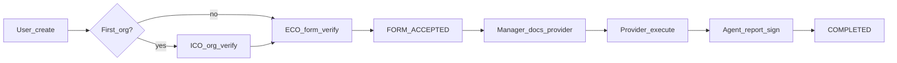

# П.1 — Gap-анализ backend-for-ved ↔ вводные

## Цель

Получить **согласованный объём доработок** для п.2: что переносить как есть, что адаптировать, чего не хватает по всему Fea360 (не только ядро заявки).

Источник требований: [`вводные/вводные от ви.txt`](вводные/вводные%20от%20ви.txt)  
Источник кода: [`кастомные модули для адаптации и переиспользования/backend-for-ved`](кастомные%20модули%20для%20адаптации%20и%20переиспользования/backend-for-ved)  
Артефакт результата: [`vdp/gap-analysis-backend.md`](vdp/gap-analysis-backend.md) (единственный документ п.1; код в `vdp/core` не пишем).

## Границы анализа

**В scope — полный разбор (ядро из вводных + весь сопутствующий контур кода):**

**Ядро процесса (вводные):**
- роли User / Internal CO / External CO / Manager / Provider и зоны видимости данных;
- статусы клиента (Новый / Активный / Заблокированный / Ожидающий обработки);
- оформление заявки (шаги 1–8);
- флоу ICO, ECO, Manager, Provider;
- документы: агентский договор, поручение, отчёт агента, инвойс, контракт, подтверждение оплаты;
- state machine заявки (статусы/переходы из вводных и полные таблицы переходов в коде).

**Расширенный контур (раньше был «вне глубокого разбора» — теперь в scope наравне с ядром):**
- роли `TREASURER`, `SENIOR_PROVIDER`, `REPORTER`, `ROOT`, `ONE_C` — endpoints, права, связь с заявкой/платежами;
- модули `Telegram`, `Liquidity`, `VirtualAccount`, `Recognition` (OCR);
- `Rate`, `CommissionCalculation`, `Payment` / интеграция 1C, `TreasurerTask`, `PaymentOrderGeneration`;
- связанные ветки state machine: treasurer-статусы, refund, shipment.

Для пунктов без прямого текста во вводных вердикт в матрице: `есть в коде / нет в ТД` + рекомендация для п.2 (`перенести as-is` / `адаптировать` / `вырезать из MVP` / `оставить как зависимость`). Решение «не брать» — только после разбора, не заранее.

## Метод сверки

Для каждого требования из вводных **и** каждого модуля/роли расширенного контура — строка матрицы:

| Поле | Смысл |
|------|--------|
| ID | например `ROLE-ICO`, `FLOW-USER-05`, `MOD-TELEGRAM`, `ROLE-TREASURER` |
| Требование | цитата из вводных **или** «нет в ТД — описание функции модуля» |
| Код | путь + enum/endpoint/сервис |
| Вердикт | `есть` / `частично` / `нет` / `лишнее` / `маппинг` / `нет в ТД` |
| Доработка | что сделать в п.2 (1 предложение) |
| Риск | блокер MVP / средний / низкий |

Вердикт `маппинг` — когда смысл есть, но имена/модель другие (пример: клиент «Активный» ↔ `OrganizationStatus.APPROVED` + `isActive`).  
Вердикт `нет в ТД` — функция есть только в коде; фиксируем ценность и рекомендацию переноса.

## Порядок работ (исполнение после утверждения плана)

### 1. Карта ролей и AuthZ
- Сверить 5 ролей вводных с [`AccountRole`](кастомные%20модули%20для%20адаптации%20и%20переиспользования/backend-for-ved/src/lib/enums/models/account.enums.ts): `USER`, `INTERNAL_COMPLIANCE_OFFICER`, `COMPLIANCE_OFFICER` (= External), `MANAGER`, `PROVIDER`.
- **Полный разбор** `TREASURER`, `SENIOR_PROVIDER`, `REPORTER`, `ROOT`, `ONE_C`: декораторы, controllers, пересечение с form-payment/payment.
- Проверить guards (`roles.guard`, `*-method`) и ограничения Provider без ПДн.

### 2. Статусы клиента / организации
- Маппинг «Новый / Активный / Заблокированный / Ожидающий обработки» → `OrganizationStatus`, `isActive`, `account.blocked`, рейтинг/очередь менеджера.
- Пробелы: запрос на разблокировку, «ожидающий» из-за красного/жёлтого рейтинга.

### 3. State machine заявки
- Разобрать [`FormPaymentStatus` / `FormPaymentStage`](кастомные%20модули%20для%20адаптации%20и%20переиспользования/backend-for-ved/src/lib/enums/models/form-payment.enums.ts) и таблицы переходов в [`form-payment.constants.ts`](кастомные%20модули%20для%20адаптации%20и%20переиспользования/backend-for-ved/src/modules/form-payment/form-payment.constants.ts).
- Наложить целевой флоу вводных **и** параллельные ветки (treasurer, refund, shipment, postpay/export variants).
- Зафиксировать TODO в `form-payment.service.ts`.

### 4. Флоу по ролям (endpoint-level)
Сверить действия с контроллерами:
- User / ICO / ECO / Manager / Provider — по шагам вводных;
- Treasurer / Senior Provider / ONE_C — полный перечень API и связь со статусами заявки.

### 5. Документы и поля
По 6 типам документов из вводных — schema/docx + Diadoc (manual vs diadoc signing).

### 6. Расширенные модули (полный разбор)
По каждому модулю: назначение, ключевые endpoints/сервисы, зависимости от form-payment/org, зрелость, вердикт для п.2.

| Модуль | Точки входа (ориентир) |
|--------|------------------------|
| Telegram | `src/modules/telegram/` |
| Liquidity | `src/modules/liquidity/` (+ CO/ICO controllers) |
| VirtualAccount | `src/modules/virtual-account/` |
| Recognition | `src/modules/recognition/` |
| Rate | `src/modules/rate/` (внутри FormPayment) |
| CommissionCalculation | `src/modules/commission-calculation/` |
| Payment + 1C | `src/modules/payment/` |
| TreasurerTask | `src/modules/treasurer-task/` |
| PaymentOrderGeneration | `src/modules/payment-order-generation/` |

### 7. Сводка объёма для п.2
- **Must-have** (блокеры соответствия вводным);
- **Should-have** (адаптация / вырезание / упрощение);
- **Перенести as-is** (включая расширенный контур, если разбор подтвердил ценность);
- **Вырезать / отложить** — только с обоснованием после п.6;
- Грубая оценка: число модулей, переходов, gap по документам.

## Критерий готовности п.1

П.1 закрыт, когда есть [`vdp/gap-analysis-backend.md`](vdp/gap-analysis-backend.md) с матрицей по **ядру и расширенному контуру**, и ты подтверждаешь сводку — после этого планируем п.2.

## Вне scope п.1

- Копирование кода в `vdp/core`
- Анализ фронта и прочих кастомных модулей репозитория (это п.3–4)
- Проектирование новых фич «на будущее» (п.5)
