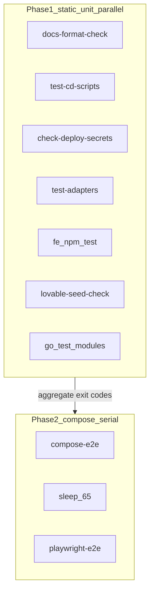

# План 1: gate без ранних блокеров и с параллелью

## Сверка с rules

Обязательны: `vdp-ci-local-gate`, `развертывание-и-доставка`, `тесты-архитектуры`, `devops-культура`, `планирование-сверка-с-rules`, `честность-готовности`, `mgmt-tg-notify` (только если трогаем precommit notify).

Вне scope: смена GitHub job graph в `.github/workflows/vdp-ci.yml`, второй compose-проект на одной машине, `compose-fe-refresh`, ML/FaaS/UI кабинетов.

Gate/DoD: после правок `cd vdp && make ci-pr-fast` показывает агрегированный отчёт по static/unit даже при одном красном шаге; полный `make ci-pr` сохраняет sleep 65 перед Playwright; красный итог не трактуется как «CI готов».

## Проблема сейчас

[`vdp/Makefile`](vdp/Makefile) гоняет `ci-pr` строго по цепочке; первый fail рвёт make:

1. docs-format-check
2. test-cd-scripts
3. test-adapters
4. fe npm test → lovable-seed → make test → compose-e2e
5. check-deploy-secrets
6. sleep 65
7. playwright-e2e

Из-за этого docs fail (как в последнем Local QG RUN) скрывает остальные красные/зелёные поверхности до следующего прогона. На GitHub `docs` и `fast` уже параллельны; локально паритет по времени хуже.

## Целевая схема

Фаза 1: все независимые проверки запускаются (параллельно где безопасно), собирают коды; итог fail если любой код ≠ 0. Фаза 2 стартует только если фаза 1 зелёная (compose/browser дорогие и зависят от стека) — либо, по явному флагу в скрипте, тоже запускаются «на сбор отчёта», но по умолчанию: static/unit всегда до конца, compose только после зелёной фазы 1, чтобы не тратить Docker на заведомо сломанный unit/docs.

Выбранный default (эффективность + ясность): **фаза 1 всегда run-all + parallel; фаза 2 только при зелёной фазе 1**. Это убирает «блокер docs скрыл adapters», но не гоняет Playwright поверх красных unit.

## Конкретные изменения

1. Новый скрипт [`vdp/scripts/ci-pr-static.sh`](vdp/scripts/ci-pr-static.sh) по образцу [`vdp/scripts/precommit-mgmt-notify.sh`](vdp/scripts/precommit-mgmt-notify.sh) (`set +e`, коды по шагам, summary в stdout):
   - параллельно: `docs-format-check`, `test-cd-scripts`, `check-deploy-secrets`, `test-adapters`, `lovable-seed-check`, `cd fe && npm test`, и восемь модулей из target `test` (отдельные `go test ./...` в фоне + `wait`);
   - печать таблицы результатов шаг → exit code;
   - exit 1 если любой шаг упал.

2. Переписать targets в [`vdp/Makefile`](vdp/Makefile):
   - `ci-pr-fast`: вызвать `ci-pr-static.sh`, затем при CODE=0 — `compose-e2e` (вынести хвост из `integration-gate` или оставить `integration-gate` как composed: static через скрипт + compose);
   - `ci-pr`: `ci-pr-fast` → sleep 65 → narrow `playwright-e2e` (secrets уже в фазе 1);
   - `integration-gate`: либо делегировать в тот же static-скрипт + compose, либо оставить legacy sequential для совместимости и сделать `ci-pr-fast` каноном — **канон = ci-pr-fast через скрипт**, `integration-gate` перевести на тот же скрипт чтобы не было двух истин.

3. Не трогать: единственный compose stack, sleep 65 перед browser, запрет параллельного compose+playwright на одном хосте.

4. Обновить [`.cursor/rules/vdp-ci-local-gate.mdc`](.cursor/rules/vdp-ci-local-gate.mdc): лестница gate и описание «static/unit run-all parallel → compose → pause → playwright»; убрать implicit «первый fail = стоп всего ci-pr-fast».

5. Тест на скрипт: лёгкий unit/smoke в `vdp/scripts/` (bash `-n` уже в `test-cd-scripts`; добавить проверку что скрипт агрегирует коды — минимальный fixture или вызов с `MAKE` stub только если уже есть паттерн; иначе достаточно `bash -n` + ручной DoD через `make ci-pr-fast`).

## DoD

- При искусственном fail docs остальные шаги фазы 1 всё равно выполняются и печатаются.
- Wall-time фазы 1 заметно ниже последовательной цепочки на многоядерной машине.
- `make ci-pr` после зелёной фазы 1 по-прежнему: compose-e2e → 65s → Playwright.
- Красный gate не объявляется «CI готов».
