# IMP2 — Импорт POSTPAY_RATE_ON_PP (домен)

Зависит от [IMP0](.cursor/plans/imp0_tz_align_615c5860.plan.md) §10.3 и закрытого [IMP1](.cursor/plans/imp1_advance_treasurer_e33c4156.plan.md). FE CTA/wizard — **IMP5**; три режима комиссии UI — **IMP3** (здесь достаточно rate+fee полей как сейчас).

## Зафиксированное поведение

```mermaid
flowchart LR
  soa[signing_order_accepted]
  pp[payment_processing]
  ps[payment_sent]
  adv[advance_signing_order]
  asa[advance_signing_order_accepted]
  pr[payment_received]
  rw[report_waiting]
  soa -->|"provider-first no client RUB"| pp
  pp --> ps
  ps -->|"rate+fee set"| adv
  adv --> asa
  asa -->|"client RUB"| pr
  pr -->|"TreasurerConfirm RATE_ON_PP"| rw
```

- Import + `payment_method=post_payment` → автоматически `platform_postpay_mode=POSTPAY_RATE_ON_PP`, `rate_on_provider=true` (Create + PatchForm).
- Primary-поручение **без курса** допустимо (POG не требует rate; overlay `EffectiveRateOnProvider` уже есть).
- После `payment_sent`: Manager задаёт rate+commission → доп. поручение `ADVANCE_*` (переходы overlay уже в [`transitions.go`](vdp/core/internal/domain/formpayment/transitions.go)).
- **TreasurerConfirm** при `post_payment` + `EffectiveRateOnProvider`: из `payment_received` → `report_waiting` (провайдер уже исполнил; не `payment_processing`).
- **Не трогать:** export `PAY_FROM_EXPORT` → `payment_sent_treasurer`; import advance → `payment_processing` (IMP1).

## Реализация

1. **Авто-режим** — [`form_payment_nest.go`](vdp/core/internal/service/form_payment_nest.go) `PatchForm` / Create path: если `DirectionImport` и `PaymentMethod == post_payment` и mode пуст → выставить `POSTPAY_RATE_ON_PP` + `RateOnProvider`. Явный другой mode не перетирать.

2. **[`machine.go`](vdp/core/internal/domain/formpayment/machine.go) `guardPaymentMethod`** — разрешить `ActionTreasurerConfirm` для `post_payment` **только** если `EffectiveRateOnProvider(form)`; иначе conflict (как сейчас).

3. **[`actions.go`](vdp/core/internal/domain/formpayment/actions.go) `TargetStatus(ActionTreasurerConfirm)`**  
   - `PAY_FROM_EXPORT` → `payment_sent_treasurer`  
   - `advance` / empty → `payment_processing`  
   - `post_payment` + rate-on-PP → `report_waiting`

4. **POG после курса на постоплате** — [`form_payment_pog.go`](vdp/core/internal/service/form_payment_pog.go) `maybeAutoEnqueuePOG`: при RATE_ON_PP и статусах `payment_sent` / `advance_signing_order*` после rate+fee — enqueue advance/import order generation; после `CalculateAndApplyCommission` тоже вызывать `maybeAutoEnqueuePOG` ([`rate_commission.go`](vdp/core/internal/service/rate_commission.go)), если rate уже задан.

5. **Docs** — [`docs_payload.go`](vdp/core/internal/service/docs_payload.go): primary при RATE_ON_PP без обязательного rate (пустые `rate_*` ок); unit на payload.

6. **Тесты**  
   - Domain: provider-first `signing_order_accepted → payment_processing` при RATE_ON_PP; `payment_sent → advance_signing_order`; TreasurerConfirm post_payment → `report_waiting`; без RATE_ON_PP post_payment confirm reject; IMP1 advance/export без регрессии.  
   - HTTP: создать/patch post_payment → mode выставлен; узкий Nest-путь confirm после `payment_received` на RATE_ON_PP.  
   - Не Playwright / не полный ci-pr (IMP6).

## Сверка с `.cursor/rules`

**Обязательны:** `планирование-сверка-с-rules`, `правила-построения`, `use-cases`, `чистая-архитектура`, `solid`, `безопасность-ролей-и-данных`, `интеграция-и-события`, `тесты-архитектуры`, `go-testing`, `честность-готовности`.

**Вне scope:** FE/wizard CTA (IMP5), комиссия 6.1–6.3 UI (IMP3), `POSTPAY_FIXED_RATE`, export overpay, `mgmt-tg-notify`, `vdp-fe-docker-пересборка`, полный `make ci-pr`.

**Gate/DoD:** unit+HTTP на money-path RATE_ON_PP; AuthZ Treasurer; не заявлять «сквозной UI постоплаты»; ПДн провайдеру не расширять.

## Зависимости

После IMP2: IMP3 commission modes и/или IMP5 FE postpay. Verify package — IMP6.
