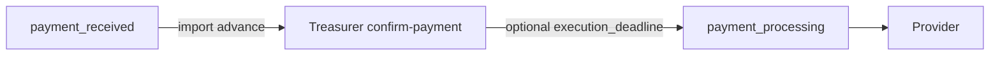

# IMP4 — FE импорт-аванс: казначей

Зависит от закрытых [IMP1](imp1_advance_treasurer_e33c4156.plan.md) (домен/API confirm) и [IMP3](imp3_commission_modes_f770a5af.plan.md) (контракт `reward_mode` — UI режимов не в этом этапе). ТЗ: [`вводные/расширение вводных.txt`](вводные/расширение%20вводных.txt) §10.2 п.4.

## Зафиксированное поведение

- На `payment_received` при импорт + `payment_method=advance` (или empty MVP): роль **treasurer** видит primary CTA «Подтвердить покрытие» → `PATCH /api/v1/treasurer/form-payment/{id}/confirm-payment` (+ опционально `execution_deadline`).
- [`nestFormPrefixForRole`](vdp/fe/src/lib/api/forms.ts): `treasurer` → `"treasurer"` (сейчас ошибочно `"manager"`).
- Manager на этом статусе: назначение провайдера / прочие side-effect; **не** подменять казначея как «следующий шаг» на авансе — спрятать или demote `mgr_payment_start` / app `payment_start` для import advance (guided next = treasurer).
- Экспортный `PAY_FROM_EXPORT` / Nest treasurer-order пути — не ломать; CTA confirm только для импорт-аванса (и empty method как в IMP1).

## Реализация

1. **Роль и seed**
   - Добавить `"treasurer"` в [`VedRole`](vdp/fe/src/lib/ved/types.ts), JWT whitelist [`session.tsx`](vdp/fe/src/lib/auth/session.tsx), [`ROLES`](vdp/fe/src/lib/ved/roles.ts), [`APP_SEED_ACCOUNTS`](vdp/fe/src/lib/ved/app-seed-accounts.ts).
   - В core seed ([`seed.go`](vdp/core/internal/repository/seed/)) завести account `treasurer@vdp.local` / role treasurer (сейчас в seed нет — HTTP-тесты IMP1 шли через root).
   - Nav: очередь заявок для treasurer в [`nav-config.ts`](vdp/fe/src/lib/ved/nav-config.ts); capability map в [`process-role-filter.ts`](vdp/fe/src/lib/ved/process-role-filter.ts) (`treasurer.ops`).

2. **Nest API client**
   - Исправить `nestFormPrefixForRole("treasurer")` → `"treasurer"`; кейс в [`forms-nest-prefix.test.ts`](vdp/fe/src/lib/api/forms-nest-prefix.test.ts).
   - Хелпер `confirmTreasurerPayment(formId, { execution_deadline? })` → `PATCH /api/v1/treasurer/form-payment/{id}/confirm-payment` (в [`forms.ts`](vdp/fe/src/lib/api/forms.ts)).

3. **CTA / bridge**
   - [`app-actions.ts`](vdp/fe/src/lib/ved/app-actions.ts) + demo [`actions.ts`](vdp/fe/src/lib/ved/actions.ts): матрица `treasurer` × `payment_received` → confirm CTA.
   - [`action-bridge.ts`](vdp/fe/src/lib/ved/action-bridge.ts) + [`platform-store.ts`](vdp/fe/src/lib/ved/platform-store.ts): side-effect `nest_confirm_payment` (не `transitionForm` без nest prefix).
   - [`ActionPanel.tsx`](vdp/fe/src/components/ved/ActionPanel.tsx) + [`manager-payment.ts`](vdp/fe/src/lib/ved/manager-payment.ts): deadline на confirm; для import advance скрыть/disable `mgr_payment_start` / `prov_payment_start` на `payment_received`.
   - Guided copy: [`mappers.ts`](vdp/fe/src/lib/api/mappers.ts) `waitingActorRoles` / `nextStepHint` — treasurer на `payment_received` при advance; manager — «ожидает казначея», assign provider остаётся.

4. **Тесты (без Playwright)**
   - Unit: nest prefix, `appActionsFor("treasurer", "payment_received")`, bridge → nest confirm, gating в `manager-payment`.
   - Не править полный [`pilot-matrix-full-ladder.spec.ts`](vdp/fe/e2e/pilot-matrix-full-ladder.spec.ts) / `make ci-pr` (IMP6).

## Сверка с `.cursor/rules`

**Обязательны:** `планирование-сверка-с-rules`, `правила-построения`, `use-cases`, `ui-web-практики`, `ux-*` (guided next / один primary CTA), `безопасность-ролей-и-данных`, `честность-готовности`, `тесты-архитектуры`, `typescript-clean-code`.

**Вне scope:** POSTPAY_RATE_ON_PP wizard/CTA (IMP5), UI трёх режимов `reward_mode` (IMP5 rate/commission panel), Playwright, `make ci-pr` (IMP6), `compose-fe-refresh` без спроса, export overpay-only UX redesign.

**Gate/DoD:** treasurer логинится seed’ом; confirm с/без deadline меняет статус на `payment_processing` через nest; manager не выдаёт казначейский шаг за свой primary на авансе; не утверждать «полный UI комиссии» и «сквозной E2E аванса».

## Зависимости

После IMP4: [IMP5 FE postpay](imp5_fe_postpay) (wizard + rate/`reward_mode` panel). Verify package — IMP6.
