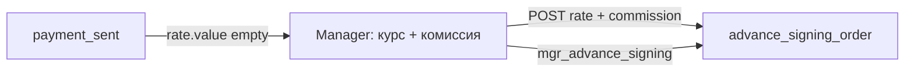

# IMP5 — FE постоплата RATE_ON_PP: курс и комиссия

Зависит от закрытых [IMP2](imp2_postpay_rate_on_pp_afc3b0c8.plan.md) (домен RATE_ON_PP) и [IMP3](imp3_commission_modes_f770a5af.plan.md) (reward_mode API). ТЗ: [`вводные/расширение вводных.txt`](вводные/расширение%20вводных.txt) §10.3 п.4 и §10.5.

## Зафиксированное поведение

- На `payment_sent` при `platform_postpay_mode=POSTPAY_RATE_ON_PP` Manager фиксирует курс и комиссию (§10.3 п.4).
- Комиссия: три режима из IMP3 (fixed / percent / percent_plus_fixed) — UI selector.
- После сохранения курса+комиссии: кнопка `mgr_advance_signing` формирует доп. поручение → статус `advance_signing_order`.
- Если rate пуст — `mgr_advance_signing` заблокирован с guided hint.
- Чтение: API уже возвращает `rate.*`, `commission.*` в GET /forms/{id}.

## Реализация

### 1. API helpers
[`forms.ts`](vdp/fe/src/lib/api/forms.ts):
- `setRate(formId, { value, currency, source })` — `POST /api/v1/forms/{id}/rate`
- `setCommission(formId, { reward_mode, fee_percent?, fee_fix?, fee_currency })` — `POST /api/v1/forms/{id}/commission`

### 2. RateCommissionPanel
Новый [`RateCommissionPanel.tsx`](vdp/fe/src/components/ved/RateCommissionPanel.tsx):
- Props: `formId`, `canEdit`, `rate`, `commission`, `invoiceAmount`, `currency`
- Read-only блок: текущий курс / комиссия / режим (если заполнены)
- Edit form (canEdit=true):
  - Rate: value + currency + source (manual / market)
  - Commission: reward_mode selector (fixed / percent / percent_plus_fixed) + соответствующие поля
- useMutation для `setRate` + `setCommission`; invalidateQueries form после успеха
- UX: сохранить обе части одним «Сохранить курс и комиссию» или последовательно

### 3. Интеграция form-detail-page
[`form-detail-page.tsx`](vdp/fe/src/components/ved/pages/form-detail-page.tsx):
- Условие показа панели: `role === "manager"` и `status === "payment_sent"` и `isPostpayRateOnPP(form)`
- `canEdit`: когда rate.value пуст или явное условие редактирования
- Прокинуть `rate`, `commission` из `CoreForm` / mapped form

### 4. Детект и gating
[`manager-payment.ts`](vdp/fe/src/lib/ved/manager-payment.ts):
- `isPostpayRateOnPP(form)` — true если `platform_postpay_mode === "POSTPAY_RATE_ON_PP"` или `rate_on_provider === true`
- `blocksAdvanceSigningWithoutRate(form)` — true на `payment_sent` + RATE_ON_PP + rate.value пуст

[`actions.ts`](vdp/fe/src/lib/ved/actions.ts) / [`app-actions.ts`](vdp/fe/src/lib/ved/app-actions.ts):
- Существующий `mgr_advance_signing` на `payment_sent` достаточен; gating через ActionPanel

[`ActionPanel.tsx`](vdp/fe/src/components/ved/ActionPanel.tsx):
- Для `mgr_advance_signing` при `isPostpayRateOnPP && !rate.value`: disable + hint «Укажите курс и комиссию»

### 5. Типы
[`types.ts`](vdp/fe/src/lib/ved/types.ts) (если нужно):
- `RewardMode = "fixed" | "percent" | "percent_plus_fixed"`
- Расширить `PaymentForm` / `CoreForm` type (rate, commission структуры)

### 6. Тесты (без Playwright)
- Unit: `setRate` / `setCommission` mock API
- Unit: `isPostpayRateOnPP`, `blocksAdvanceSigningWithoutRate`
- Unit: ActionPanel gating для `mgr_advance_signing`

## Сверка с `.cursor/rules`

**Обязательны:** `планирование-сверка-с-rules`, `правила-построения`, `use-cases`, `ui-web-практики`, `ux-*` (один primary CTA, guided hints), `безопасность-ролей-и-данных`, `честность-готовности`, `тесты-архитектуры`, `typescript-clean-code`.

**Вне scope:** Playwright E2E, `make ci-pr` (IMP6), export treasurer, POSTPAY_FIXED_RATE, PDF шаблоны primary без курса, `compose-fe-refresh` без спроса.

**Gate/DoD:** Manager видит панель на `payment_sent` при RATE_ON_PP; сохраняет rate+commission через API; `mgr_advance_signing` заблокирован до заполнения rate; unit на gating и API helpers; не утверждать «полный UI календаря deadline» или «E2E postpay».

## Зависимости

После IMP5: IMP6 (verify package / `make ci-pr`).
