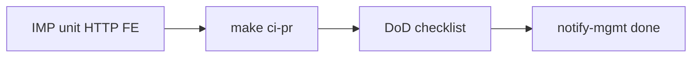

# IMP6 — Verify package импортных маршрутов

Закрывает пакет после [IMP0](imp0_tz_align_615c5860.plan.md)–[IMP5](imp5_fe_postpay_rate_46db5010.plan.md). Новый продуктовый код не пишем, кроме фиксов, если gate красный.

## Зафиксированное поведение



- Регрессия money-path: HTTP `imp1` / `imp2` / `imp3` + FE unit (treasurer gate, rate/commission, nesting).
- Gate поставки: `cd vdp && make ci-pr` (docs + adapters + integration + узкий Playwright из PR).
- Не утверждать «сквозной E2E аванс/постоплата в браузере» и «паритет 100%» — покрытие = unit/HTTP + PR smoke.
- После зелёного gate: `notify-mgmt` kind `done` продуктовым языком (казначей на авансе; курс и режимы вознаграждения на постоплате).

## Реализация

### 1. Целевая регрессия (быстрый сигнал)
Из `vdp/`:

```sh
go test ./core/internal/transport/http/ -count=1 -run 'IMP1|IMP2|IMP3'
go test ./core/internal/domain/formpayment/ -count=1 -run 'Commission|Postpay|Treasurer|RateOn'
```

Из `vdp/fe/`:

```sh
npm test -- --run src/lib/ved/manager-payment.test.ts src/lib/api/forms-rate-commission.test.ts src/lib/api/forms-nest-prefix.test.ts src/lib/api/mappers.test.ts
```

Красное → чинить в том же IMP6 (минимальный diff), не открывать новый продуктовый scope.

### 2. Локальный PR-gate
```sh
cd vdp && make ci-pr
```
Shell агента сразу с `required_permissions: ["all"]` (`vdp-ci-local-gate`).  
Не `release-gate`, не `ci-pr-pilot` (pilot-matrix не расширяли под treasurer/rate в IMP4/5).

`compose-fe-refresh` — только после явного «да» пользователя, если FE в Docker падает на deps.

### 3. DoD-чеклист пакета (честность)
Пройти и зафиксировать в ответе / done-notify без ложной полноты:

| Слой | Критерий |
|------|----------|
| IMP1 | TreasurerConfirm import advance → `payment_processing`; HTTP green |
| IMP2 | Auto `POSTPAY_RATE_ON_PP`; provider-first; confirm postpay → `report_waiting` |
| IMP3 | `reward_mode` fixed/percent/percent_plus_fixed normalize+HTTP |
| IMP4 | FE treasurer seed/prefix/CTA; hide mgr payment_start на авансе |
| IMP5 | RateCommissionPanel + gating `mgr_advance_signing` без rate |
| IMP6 | `make ci-pr` green |

Вне DoD пакета: `POSTPAY_FIXED_RATE`, export overpay-treasurer redesign, PDF primary без курса, полный browser journey postpay, `make release-gate`.

### 4. Закрытие волны
```sh
make -C vdp notify-mgmt KIND=done TITLE='…' BODY='…'
```
Текст: продукт для менеджмента (рублёвое покрытие казначеем на авансе; после ПП — курс и три режима вознаграждения, доп. поручение). Без plan-id, IDE, путей `.cursor/plans`, localhost, учёток (`mgmt-tg-notify`).

## Сверка с `.cursor/rules`

**Обязательны:** `планирование-сверка-с-rules`, `правила-построения`, `vdp-ci-local-gate`, `честность-готовности`, `тесты-архитектуры`, `mgmt-tg-notify`, `use-cases` (только сверка DoD), `безопасность-ролей-и-данных` (без расширения ПДн).

**Вне scope:** новые фичи FE/домена; `vdp-fe-docker-пересборка` без спроса; `release-gate`; новые Playwright spec под IMP; intake/Lovable.

**Gate/DoD:** целевые IMP-тесты + `make ci-pr` зелёные; notify `done`; не заявлять полный E2E импортных маршрутов и не `ci-pr-pilot` без зелёного ci-pr.
