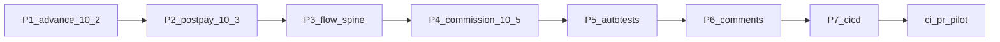

# Серия планов роста: импорт и страховка

После [IMP6](imp6_verify_package_95a93911.plan.md) домен/API/FE unit закрыты; главный пробел — browser/UAT и честность docs. Порядок исполнения жёсткий: P1→P7, затем глобальный gate.

Семь дочерних планов уже материализованы: `.cursor/plans/imp7_*.plan.md` … `cicd_import_ops_*.plan.md` (todo materialize-plans completed). Выполнять по порядку P1→P7.

---

## P1 — Импорт аванс §10.2 (`imp7_advance_uat`)

**Цель.** Доказать §10.2 в браузере и закрыть честность docs (treasurer уже в pilot-matrix).

**Факты.** [`pilot-matrix-full-ladder.spec.ts`](vdp/fe/e2e/pilot-matrix-full-ladder.spec.ts) уже: hide mgr payment_start → `awaits-treasurer` → confirm → `payment_processing`. HTTP: [`imp1_treasurer_advance_test.go`](vdp/core/internal/transport/http/imp1_treasurer_advance_test.go). Нет E2E на `execution_deadline`; docs всё ещё пишут «pilot-matrix под treasurer не заявлен».

**Работы.**
- Расширить ladder: ввод срока в UI казначея (модалка в [`ActionPanel.tsx`](vdp/fe/src/components/ved/ActionPanel.tsx)) и assert, что после confirm заявка в `payment_processing`.
- Прогнать `make playwright-pilot-matrix` из `vdp/`.
- Обновить [`known-gaps.md`](vdp/docs/pilot/known-gaps.md) и [`form-lifecycle.md`](vdp/docs/domain/form-lifecycle.md): advance treasurer в `@pilot-matrix` заявлен; полный wizard `payment_method: advance` end-to-end — всё ещё вне этого пакета.
- Регресс: `go test … -run IMP1`.

**Вне scope.** POSTPAY ladder, PDF, PR smoke расширение, `POSTPAY_FIXED_RATE`.

**DoD.** Deadline E2E green; docs sync; IMP1 green.

---

## P2 — POSTPAY_RATE_ON_PP §10.3 (`imp8_postpay_uat`)

**Цель.** Первый полный browser ladder provider-first → курс/комиссия → доп. поручение → казначей → `report_waiting`.

**Факты.** HTTP: [`imp2_postpay_rate_on_pp_test.go`](vdp/core/internal/transport/http/imp2_postpay_rate_on_pp_test.go). FE: [`RateCommissionPanel.tsx`](vdp/fe/src/components/ved/RateCommissionPanel.tsx), gating в [`manager-payment.ts`](vdp/fe/src/lib/ved/manager-payment.ts). Browser journey отсутствует. В [`actions.ts`](vdp/fe/src/lib/ved/actions.ts) у `treas_confirm_payment` зашит `nextStatus: "payment_processing"` — для postpay домен ведёт в `report_waiting` (проекция UI врёт).

**Prerequisite:** `@pilot-matrix` postpay держит CTA в sync с UI через `e2e/helpers/wizard.ts` (`wizard-save-draft`). Не удалять spec из‑за старого TEST_STALE «Создать черновик».

**Работы.**
- Новый `@pilot-matrix` spec (или ветка в full-ladder): import + `post_payment` → auto mode → provider до рублей → panel rate+один reward_mode → `mgr_advance_signing` (блок без rate) → user upload advance order → treasurer confirm → статус `report_waiting`.
- Исправить UI projection `treas_confirm_payment`: nextStatus зависит от маршрута (advance → `payment_processing`, RATE_ON_PP → `report_waiting`) согласованно с доменом; unit в `manager-payment.test.ts` / actions test.
- Регресс IMP2 + FE rate/commission unit.

**Вне scope.** `POSTPAY_FIXED_RATE`, PDF primary-without-rate workshop, все три режима в одном E2E (три режима — P4 unit).

**DoD.** Postpay `@pilot-matrix` green; CTA nextStatus честный; IMP2 green.

---

## P3 — Флоу заявки в целом (`flow_spine_hardening`)

**Цель.** Один spine + явные ветки без расхождения CTA/AuthZ/docs.

**Работы.**
- Построить таблицу сверки в прогрессе плана P3 (не ops-doc): advance / RATE_ON_PP / continuity без ICO·ECO / corrections / refund / provider return — статус × роль × действие vs [`actions.ts`](vdp/fe/src/lib/ved/actions.ts) + domain `RoleMayPerform` + bridge.
- Починить найденные расхождения проекции (по образцу treasurer nextStatus); не добавлять продуктовые фичи.
- Зафиксировать в [`form-lifecycle.md`](vdp/docs/domain/form-lifecycle.md): pilot happy path = report→completed; shipment — ветка, не обязательный ladder.
- Точечные unit/continuity contract, если CTA менялись.

**Вне scope.** Логистика, Nest migration, analytics, export overpay redesign.

**DoD.** Список расхождений пуст или все закрыты; lifecycle честен; `make test` / затронутые FE unit green.

---

## P4 — Вознаграждение §10.5 (`imp9_commission_polish`)

**Цель.** Три режима в обеих точках фиксации ТЗ, не только post-PP panel.

**Факты.** [`commission.go`](vdp/core/internal/domain/formpayment/commission.go) + IMP3 HTTP + RateCommissionPanel уже умеют `fixed|percent|percent_plus_fixed`. Чеклист во [`вводные/расширение вводных.txt`](вводные/расширение%20вводных.txt) §9 ещё `[ ]`.

**Работы.**
- FE unit: все три режима в панели (save payload) — расширить [`forms-rate-commission.test.ts`](vdp/fe/src/lib/api/forms-rate-commission.test.ts) / panel-level test.
- Проверить/дожать фиксацию комиссии на primary-поручении аванса (10.2 п.1): если manager уже шлёт commission до order — добавить HTTP/unit assert; если UI дыра на signing_order — минимальный wiring без нового дизайна.
- Edge validation: пустой percent / пустой fix → явная ошибка (уже в NormalizeAndCompute) — HTTP negative cases если нет.
- Синхронизировать галочки §9 вводных под факт кода (после green).

**Вне scope.** Четвёртый режим, bank org commission как deal commission, PDF формулы.

**DoD.** 3 режима × post-PP покрыты тестами; аванс-primary путь зафиксирован тестом или known-gap одной фразой; §9 sync.

---

## P5 — Автотесты (`test_pyramid_import`)

**Цель.** Поднять импорт с unit/HTTP на service + browser без раздувания PR smoke.

**Работы.**
- [`compose-e2e.sh`](vdp/scripts/compose-e2e.sh): два API journey — import advance treasurer→`payment_processing`; import postpay provider-first→rate→advance→treasurer→`report_waiting` (зеркало IMP1/IMP2 без браузера).
- Playwright: опереться на P1/P2 specs; не добавлять treasurer/postpay в обязательный PR smoke (4 specs).
- Документировать пирамиду одной правкой в [`known-gaps.md`](vdp/docs/pilot/known-gaps.md) / development testing при необходимости (`docs/conventions/format.md` для ops).

**DoD.** compose-e2e включает оба import API path; `make ci-pr` не обязан гонять полный postpay browser (это path-filter / pilot).

---

## P6 — Комментирование (`docs_comments_money_path`)

**Цель.** Контракт money-path в GoDoc/JSDoc, не % комментариев.

**Факты.** Package [`formpayment/doc.go`](vdp/core/internal/domain/formpayment/doc.go) и exports в actions/machine уже с GoDoc.

**Работы.**
- GoDoc: [`TreasurerConfirmPayment`](vdp/core/internal/service/form_payment_nest.go), HTTP `handleTreasurerConfirmPayment`, `SetCommission` / rate handlers — когда, кто (роль), куда статус (advance vs postpay).
- JSDoc: публичные `confirmTreasurerPayment`, `setRate`, `setCommission` в [`forms.ts`](vdp/fe/src/lib/api/forms.ts).
- Без новых markdown-программ и без комментариев «что делает очевидная строка».

**DoD.** Экспортируемые money-path точки с контрактом; review без шума.

---

## P7 — CI/CD (`cicd_import_ops`)

**Цель.** Path-filter ловит postpay/IMP surface; local proxy не молчит в gaps.

**Работы.**
- Расширить regex в [`vdp-ci.yml`](../.github/workflows/vdp-ci.yml) `detect-pilot-matrix`: добавить `RateCommissionPanel.tsx`, `manager-payment.ts`, `forms-rate-commission` / nest treasurer paths по факту файлов P2. Path-filter для pilot runs (ci-pr-pilot) и ревью; PR Playwright остаётся узким (4 required specs без полной postpay ladder).
- [`known-gaps.md`](vdp/docs/pilot/known-gaps.md): добавить явное упоминание — для локальной работы нужен `export VDP_API_PROXY_TARGET=http://localhost:8080` (или через .env), без этого proxy молчит; partial CD VM без изменения bootstrap.
- Не делать `release-gate` обязательным на PR; не расширять PR Playwright до полной матрицы.

**DoD.** Path-filter покрывает IMP FE+domain; docs caveat proxy; workflow валиден.

---

## Глобальная проверка (после P1–P7)

Из `vdp/` с полным снятием sandbox агента (`vdp-ci-local-gate`):

1. Целевые: `go test ./core/internal/transport/http/ -run 'IMP1|IMP2|IMP3'` + FE unit rate/commission/manager-payment.
2. **`make ci-pr-pilot`** (PR-паритет + `@pilot-matrix` с advance deadline и postpay ladder).
3. Синхрон [`readiness-and-limits.md`](vdp/docs/pilot/readiness-and-limits.md) датой/формулировками browser coverage.
4. `notify-mgmt` kind=`done` продуктовым языком ТОЛЬКО после зелёного ci-pr-pilot (один на всю серию P1-P7, не на каждый пакет; согласованно с `mgmt-tg-notify` rule).

`make release-gate` — вне этой серии (handover отдельно).

---

## Сверка с `.cursor/rules`

**Обязательны:** `планирование-сверка-с-rules`, `честность-готовности`, `use-cases`, `тесты-архитектуры`, `playwright-e2e`, `безопасность-ролей-и-данных`, `интеграция-и-события` (§3.6 исключение RATE_ON_PP), `vdp-ci-local-gate`, `mgmt-tg-notify`, `правила-построения`, `go-testing`.

**Вне scope серии:** ML/analytics product, serverless money-path, `POSTPAY_FIXED_RATE`, Nest data migration, `vdp-fe-docker-пересборка` без спроса, полный `release-gate`.

**Gate/DoD серии:** каждый пакет — свой DoD; серия закрыта только при зелёном `ci-pr-pilot` + честных gaps/readiness.
