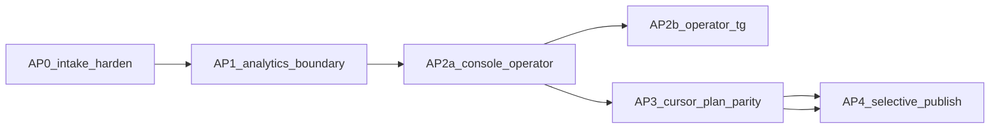

# Поток вводных: прикладные этапы (мастер AP0–AP5)

Это **сборка планов работ**, не немедленный код. Исполнять **по одному дочернему плану**; мастер не закрывать целиком. Модуль уже есть: [`инструменты/поток-вводных/`](инструменты/поток-вводных/). Устаревшие [`intake_master_index_c872b56d.plan.md`](.cursor/plans/intake_master_index_c872b56d.plan.md) / [`tg_intake_pipeline_8f8217bc.plan.md`](.cursor/plans/tg_intake_pipeline_8f8217bc.plan.md) — не исполнять; при старте AP0 пометить superseded.

## Зафиксированные решения

- **Операторский контур (1C):** волна **AP2a** — консоль `:8787` как операторский чат; волна **AP2b** — отдельный TG-чат/DM оператора + консоль как зеркало.
- **Планы (2B):** паритет с форматом Cursor [`.cursor/plans/*.plan.md`](.cursor/plans) (YAML frontmatter, `todos` id/content/status, обновление файла) в API + React UI — не урезанный «только markdown-черновик».
- **Не делаем в этой программе:** Ollama-диалог, webhook Bot API, stickers/voice, auto-run агента из TG, `make ci-pr` VDP, отдельный микросервис analytics.

## Сверка с `.cursor/rules`

**Обязательны:** `планирование-сверка-с-rules`, `базовые-правила-инструмента`, `правила-построения`, `workspace-карта` (tools ≠ `vdp/`), `границы-и-контексты` / `screaming-architecture` / `детали-как-плагины` (UI/TG — адаптеры; store/pipeline — истина), `интеграция-и-события` (статус HITL/плана в домене), `безопасность-ролей-и-данных` (Bearer console; без ПДн в mgmt-тексте), `mgmt-tg-notify` (продуктовый язык исходящих в manager-чат), `честность-готовности`, `go-testing` / `go-architecture`, `typescript-clean-code`, `ui-web-практики` + `ux-*`, `тесты-архитектуры` (unit + узкий smoke, без «мороженого» E2E).

**Вне scope:** `vdp-ci-local-gate` / `vdp-fe-docker-пересборка`, ML-ядро, serverless FaaS для статусов.

**Gate/DoD на каждую волну (золотая середина):** `make test` в модуле; FE typecheck/vitest при правках `fe/`; smoke `make smoke` или ручной `:8787` + Bearer; honesty в README волны; не заявлять «как Cursor IDE» сверх DoD паритета frontmatter/todos.

## Карта этапов ↔ волны

| Видение | Волна | Готовность сейчас | Фокус |
|---|---|---|---|
| Менеджер → общий TG | AP0 | ~85% | Harden + honesty gaps |
| «Модуль аналитики» | AP1 | ~70% | Явная граница пакета/контракта, не новый сервис |
| Разбор бот+оператор | AP2a → AP2b | ~45% | Консоль-оператор, затем 2-й TG |
| Планы как Cursor | AP3 | ~40% | `.plan.md` frontmatter + todos UI |
| Выбор → TG | AP4 | ~55% | Publish selection + React parity mgmt |

---

## AP0. Harden intake (общий чат)

**Цель:** стабильный вход менеджера без ложных обещаний.

**Опора:** [`internal/pipeline/pipeline.go`](инструменты/поток-вводных/internal/pipeline/pipeline.go), [`internal/normalize`](инструменты/поток-вводных/internal/normalize), [`README.md`](инструменты/поток-вводных/README.md).

**Работы:**
- Зафиксировать матрицу: триггер → inbox/HITL vs thread-only (медиа без `@bot`/`/vvod`).
- Unit на classify + media-only path; README honesty без раздува.
- Опционально: явный `/help` копирайт «что попадёт в HITL».

**DoD:** `go test` зелёный; README совпадает с поведением; smoke poller+thread.

**Вне scope:** история до старта poller; stickers/voice.

---

## AP1. Analytics boundary (без нового процесса)

**Цель:** «модуль аналитики» как **явный пакетный контракт**, читаемый консолью/планом.

**Опора:** [`internal/analyze`](инструменты/поток-вводных/internal/analyze), [`proposal`](инструменты/поток-вводных/internal/proposal), [`estimate`](инструменты/поток-вводных/internal/estimate), [`conflict`](инструменты/поток-вводных/internal/conflict).

**Работы:**
- Один публичный результат анализа (DTO): class, confidence, summary, conflicts, estimate — на границе pipeline → card/planfile/API.
- `GET` обогащения карточки/thread метаданными анализа (если ещё не в API).
- Unit table-driven на DTO; без HTTP-чата к внешнему LLM.

**DoD:** pipeline пишет один контракт; тесты на маппинг; README: analytics = in-process пакет.

**Вне scope:** отдельный docker-сервис analytics; Ollama.

---

## AP2a. Console = operator surface

**Цель:** консоль — полноценный операторский контур (решение 1C, фаза A).

**Опора:** [`internal/console/server.go`](инструменты/поток-вводных/internal/console/server.go), [`fe/src/routes/index.tsx`](инструменты/поток-вводных/fe/src/routes/index.tsx), vanilla [`internal/console/ui/app.js`](инструменты/поток-вводных/internal/console/ui/app.js).

**Работы:**
- React-паритет с vanilla: `mgmt/done`, `tg/delete`, `to-cursor` plan (не только prompt).
- Индикация доступов: консоль Bearer vs агент `key_…` (отдельные статусы в шапке).
- После `fe-sync` — не терять `fe/src/lib/api/**`.
- `make up` / smoke SPA.

**DoD:** оператор закрывает HITL, шлёт mgmt-done, сохраняет plan/prompt, видит статусы ключей без DevTools.

**Вне scope:** второй TG-чат (это AP2b).

---

## AP2b. Operator Telegram channel

**Цель:** второй allowlist chat (или DM) для бот↔оператор; manager-чат остаётся вводным.

**Опора:** [`internal/config/config.go`](инструменты/поток-вводных/internal/config/config.go) (`TELEGRAM_INTAKE_CHAT_IDS`), pipeline send paths.

**Работы:**
- Env: `TELEGRAM_OPERATOR_CHAT_IDS` (отдельно от manager intake).
- Маршрутизация: HITL-reminders / agent digests / operator prompts → operator chat; ack менеджеру — в manager chat (продуктовый язык).
- Thread store помечает `channel`/`chat_id`; консоль фильтр «оператор / менеджер».
- Unit на router; config load test.

**DoD:** два чата в env; тест маршрута; honesty: консоль всё ещё зеркало.

**Зависимость:** после AP2a.

---

## AP3. Cursor `.plan.md` parity (решение 2B)

**Цель:** сборка/правка плана в консоли = формат Cursor plans.

**Опора:** текущий [`internal/planfile/write.go`](инструменты/поток-вводных/internal/planfile/write.go) (урезанный frontmatter) → расширить до модели todos; референс существующих планов в [`.cursor/plans/`](.cursor/plans).

**Работы:**
- Модель `PlanDoc`: name, overview, todos[{id,content,status}], optional overview body; read/write YAML+markdown.
- API: `GET/PUT /api/plans/{id}`, list by card; HITL intake пишет совместимый `.plan.md` в `.cursor/plans/тгбот/`.
- React: редактор todos (добавить/статус/текст), сохранить, открыть path.
- Unit round-trip parse/write; не исполнять todos агентом автоматически.

**DoD:** файл открывается как plan в экосистеме Cursor (валидный frontmatter+todos); UI round-trip; тесты parse.

**Вне scope:** полный CreatePlan MCP; subagents/execution model UI.

---

## AP4. Selective publish → TG

**Цель:** оператор выбирает фрагменты (сообщения / ответ агента / summary плана) → превью → отправка в выбранный чат (manager или operator).

**Опора:** composer `mirror_to_tg`, [`comms.ManagerDone`](инструменты/поток-вводных/internal/comms/templates.go), SelectionBar.

**Работы:**
- `POST /api/publish`: source ids + edited text + target chat + sanitize.
- UI: «Отправить выбранное» с превью; опционально «отправить summary плана».
- Unit sanitize + deny без Bearer; smoke ручной в TG.

**DoD:** выбранный текст доходит в TG; tech-leak strip; React без зависимости от vanilla.

**Зависимость:** логично после AP2a; сильнее с AP3 (publish plan summary).

---

## Порядок исполнения и артефакты

При старте программы (после approve этого мастера) создать дочерние plan-файлы `ap0_…` … `ap4_…` по шаблону RD/IN (цель, сверка rules, DoD, вне scope) и пометить старый master index superseded.

**Порядок:** AP0 → AP1 → AP2a → AP3 → AP4; **AP2b** параллельно после AP2a или сразу после AP4, если приоритет publish выше второго TG — **по умолчанию AP2b сразу после AP2a** (решение 1C).

## Анти-паттерны

- Большой bang «весь Cursor IDE в консоли».
- Shared DB / analytics как отдельный деплой без мотива.
- Молчаливый auto-approve HITL или auto-pay из агента.
- Закрытие волны без unit/smoke и honesty %.
