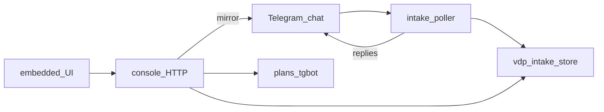

# Intake console: TG + локальная консоль

## Сверка с `.cursor/rules`

**Обязательны:** `планирование-сверка-с-rules`, `базовые-правила-инструмента`, `правила-построения`, `workspace-карта` (модуль tools, не продукт `vdp/`), `границы-и-контексты` / `screaming-architecture` / `детали-как-плагины` (консоль и Bot API — адаптеры; inbox/cards — ядро), `безопасность-ролей-и-данных` (токен только localhost; redact; без ПДн в логах), `интеграция-и-события` (один источник истины store; TG — проекция), `устойчивость-и-наблюдаемость` (таймауты HTTP, идемпотентность inbox), `go-architecture` / `go-testing` / `go-resilience-security`, `честность-готовности`, `mgmt-tg-notify` (зеркальные тексты менеджменту — продуктовый язык, не org-gate), `ui-web-практики` + `ux-формы-навигация-онбординг` / `ux-взаимодействие-и-скорость` / `ux-когнитивная-нагрузка` (один composer, понятная лента), `поддержка-и-обратная-связь` (консоль = операторский self-service над inbox).

**Вне scope:** Lovable; встраивание в [`vdp/fe`](vdp/fe); `vdp/hub` / product telegram link; Cursor Canvas как UI; webhook-режим Bot API; ML как истина HITL; `make ci-pr` продукта VDP как gate этого модуля; Nest.

**Зафиксированные решения:**
- Гибрид **2+3**: Telegram остаётся каналом; локальная консоль — пульт с богатым вводом и мостом в Cursor.
- Один store [`~/.vdp-intake`](инструменты/поток-вводных/internal/store/store.go) = истина; исходящие в TG идут через тот же клиент.
- UI: **встроенный** static UI (Go `embed` + vanilla JS), без отдельного npm-стека и без `vdp-fe`.
- Процесс: тот же [`cmd/intake`](инструменты/поток-вводных/cmd/intake/main.go) — poller + HTTP console (`INTAKE_CONSOLE_ADDR`, default `127.0.0.1:8787`).
- Auth: shared bearer из env (`INTAKE_CONSOLE_TOKEN`); bind только loopback.
- «В Cursor» = запись/дополнение draft в [`.cursor/plans/тгбот/`](инструменты/поток-вводных/internal/planfile/write.go) + явный eng prompt-файл рядом (не Automation webhook).

---

## IC0. Транспорт консоли: лента + текст + mirror

**Декомпозиция:** inbound HTTP; чтение inbox/cards; отправка текста в pipeline/store; опциональный mirror в allowlist-чат.

**Реализация:**
- Пакет `internal/console` (handlers) + `internal/console/ui` (`embed` index).
- API (JSON): `GET /health`, `GET /api/thread?limit=`, `POST /api/messages` `{text, mirror_to_tg, as_intake}` , `GET /api/cards`.
- Сообщение из консоли с `as_intake=true` проходит redact → AppendInbox → при HITL тот же путь proposal/card, что TG ([`pipeline`](инструменты/поток-вводных/internal/pipeline/pipeline.go)); не дублировать бизнес-логику в handler.
- `mirror_to_tg`: `SendMessage` через [`telegram.Client`](инструменты/поток-вводных/internal/telegram/client.go) + [`comms.SanitizeManager`](инструменты/поток-вводных/internal/comms/sanitize.go).
- Wire в `main`: goroutine `ListenAndServe` рядом с poll loop; config в [`config.go`](инструменты/поток-вводных/internal/config/config.go).
- Makefile: `console-url` / document `http://127.0.0.1:8787`; compose publish `8787:8787` только если bind внутри контейнера согласован (иначе host-run console).

**Отладка:** unit handlers (httptest); dry-run без токена TG; ручной POST → строка в `inbox/*.jsonl`; mirror → сообщение в чате.

---

## IC1. Медиа: upload, TG inbound/outbound files

**Декомпозиция:** локальный `media/`; расширение Bot API; UI attach.

**Реализация:**
- Store: `~/.vdp-intake/media/{id}` + метаданные в inbox record (`attachments[]`: path, mime, size, source).
- Telegram client: `getFile` + download; parse `photo`/`document`/`video` в Update; `sendDocument`/`sendPhoto` для mirror.
- `POST /api/upload` (multipart); composer: image, video, «код как файл» `.md`/`.sh`/`.go`.
- Poller: при медиа без текста — ingest caption или placeholder + attachment (redact caption).
- Лимиты размера и mime allowlist в config.

**Отладка:** unit parse Update с fixture photo; upload → file on disk; mirror document в TG; go test без сети (httptest Bot API).

---

## IC2. Cursor bridge + управление TG + шаблон менеджмента

**Декомпозиция:** явные действия оператора; delete; продуктовый текст.

**Реализация:**
- `POST /api/to-cursor` `{card_id|text, mode: plan|prompt}` → [`planfile.WriteMarkdown`](инструменты/поток-вводных/internal/planfile/write.go) и/или `тгбот/{id}.prompt.md` (инструкция агенту: что сделать в workspace).
- UI: кнопки HITL approve/decline (тот же [`ParseHitlDecision`](инструменты/поток-вводных/internal/comms/hitl.go) / card transitions); «В Cursor».
- Telegram: `deleteMessage`; UI «удалить в TG» по `chat_id`+`message_id` (для правок кривых notify).
- Шаблон исходящего «готово для менеджмента»: заголовок + продуктовые буллеты (запрет plan-id / org-gate / имён раннеров) — согласовать с духом [`mgmt-tg-notify`](.cursor/rules/mgmt-tg-notify.mdc); консоль может звать `vdp/scripts/notify-mgmt.sh` **или** тонкую обёртку через Bot API в тот же чат — зафиксировано: **отправка через intake Bot API + sanitize модуля**, без зависимости runtime от `vdp/Makefile` (tools автономен); при желании оператор вручную дублирует kind=done из vdp.

**Отладка:** unit to-cursor пишет файл в temp workspace; deleteMessage mock; ручной сценарий: консоль → plan в `.cursor/plans/тгбот/` → открытие в Cursor.

---

## DoD программы

- Консоль на loopback открывается, лента показывает inbox+исходящие метаданные; текст с mirror виден в Telegram.
- Медиа round-trip (upload ↔ disk; inbound TG file → media).
- «В Cursor» создаёт eng-артефакт без ссылок/техжаргона в manager chat.
- Unit-тесты новых пакетов зелёные; `go test ./...` в модуле.
- Честно: это **операторский** контур tools, не кабинет ВЭД и не 100% паритет всех TG update types (stickers/voice вне MVP).
- Документация how-to только в модуле (README короткий) — **по запросу** или минимальный блок в существующий README модуля, без распыления ops-docs в `vdp/docs`.
