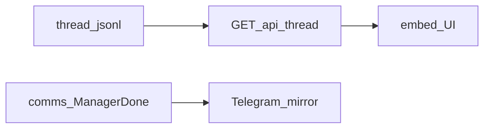

# Intake console polish (после IC0–IC2)

## Контекст

Программа [`intake_console_hybrid`](.cursor/plans/intake_console_hybrid_ef509d1a.plan.md) **уже реализована** (todos completed). Консоль, медиа, to-cursor, HITL, delete, mgmt/done — в [`инструменты/поток-вводных`](инструменты/поток-вводных).

Эта волна закрывает **honesty gaps / PARTIAL**, не переписывает MVP.

## Сверка с `.cursor/rules`

**Обязательны:** `планирование-сверка-с-rules`, `базовые-правила-инструмента`, `правила-построения`, `workspace-карта` (tools, не `vdp/`), `границы-и-контексты` / `детали-как-плагины`, `безопасность-ролей-и-данных` (localhost + bearer; sanitize), `интеграция-и-события` (store = истина; TG = проекция), `mgmt-tg-notify` (продуктовый язык исходящих), `честность-готовности`, `go-testing` / `go-architecture`, `ui-web-практики` (одна лента, один composer).

**Вне scope:** Lovable / `vdp/fe`; webhook Bot API; stickers/voice; смена HITL-политики; `make ci-pr` VDP; переделка IC0–IC2 с нуля.

**Зафиксированные решения:**
- Лента консоли = [`ListThreadRecent`](инструменты/поток-вводных/internal/store/thread.go) (уже пишется через `AppendThread` в pipeline), не только inbox.
- Медиа без `@bot`/`/vvod` **не** становится intake автоматически — только документируем + unit на `pullMedia`.
- Шаблон mgmt-done: helper в [`comms`](инструменты/поток-вводных/internal/comms/) + sanitize; отправка по-прежнему через Bot API модуля.

---

## ICP1. Лента = thread

**Декомпозиция:** [`handleThread`](инструменты/поток-вводных/internal/console/server.go) сейчас зовёт `ListInboxRecent` — зеркала outbound и chat-линии теряются.

**Реализация:**
- `GET /api/thread` → `Store.ListThreadRecent(limit)`.
- Подправить [`ui/app.js`](инструменты/поток-вводных/internal/console/ui/app.js) под поля `ThreadMsg` (`direction`, `text`, `attachments`, `at`, `message_id`…).
- Unit: AppendThread → GET thread видит outbound mirror.

**Отладка:** httptest после `AppendThread` direction=out.

---

## ICP2. ManagerDone template

**Декомпозиция:** `POST /api/mgmt/done` сейчас склеивает title/body ad-hoc.

**Реализация:**
- `comms.ManagerDone(title string, bullets []string) string` — заголовок + буллеты, `SanitizeManager`, без plan-id / org-gate / имён раннеров.
- Handler + UI передают bullets (textarea по строкам или JSON); статус «Приёмка: пройдена» в шаблоне.
- Unit на sanitize strip запрещённых маркеров.

**Отладка:** `go test ./internal/comms/`.

---

## ICP3. Тесты пробелов + honesty README

**Декомпозиция:**
- httptest: `/api/hitl`, `/api/tg/delete`, `/api/mgmt/done` (+ auth deny).
- Pipeline: fixture media → `pullMedia` / attachments на Record (без сети).
- README: явно «медиа без триггера `@bot`/`/vvod` → только thread, не HITL»; stickers/voice вне MVP.

**Gate:** из [`инструменты/поток-вводных`](инструменты/поток-вводных): `make test` / `go test ./...`. Smoke: `make console-url` + ручной open loopback (если env есть). `notify-mgmt` **не** обязателен (tools-модуль; только если закрываем продуктовую волну VDP — здесь skip).

---

## DoD

- Консоль показывает in+out из `thread/`.
- Mgmt-done идёт через `comms.ManagerDone` + sanitize.
- Новые/расширенные unit зелёные; `go test ./...` в модуле.
- Honesty: media-only trigger и stickers/voice зафиксированы в README; не утверждать «полный паритет TG updates».
