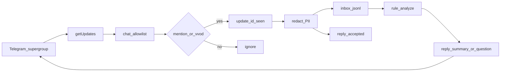

# План: intake по @mention + анализ и ответ в чате

## Что такое «W0 intake» (ответ на уточнение)

**W0** (в более новых планах то же самое названо **IN0**) — это **первая исполняемая волна** программы «поток вводных», только **транспорт**:

- бот читает Telegram (`getUpdates`);
- фильтрует нужный чат;
- принимает вход (раньше планировали команду `/vvod`);
- маскирует ПДн, пишет jsonl в `~/.vdp-intake/inbox/`;
- отвечает в чат коротко («принято»), **без** классификации, бэклога и планов.

Кода модуля ещё **нет** (`инструменты/поток-вводных/` пуст) — поэтому сообщения @mention видны в Bot API, но «к нам» в inbox не попадают. Волны **после** W0/IN0: контракт полей → интерпретация → draft волны работ (человек утверждает).

Старые планы: [`in0_intake_transport_da671411.plan.md`](.cursor/plans/in0_intake_transport_da671411.plan.md), [`tg_intake_pipeline_8f8217bc.plan.md`](.cursor/plans/tg_intake_pipeline_8f8217bc.plan.md). Этот план **заменяет триггер** `/vvod` на ваш актуальный сценарий **@mention** и явно добавляет волну «анализ + коммуникация».

## Цель на данном этапе

1. Принимать входящие в супергруппе при отметке **`@vdp_intake_bot`**.
2. Анализировать текст и **отвечать участникам** в том же чате (краткий разбор + при необходимости один уточняющий вопрос).

## Зафиксированные решения

- Бот: `@vdp_intake_bot`. Чат: супергруппа **`-1004449173165`** (уже в `~/.vdp-intake/env` как `TELEGRAM_INTAKE_CHAT_IDS` / `MGMT_NOTIFY_CHAT_ID`).
- Триггер приёма: entity `mention` на `@vdp_intake_bot` (как msg 14/15 в проверке). Дополнительно принимать `/vvod` и `/vvod@vdp_intake_bot` для совместимости со старым контрактом.
- Без `@` и без `/vvod` / `/help` — **молча** (не спамить чат).
- Анализ: **правила + эвристики** (длина, теги `#…`, тип сигнала `bug|gap|change|confused|noise|test`); **не** ML как истина; HITL.
- Ответ: reply на исходное сообщение; без эха полного сырого текста с ПДн; redact в логах/jsonl.
- Отдельный Go-модуль, **не** `vdp/hub`, не webhook на этом боте (long poll).
- Секреты только в `~/.vdp-intake/env`, не в образе/git.

## Сверка с `.cursor/rules` (MUST) — повторная 2026-09-09

Правило `планирование-сверка-с-rules` / `базовые-правила-инструмента`: план без явной матрицы rules не готов. Ниже — обязательные / вне scope / gate. Расхождения со старым IN0 (только `/vvod`) закрыты: триггер **@mention**, чат **`-1004449173165`**.

### Обязательны (как применяются)

| Rule | Применение в этом плане |
|------|-------------------------|
| `планирование-сверка-с-rules`, `базовые-правила-инструмента`, `workspace-карта` | Intake — **side-tool** в `инструменты/поток-вводных/`, не ядро `vdp/`; не vendored AMG. |
| `правила-построения`, `тесты-архитектуры`, `go-testing` | Unit на mention/dedupe/redact/analyze; ручной journey @mention → inbox → reply; не «мороженое» E2E браузера. |
| `честность-готовности` | После A: только транспорт; после B: анализ правил, не «полный backlog/IN3». Не писать «100% поток вводных». |
| `границы-и-контексты`, `screaming-architecture`, `чистая-архитектура`, `solid`, `детали-как-плагины` | Модуль по возможности «intake»; Telegram/HTTP — адаптеры; политика приёма/redact/analyze внутри; без shared DB с core/hub. |
| `безопасность-ролей-и-данных` | Redact ПДн в jsonl/логах/ответах; allowlist chat_id; токен не в git/образе; не тащить клиентские ПДн сделки в ответы. |
| `интеграция-и-события` | At-least-once `getUpdates` + идемпотентность `update_id`; UI/бот не источник статуса заявки. |
| `устойчивость-и-наблюдаемость`, `go-resilience-security`, `go-observability` | Timeout/backoff 429/5xx; в логах `update_id` + `message_id` + `chat_id` (correlation), без сырого ПДн. |
| `развертывание-и-доставка`, `devops-культура` | Отдельный compose/контейнер = один поллер; секреты снаружи; CI job на путь модуля. |
| `go-architecture` | `cmd/` + `internal/`; порты; без глобального god-state. |
| `машинное-обучение` (HITL) | Класс/confidence — эвристики; low → один вопрос человеку; **запрет** auto-pay / auto-approve / смена статуса заявки. |
| `поддержка-и-обратная-связь` | Ответ = ясный next step («принято» / краткий разбор / один clarify); `confused` → сигнал на UX/копирайт, не «умный статус». |
| `ux-взаимодействие-и-скорость` (Doherty) | Ack «принято» быстро после приёма. |
| `ux-когнитивная-нагрузка` (Hick/Miller) | Не больше **одного** уточняющего вопроса за ход; не простыня опций в чат. |
| `mgmt-tg-notify` | Канал менеджмента / `notify-mgmt` **не** смешивать с intake: анализ и ack только через `@vdp_intake_bot` в супергруппе. |

### Вне scope (явно не трогаем)

| Rule / зона | Почему вне |
|-------------|------------|
| `use-cases`, статусы/AuthZ/деньги `vdp/core` | Intake не машина статусов. |
| `vdp/hub`, webhook `vdp_notify_bot` | Другой бот/контур уведомлений продукта. |
| `nestjs-*`, `playwright-e2e`, `typescript-clean-code` | Нет Nest/FE в scope. |
| `vdp-fe-docker-пересборка` | FE не трогаем; refresh не спрашивать. |
| `vdp-ci-local-gate` (`make ci-pr`) | Gate для `vdp/**`; для intake — `go test` модуля + job `intake`, не подменять `ci-pr`. |
| `serverless-и-faas` | Полный intake-поллер — долгоживущий процесс, не FaaS как носитель истины. |
| `ui-web-практики`, кабинеты BDUI | Нет UI кабинета в этой волне. |
| `команды-и-закон-конвея` (орг) | Ownership: eng, модуль `tools/intake`; не плодить второй орфан-сервис в compose VDP. |
| Авто-`.cursor/plans/` / IN3 | Только после отдельного плана; человек утверждает. |
| LLM/Yandex как обязательный анализ в B | Later за портом; B = правила. |

### Gate/DoD из rules (проверяемо)

**Волна A:** unit mention|vvod|ignore; dedupe; redact; ack без эха; токен отсутствует в git/Dockerfile; hub/diff VDP compose чист; ручной @mention → строка inbox + «принято»; в логах есть `update_id`/`message_id`.

**Волна B:** unit classify + format reply; low confidence → ровно один вопрос; нет ПДн в reply/логах; статусы заявок не меняются; не утверждать «IN3/wave ready».

### Правки плана после сверки (зафиксировано)

1. Correlation в логах (не только jsonl) — обязательно A.
2. Явный запрет писать итоги анализа в `notify-mgmt` / mgmt-чат.
3. CI intake ≠ `make ci-pr` VDP.
4. Один clarify-вопрос — не опция, а правило Hick.

---

## Волна A — Транспорт приёма (бывший W0/IN0, триггер @mention)

Каталог: [`инструменты/поток-вводных/`](инструменты/поток-вводных/). Module: `github.com/viletech/tools/intake`.

Структура: `cmd/intake`, `internal/{telegram,normalize,redact,store,config,analyze}` (analyze stub-интерфейс в A, реализация в B).

1. Config из `~/.vdp-intake/env`: `TELEGRAM_INTAKE_TOKEN`, `TELEGRAM_INTAKE_CHAT_IDS=-1004449173165` (список через запятую).
2. `getUpdates` long poll; `--once` и цикл-демон; timeout + backoff 429/5xx.
3. Filter chat_id; detect `@vdp_intake_bot` mention **или** `/vvod`; `/help` → шаблон без записи в backlog.
4. Dedupe `~/.vdp-intake/seen/update_ids`; redact; append `~/.vdp-intake/inbox/YYYY-MM-DD.jsonl` (поля: `update_id`, `message_id`, `chat_id`, `from_id`, `from_username`, `trigger=mention|vvod`, `text` redact, `received_at`).
5. Reply «принято» (без эха тела).
6. Docker Compose **в модуле** + volume home; job `intake` в [`.gitlab-ci.yml`](.gitlab-ci.yml) на `go test ./...`.
7. После деплоя поллера: прогнать на уже висящих updates / новый @mention → строка в inbox.

**DoD A:** unit green; ручной `@vdp_intake_bot …` → jsonl + «принято»; чужой chat молчит; hub не изменён; логи с `update_id`/`message_id` без ПДн; итог не уходит в `notify-mgmt`. Честно: анализ/умный диалог = 0% до волны B.

---

## Волна B — Анализ и коммуникация

После DoD A.

1. `internal/analyze`: эвристики (символы/слова, `#теги`, наличие просьбы, класс `test|bug|gap|change|confused|noise`); confidence low/medium/high на правилах.
2. После записи inbox: reply в тред с **кратким разбором** (длина, теги, класс, «что понял») — без копипасты ПДн.
3. При low confidence — **ровно один** уточняющий вопрос в тот же чат (Hick); повторный ответ пользователя с @mention снова идёт в inbox (карточка «ожидает уточнения» в jsonl `kind=clarify`).
4. Не менять статусы заявок VDP; не создавать `.cursor/plans/` автоматически (это бывший IN3 — отдельно); не слать разбор в management TG (`mgmt-tg-notify`).

**DoD B:** unit на classify/format reply; два сценария руками: (1) ясный `#тест` → summary reply; (2) короткий/мутный текст → один вопрос; без banned ПДн в логах; CI модуля = `go test`, не `make ci-pr`.

---

## Порядок и анти-паттерны

| Шаг | Результат |
|-----|-----------|
| A | Сообщения с @ доезжают в inbox + ack |
| B | Бот отвечает анализом / уточнением в чате |

- Не слать в чат полный dump jsonl / токены.
- Не считать getUpdates без поллера «доставлено в продукт».
- Не подключать Yandex/LLM в волне B как обязательный путь (можно later за портом).
- Не смешивать с `notify-mgmt` / `manager-ops`.
