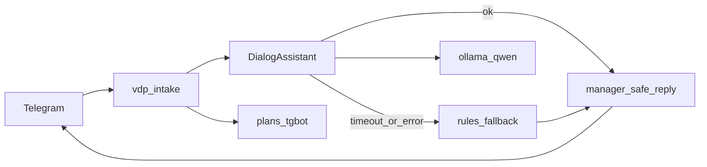

# План: intake + Ollama (диалог в чате)

## Цель

Менеджер пишет в супергруппу → бот **в первую очередь** опирается на локальную модель (Ollama) для первички: уточняющий вопрос, конфликт, краткое предложение, мягкий разбор полей из текста. Правила и estimate остаются **fallback** и страховкой. Ответы менеджеру — только деловой язык (санитайзер). Техпланы по-прежнему только в [`.cursor/plans/тгбот/`](.cursor/plans/тгбот/).

## Зафиксированные решения

- **Стек:** расширить compose-проект [`инструменты/поток-вводных/docker-compose.yml`](инструменты/поток-вводных/docker-compose.yml) (`name: vdp-intake`): сервисы `intake` + `ollama`. Не добавлять Ollama в default [`vdp/docker-compose.yml`](vdp/docker-compose.yml) (там уже profile `own` для extraction — не смешивать контуры).
- **Модель волны 1:** одна — `qwen2.5:3b` (уже знакома extraction). Вторая модель — отдельная волна после стабильного диалога.
- **Интеграция:** порт `DialogAssistant` в модуле intake (`internal/dialog` + HTTP-клиент Ollama `/api/chat`). Паттерн смотреть в [`vdp/extraction/internal/engine/ollama.go`](vdp/extraction/internal/engine/ollama.go), **без** импорта extraction (другая граница модуля).
- **Политика:** модель предлагает структуру; pipeline решает; HITL/человек; **запрет** auto-pay / смена статуса заявки / авто-деплой / фраза «план готов — выполнить».
- **Файлы/OCR:** вне DoD волны 1 (только текст сообщений). Волна 2: метаданные вложений + при необходимости вызов extraction.
- **Сервер:** тот же compose; weights в named volume; one-shot `ollama pull` через Makefile/`ensure`, не в Dockerfile. Секреты TG — `~/.vdp-intake/env` на хосте.

## Сверка с `.cursor/rules` (MUST)

| Rule | Применение |
|------|------------|
| `планирование-сверка-с-rules`, `базовые-правила-инструмента`, `workspace-карта` | Side-tool `инструменты/поток-вводных`; не ядро заявки; не vendored AMG. |
| `машинное-обучение`, HITL | LLM только side-path диалога/разбора; low confidence / сбой → правила + человек; не истина статуса/платежа. |
| `безопасность-ролей-и-данных` | Redact до вызова модели; в логах correlation без сырого ПДн; ответы через manager-safe sanitize. |
| `поддержка-и-обратная-связь`, `ux-когнитивная-нагрузка`, `ux-взаимодействие-и-скорость` | Один уточняющий вопрос; быстрый ack; без tech в чате. |
| `mgmt-tg-notify` | Диалог только `@vdp_intake_bot`; не слать разбор через notify-mgmt. |
| `границы-и-контексты`, `чистая-архитектура`, `solid`, `детали-как-плагины`, `screaming-architecture` | Ollama — деталь за портом; политика карточки/comms внутри intake. |
| `интеграция-и-события`, `устойчивость-и-наблюдаемость`, `go-resilience-security` | Timeout/backoff на Ollama; fallback; в логах `update_id`/`message_id`/`card_id`. |
| `развертывание-и-доставка`, `devops-культура` | Отдельный compose-проект; один контейнер = один процесс; секреты и веса снаружи образа. |
| `честность-готовности` | Не обещать «бот думает как продукт» / файлы / 2 модели / GPU, пока нет DoD. |
| `тесты-архитектуры`, `go-testing`, `правила-построения` | Unit на клиент (httptest), на merge dialog+rules, на sanitize; CI job `intake` = `go test`. |
| `serverless-и-faas` | Вне scope: поллер и Ollama — долгоживущие процессы. |

**Вне scope:** `use-cases`/статусы VDP, nest/FE/playwright, `vdp-fe-docker-пересборка`, `make ci-pr` как gate intake, автозапуск Cursor/QG/alpha, prod PRIMARY extraction = own.

### Gate / DoD (проверяемо)

- `docker compose` проекта `vdp-intake` поднимает `intake` + `ollama`; модель доступна после ensure.
- При живом Ollama: @mention → ответ с уточнением/предложением от dialog-пути (без путей/«выполнить?»).
- При down Ollama: тот же сценарий отрабатывает **правилами**, без 500 и без молчания.
- Unit green; токен/веса не в git/образе; hub/VDP статусы не тронуты.
- Честно: файлы/вторая модель/серверный GPU = следующие волны.

---

## Волна F0 — Ollama в compose vdp-intake

1. Сервис `ollama` в [`docker-compose.yml`](инструменты/поток-вводных/docker-compose.yml): image `ollama/ollama`, volume `ollama_models`, без publish наружу по умолчанию (только сеть compose); healthcheck по `/api/tags`.
2. `intake` зависит от healthy ollama; env `OLLAMA_BASE_URL=http://ollama:11434`, `OLLAMA_MODEL=qwen2.5:3b`, `INTAKE_DIALOG=1`.
3. Makefile: `ensure-model` (exec pull если нет тега), `up`/`down`/`logs` обновить.
4. Документация только если попросите; иначе комментарий в Makefile.

**DoD F0:** `make up` + ensure → tags содержит модель; intake стартует с `dialog` флагом в логе.

## Волна F1 — Порт DialogAssistant + fallback

1. `internal/dialog`: интерфейс `Assist(ctx, Input) (Output, error)`; Input = redact text, class hints, tags; Output = `ClarifyQuestion`, `ConflictPlain`, `ProposalSummary`, `ParsedFields` (map), `UsedModel bool`.
2. Клиент Ollama chat JSON; system prompt: деловой русский, один вопрос, без путей/команд/IDE, JSON-схема ответа.
3. Pipeline HITL: если `INTAKE_DIALOG` и клиент задан → Assist; при ошибке/таймауте → текущие `conflict`/`analyze`/`proposal`/`estimate`.
4. Все исходящие в TG — `comms.SanitizeManager`; estimate срока по-прежнему правилами (модель не выдумывает «половину дня» без базы ориентира — можно позже скормить модели phrase как вход).
5. Unit: mock Ollama ok/5xx/timeout; sanitize strips tech from model leak.

**DoD F1:** unit green; ручной @mention с Ollama up и с Ollama stop.

## Волна F2 — Серверное зеркало

1. Тот же compose на Linux-хосте заказчика/staging: volume моделей, env TG, `INTAKE_WORKSPACE` mount или отключение записи plans если workspace нет (писать только inbox/cards в `INTAKE_HOME`).
2. Короткие команды up/down/ensure; проверка: бот отвечает в продовой супергруппе с сервера.
3. Не смешивать с release-образами продукта VDP.

**DoD F2:** один прогон на сервере (или явный blocker «хост не выдан»).

## Волна F3 (следующий этап, не блокирует F0–F2)

- Вторая модель / GPU.
- Вложения TG → метаданные + текст; OCR через extraction port.
- Подстройка шаблонов из `experience/` jsonl.

## Анти-паттерны

- Веса в Docker image / pull в Dockerfile.
- Модель как единственный путь без fallback.
- Tech/пути/«выполнить?» в ответах менеджеру.
- Shared DB с core/hub; смена статусов заявки из dialog.
- Второй поллер на том же токене (host `go run` + container).
