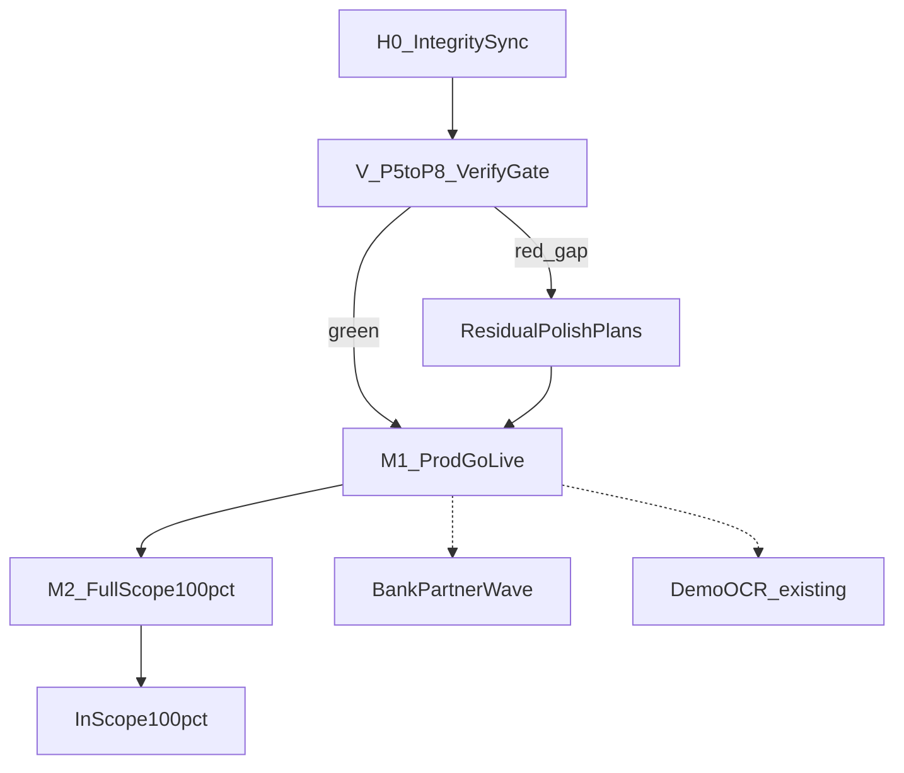

# Integrity + Full-Scope Plan Series

Канон: не дублировать [`.cursor/plans`](.cursor/plans). Совпадения **проверять evidence** (код + `@pilot-matrix` + docs). Подтверждено → `done_keep`. Не подтверждено → игнорировать галочку плана и создавать/оставлять work-план. Ритм: [`заметки/ориентир-скорости-2026-08-25.md`](заметки/ориентир-скорости-2026-08-25.md) ≈ **3.8 todo/ч**. Rules: `планирование-сверка-с-rules`, `честность-готовности`, `vdp-ci-local-gate`, `mgmt-tg-notify`, `use-cases`, `тесты-архитектуры`.

Контекст чатов `fa9eba60` / `dc7e23c2` локально не найден; опора на серию из [4dad4822](4dad4822-c636-46f6-bd55-b47e3e9c9206) + сверку [3a42032c](3a42032c-f1c4-459d-b534-9cfde665b20b): курс/комиссия/RATE_ON_PP закрыты IMP; очередь — integrity → M1 → M2 → residual gaps.

## Определение «100% завершения» (жёстко)

**100% = DoD Milestone 2: in-scope вводных**, не «весь roadmap навсегда».

Входит в 100%:
- Импорт аванс + POSTPAY_RATE_ON_PP + 3 режима вознаграждения (IMP — уже код)
- Export `PAY_FROM_EXPORT` (P5–P6)
- Refunds product path (P7)
- Shipment ветка `SHIPMENT_*` (P8, не logistics-product)
- §9 пункты API/домена, закрытые R3/R5/R10/IMP — **честные `[x]`** во [`вводные/расширение вводных.txt`](вводные/расширение%20вводных.txt)
- Gates: `make check-env-parity` → targeted unit → `make ci-pr-pilot` (M2) / `make release-gate` (M1)
- Docs: [`known-gaps.md`](vdp/docs/pilot/known-gaps.md) + [`readiness-and-limits.md`](vdp/docs/pilot/readiness-and-limits.md) согласованы с фактом; `docs-format-check`; один `notify-mgmt` на milestone

Не входит в 100% (явный residual, планы не плодить без продукта):
- `POSTPAY_FIXED_RATE`
- Logistics-as-separate-product
- Analytics / assistant product
- Own OCR PRIMARY / ML money-path
- Nest data migration
- Full browser matrix all roles × statuses
- Bank **partner** live OpenAPI (отдельный track ниже, не блокер M2 in-scope MVP)

## Сверка совпадений (evidence → verdict)

| Существующий план | Evidence | Verdict |
|---|---|---|
| P1–P3 | master `completed` | **done_keep** |
| [`phase_4_ops_excellence`](phase_4_ops_excellence_20962059.plan.md) | todos completed; known-gaps ops deliverables | **done_keep** (live Prometheus — ops leftover, не redo P4) |
| P5 export + P6 UI | `export_machine_test.go`, `export_flow_test.go`, `pilot-matrix-export.spec.ts` | **verify_then_done** (YAML pending — устарело) |
| P7 refunds | `r7_refund_test.go`, `RefundPanel`, `pilot-matrix-refund.spec.ts` | **verify_then_done** |
| P8 shipment | `ShipmentPanel`, `pilot-matrix-shipment.spec.ts` | **verify_then_done** |
| R3 / R10 / IMP9 | todos completed + код | **done_keep** (+ sync §9 / DoD markdown) |
| R5 multi-order | todos completed, overview «RESET» | **verify_then_done** или residual polish только если verify red |
| [`milestone_1`](milestone_1_prod_go_live_38e889e1.plan.md) | pending, gate `release-gate` | **needs_work — keep** |
| [`milestone_2`](milestone_2_full_scope_7c4ecee1.plan.md) | pending | **needs_work — keep** |
| [`demo_document_ocr`](demo_document_ocr_47af6bf7.plan.md) | pending, side-path | **needs_work — keep** (параллельный track, не блокер M1) |

Не создавать вторые копии P1–P8 / IMP / R3 / R10.

## Карта этапов (исполнение)

### H0 — Integrity sync (НОВЫЙ plan-файл)

Файл: `.cursor/plans/integrity_prod_readiness_sync_<id>.plan.md`

Работы:
1. Прогнать verify-матрицу P5–P8: `go test` export/refund/shipment + FE unit + `make ci-pr-pilot` (или targeted `@pilot-matrix` export/refund/shipment/postpay/full-ladder).
2. Если green: проставить todos `completed` в phase_5/6/7/8 + master todos P4–P8; убрать «следующий» с P4; поправить R5 overview; добить unchecked DoD в IMP9 body.
3. Sync §9 во вводных: Contract/on-behalf/multi-order/Bank **internal** → `[x]` только при подтверждении кода; оставить `[ ]` только на REPORT_ACCEPTED / согласование с ВИ / то, что реально не в коде.
4. Gate: `docs-format-check` если правили `vdp/docs/**`.
5. Оценка: ~8–12 todos → **~2–3 ч**.

### V — Verify P5–P8 (внутри H0, не отдельный дубль scope)

Если verify **red** по конкретному маршруту — создать **один** residual plan на дыру (например `export_e2e_residual_*`), не переписывать весь P5. Если green — планы P5–P8 не пересоздавать.

### M1 — Prod go-live (СУЩЕСТВУЮЩИЙ)

Исполнять [`milestone_1_prod_go_live_38e889e1.plan.md`](milestone_1_prod_go_live_38e889e1.plan.md) после H0 (P4 done).

DoD 100% для M1 (= import pilot prod-ready, не full вводные):
- Preconditions P1–P4 `completed` в master
- `make release-gate` green
- security-signoff + handover-secrets закрыты
- readiness prod score evidence-based
- `notify-mgmt` once

Оценка: ~5 todos + gate time → **~1–2 дня** (зависит от ops secrets/SSH).

### M2 — Full scope 100% in-scope (СУЩЕСТВУЮЩИЙ)

Исполнять [`milestone_2_full_scope_7c4ecee1.plan.md`](milestone_2_full_scope_7c4ecee1.plan.md) после M1 + H0 green на P5–P8.

DoD 100% M2:
- Verification matrix export/refund/shipment/import в плане M2 — все ветки green
- `make ci-pr-pilot` green
- §9 sync завершён (часть H0 + финальная сверка)
- known-gaps / readiness честны; residual gaps перечислены явно
- `notify-mgmt` once

### Новые планы только на подтверждённые дыры без покрытия

1. **Bank partner wave** (НОВЫЙ) — `.cursor/plans/bank_partner_api_wave_<id>.plan.md`  
   Источник: [`заметки/vdp-bank-api-gap-2026-09-01.md`](заметки/vdp-bank-api-gap-2026-09-01.md). R10 = internal stub **done_keep**. Scope: OpenAPI v1 bank, machine AuthN, update idempotency, webhook retry docs. **Не блокер M2.** ~12–18 todos → **~3–5 дней**.

2. **Demo OCR** — не дублировать; исполнять [`demo_document_ocr_47af6bf7.plan.md`](demo_document_ocr_47af6bf7.plan.md) параллельно после M1 или по приоритету демо. Side-path, не money-path.

3. **AD/DP templates feedback** (НОВЫЙ, узкий) — `.cursor/plans/feedback_ad_dp_templates_<id>.plan.md`  
   Из [`вводные/обратная связь…`](вводные/обратная%20связь%20после%20передачи%20на%20просмотр.txt) §9: ветвление поручение/отчёт АД vs ДП + примеры docs. Domain already has contract types (R3); gap = PDF/template branching. ~8–10 todos → **~2–3 дня**. После M2 или параллельно docs/PDF track.

4. **Product decisions doc-only** (НОВЫЙ, тонкий) — `.cursor/plans/product_open_decisions_<id>.plan.md`  
   Только зафиксировать в вводных/docs без реализации: `REPORT_ACCEPTED` vs flat statuses; порядок ПА/курс vs шаг 5 ВИ; явный defer `POSTPAY_FIXED_RATE`. ~4 todos → **~1 ч**. Не код money-path.

### Явно НЕ создавать

- Второй master вместо [`vdp_prod_readiness_master`](vdp_prod_readiness_master_89fa45e7.plan.md) — **обновить** существующий
- Новые IMP / rate-commission / P5–P8 full rewrites
- План `POSTPAY_FIXED_RATE` до решения продукта
- План logistics-as-product

## Файлы, которые создаются/правятся при исполнении этой серии

Создать (4 новых child):
- `integrity_prod_readiness_sync_*.plan.md`
- `bank_partner_api_wave_*.plan.md`
- `feedback_ad_dp_templates_*.plan.md`
- `product_open_decisions_*.plan.md`

Обновить (не дублировать):
- [`vdp_prod_readiness_master_89fa45e7.plan.md`](vdp_prod_readiness_master_89fa45e7.plan.md) — статусы P4–P8 после H0
- phase_5 / phase_6 / phase_7 / phase_8 — todos → completed после verify
- r5 overview; imp9 DoD checkboxes
- при H0/M2: `вводные/расширение вводных.txt` §9; `vdp/docs/pilot/*`

Оставить как есть (исполнять):
- milestone_1, milestone_2, demo_document_ocr

## Глобальный DoD серии (критерий «работы закончены»)

1. H0 verify green → master отражает P1–P8 completed.
2. M1 DoD выполнен (`release-gate` + checklists) **или** явный blocker ops записан в known-gaps (не ложный 100%).
3. M2 DoD выполнен = **100% in-scope вводных** по определению выше.
4. Новые child-планы Bank / AD-DP / product-decisions существуют с слоями + именем gate в DoD.
5. Нет ложных «паритет 100% / CI ok» без заявленного gate (`честность-готовности`).
6. Residual вне 100% перечислен в known-gaps одним абзацем.

## Порядок агента при Run

1. Создать 4 новых plan-файла + обновить master/children статусы по шаблону H0 (без исполнения code gates в том же шаге, если пользователь просил только планы).
2. Если пользователь сказал «закончить работы» включая код: H0 verify → mark done → M1 → M2 → parallel Bank/OCR/AD-DP.
3. На каждом закрытии milestone — `notify-mgmt` продуктовым языком.

> **Status-sync 2026-09-24:** cancelled as obsolete/superseded — see todo notes / overview. Do not execute this plan as a product wave.
