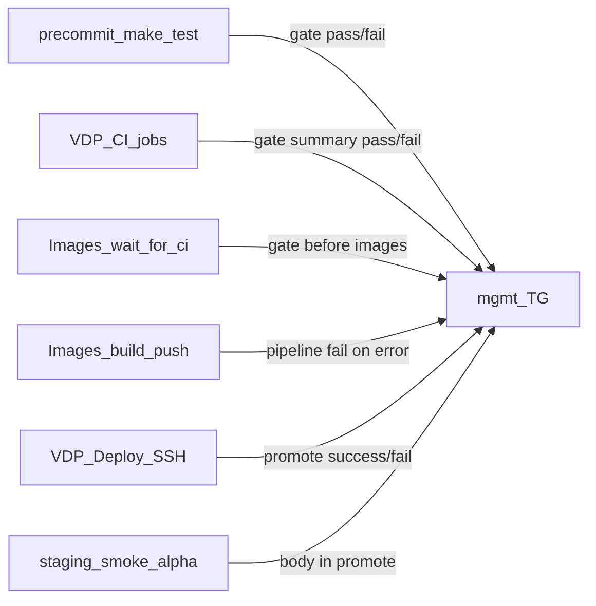

# План: TG-сигналы тестов и деплоя

## Решения (зафиксировано)

- П.2: и **fail**, и **green** (локально до коммита + сводка CI до продолжения Images/deploy).
- П.4: среда **alpha** (`alpha.vedy.io` в текстах как «среда alpha», без учёток/URL с секретами); проверки на хосте = существующий [`staging-smoke.sh`](vdp/scripts/staging-smoke.sh).
- Канал: только [`notify-mgmt.sh`](vdp/scripts/notify-mgmt.sh) + санитайзер; kinds уже есть: `gate`, `pipeline`, `promote`, `push`.
- Без `manager-ops`, без новых kind’ов, без правок домена заявки.

## Сверка с `.cursor/rules` (MUST)

**Обязательны:**
- [`mgmt-tg-notify`](.cursor/rules/mgmt-tg-notify.mdc) — только `notify-mgmt.sh`, без IDE/раннеров/путей планов/`localhost`/секретов; санитайзер.
- [`планирование-сверка-с-rules`](.cursor/rules/планирование-сверка-с-rules.mdc), [`базовые-правила-инструмента`](.cursor/rules/базовые-правила-инструмента.mdc).
- [`честность-готовности`](.cursor/rules/честность-готовности.mdc) — не заявлять «деплой-notify 100%», пока DoD ниже не зелёный.
- [`развертывание-и-доставка`](.cursor/rules/развертывание-и-доставка.mdc) — Images ждёт CI; Deploy только pin; notify не заменяет gate.
- [`devops-культура`](.cursor/rules/devops-культура.mdc) — быстрый сигнал fail/success в общий канал.
- [`устойчивость-и-наблюдаемость`](.cursor/rules/устойчивость-и-наблюдаемость.mdc) — semantic сигнал «выкат/smoke»; без ПДн в тексте.
- [`правила-построения`](.cursor/rules/правила-построения.mdc) — тесты на скрипты (`test-cd-scripts`).

**Вне scope:** Nest/UI кабинетов, `manager-ops`, ML, fe Docker refresh, смена AuthZ/статусов, root-специфичный suite на VM, beta/gamma smoke-notify (smoke уже skip на gamma; promote для всех env из Deploy).

**Gate/DoD из rules:** dry-run санитайзера без banned tokens; fail+pass пути в unit shell-тестах; Deploy fail не молчит; текст без brand names.

---

## Волна 1 — Расширить `ci-mgmt-notify`

Файл: [`vdp/scripts/ci-mgmt-notify.sh`](vdp/scripts/ci-mgmt-notify.sh).

- Новый mode `gate-summary`: по `NEED_*_RESULT` собрать список шагов; если есть failure → `pipeline --status failed`; иначе → `gate --status passed` (title вроде «приёмка / интеграция / сценарии» через уже существующий `map_step` / join).
- Mode `auto`: после текущего `push`/`review` **всегда** слать gate-summary (и green, и red), не только при `FAILED`.
- Modes `deploy-ok` / `deploy-fail`: обёртки над `promote` / `pipeline` с `--env` и `--revision` (для Deploy workflow).
- Mode `pre-images-gate`: `gate --status passed|failed --title "перед сборкой образов"` после wait-for-ci.

Обновить [`vdp/scripts/test-cd-scripts.sh`](vdp/scripts/test-cd-scripts.sh): dry-run для `gate-summary` (pass и fail), `deploy-ok`, запрет banned tokens.

---

## Волна 2 — П.2 локально до коммита (pass+fail)

- Скрипт [`vdp/scripts/precommit-mgmt-notify.sh`](vdp/scripts/precommit-mgmt-notify.sh):
  1. `make test` в `vdp/` (быстрая пирамида unit/adapters, не полный release-gate).
  2. При exit 0 → `notify-mgmt --kind gate --title "локальная приёмка" --status passed --revision $(git rev-parse --short HEAD)`.
  3. При ненулевом → тот же kind со `failed`, затем `exit` с кодом тестов (коммит блокируется).
  4. Нет token/chat → как сейчас у notify: skip с сообщением в stderr, тесты всё равно обязательны.
- Хук [`.githooks/pre-commit`](.githooks/pre-commit) вызывает скрипт.
- Makefile: `install-git-hooks` (`git config core.hooksPath .githooks`) + phony `precommit-gate`.
- Без husky/npm; без эха сырых логов тестов в TG (только статус + ревизия).

---

## Волна 3 — П.2/П.3 CI и «перед пайплайном образов/выката»

**VDP CI** ([`.github/workflows/vdp-ci.yml`](.github/workflows/vdp-ci.yml)): job `mgmt-notify` уже `always()` — переключить вызов на `gate-summary` (или `auto` после волны 1), чтобы green тоже уходил.

**VDP Images** ([`.github/workflows/vdp-images.yml`](.github/workflows/vdp-images.yml)):
- После успешного `wait-for-ci` → notify `pre-images-gate` / `gate passed` (результаты CI, без которых сборка не идёт).
- При failure `wait-for-ci` или `release-gate` → `pipeline-fail` (секреты как в CI).
- Не слать URL Actions / имена job brand’ом — только «проверки / полный контур / перед сборкой».

**VDP Release** ([`.github/workflows/vdp-release.yml`](.github/workflows/vdp-release.yml)): к существующему fail добавить success → `gate --status passed --title "полный контур"`.

---

## Волна 4 — П.1 + П.4 деплой и staging-smoke

**[`vdp-deploy.yml`](.github/workflows/vdp-deploy.yml)**:
- `if: success()` → `ci-mgmt-notify.sh deploy-ok` с `MGMT_CI_ENV` / `--env` = `target_env`, revision из pin.
- `if: failure()` → `deploy-fail` (закрывает «ошибки CI при деплоях»).

**[`deploy-compose-release.sh`](vdp/scripts/deploy-compose-release.sh)**:
- После успешного SSH-блока (включая remote `staging-smoke` для non-gamma): вызвать `notify-mgmt --kind promote --env "$ENVIRONMENT" --status success --revision … --body "дымовые на среде: ок"` (для alpha body без hostname с учётками; допустимо «среда alpha»).
- На ошибке (set -e / trap): `promote` или `pipeline` failed + body «выкат или дымовые не прошли»; `|| true` на notify, чтобы код деплоя не маскировался.
- Проброс `MGMT_NOTIFY_*` в GitHub Deploy job env (secrets уже используются в CI).

П.4 = итог того же smoke, отдельный root-suite не делаем.

---

## Волна 5 — Самопроверка DoD

- `bash vdp/scripts/test-cd-scripts.sh` green (новые dry-run кейсы).
- Ручной dry-run: `ci-mgmt-notify.sh dry-run` / `gate-summary` pass+fail.
- Честно в итоге: «notify на 4 точки включён»; не утверждать полный ops-паритет всех сред без прогона реального Deploy.

## Анти-паттерны

- Сырой вывод Jest/Playwright/go test в TG.
- Упоминание GitHub/GitLab/Playwright/vitest в тексте.
- Notify success при красном smoke.
- Ломать commit, если нет TG secrets (только если красные тесты).
