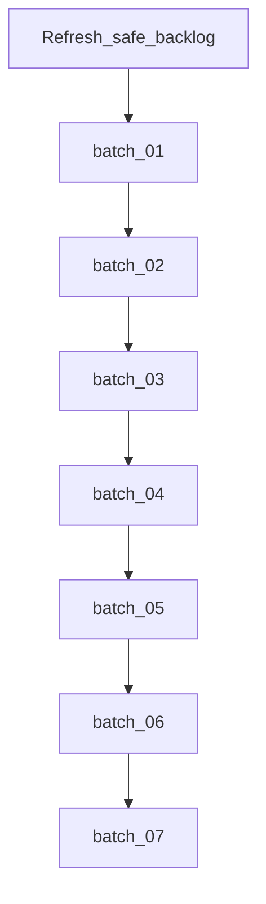

> **SUPERSEDED** by [unified_backlog_pipeline_70ee04a1.plan.md](unified_backlog_pipeline_70ee04a1.plan.md). Do not execute this plan.

# Планы на 73 открытых каталожных единицы

## Уточнение счёта

В каталоге [`.cursor/plans/`](.cursor/plans/) сейчас **73 плана с open todos** (внутри них суммарно **329** pending/in_progress пунктов). Запрос «73 туду по 10, последний 13» трактуем как **73 плана**: каждый todo нового batch-плана = один каталожный план на triage/закрытие/исполнение.

Разбиение: **6×10 + 13 = 73** → **7 файлов**.

Учтён [safe_backlog_pipeline_0c5a3c9f](/Users/levpogosov/.cursor/plans/safe_backlog_pipeline_0c5a3c9f.plan.md): не второй оркестратор; refresh (ship = done) + ссылка на batch-планы. Product-планы вроде `precommit_fe_unit` / `uat_w6` / `ocr_feedback_p0` **не переписываем** — в batch они только как triage-todo со ссылкой.

## Шаблон одного batch-плана

Каждый файл `open_plans_batch_0N_*.plan.md` в `.cursor/plans/`:

- **overview:** triage пакета N из 7; не откатывать продукт; следовать safe_backlog.
- **todos:** ровно 10 (для batch 07 — 13); id `triage-<slug>`; content: `Triage {plan.md}: проверить необходимость open todos → status-sync если код есть / исполнить если реально нужно / cancelled если obsolete; без отката vdp/**`.
- **Сверка с rules:** `планирование-сверка-с-rules`, `честность-готовности`, `vdp-ci-local-gate` (gate только если triage решил исполнять product), `правила-построения`.
- **Слои:** по умолчанию metadata/triage; product UI/FE/API/E2E — только если triage = execute и тогда работа в **исходном** plan-файле, не дублировать scope в batch.
- **DoD batch:** все triage-todos закрыты решением (completed / cancelled с причиной в plan note); product CI не обязателен для чистого status-sync.

## Состав пакетов (алфавитный порядок каталога)

### Batch 01 (10) — plans 1–10

1. `ap0_intake_harden.plan.md`
2. `ap1_analytics_boundary.plan.md`
3. `ap2a_console_operator.plan.md`
4. `ap2b_operator_tg.plan.md`
5. `ap3_cursor_plan_parity.plan.md`
6. `ap4_selective_publish.plan.md`
7. `api_contract_a1_forms_yaml.plan.md`
8. `api_contract_a2_schema_helper.plan.md`
9. `api_contract_a3_httptest.plan.md`
10. `api_contract_a4_docs_qg.plan.md`

### Batch 02 (10) — plans 11–20

1. `api_contract_b1_golden.plan.md`
2. `api_contract_b2_vitest.plan.md`
3. `api_contract_b3_docs_qg.plan.md`
4. `api_contract_lean_master.plan.md`
5. `ci_situation_analytics_6f54693b.plan.md`
6. `demo_document_ocr_47af6bf7.plan.md`
7. `in0_intake_transport_da671411.plan.md`
8. `intake_ollama_dialogue_3acea8a9.plan.md`
9. `integrity_full_scope_series_c3883655.plan.md`
10. `milestone_2_full_scope_7c4ecee1.plan.md`

### Batch 03 (10) — plans 21–30

1. `nest_to_parity_rename_36a204c3.plan.md`
2. `ocr_feedback_p0_132b4b56.plan.md`
3. `ocr_path_до_uat_382e6525.plan.md`
4. `ocr_uat_unblock_fb43d5c8.plan.md`
5. `phase_5_export_domain_dffbc889.plan.md`
6. `phase_6_export_ui_e2e_22fcdbc8.plan.md`
7. `phase_7_refunds_system_87a207ef.plan.md`
8. `phase_8_logistics_shipment_b7770f93.plan.md`
9. `precommit_fe_unit_e03035eb.plan.md`
10. `return_after_execution_0_boundary.plan.md`

### Batch 04 (10) — plans 31–40

1. `return_after_execution_1_fact.plan.md`
2. `return_after_execution_2_clarify.plan.md`
3. `return_after_execution_3_return_client.plan.md`
4. `return_after_execution_4_repeat.plan.md`
5. `return_after_execution_5_e2e_journeys.plan.md`
6. `rfc_w1_domain_mandatory.plan.md`
7. `rfc_w2_persist_api.plan.md`
8. `rfc_w3_continuity_spine.plan.md`
9. `rfc_w4_process_roles_ux.plan.md`
10. `rfc_w5_admin_user_form.plan.md`

### Batch 05 (10) — plans 41–50

1. `rfc_w6_verify_dod.plan.md`
2. `rh0_ci_pipeline.plan.md`
3. `rh1_postgres_integration.plan.md`
4. `rh2_e2e_coverage.plan.md`
5. `rh3_staging_adapters.plan.md`
6. `rh4_release_gate.plan.md`
7. `rw0_terminology_foundation.plan.md`
8. `uat_w2_parties_hygiene.plan.md`
9. `uat_w3_no_docs_invoice_gate.plan.md`
10. `uat_w4_card_field_labels.plan.md`

### Batch 06 (10) — plans 51–60

1. `uat_w5_root_cancel.plan.md`
2. `uat_w6_role_cabinets_browser.plan.md`
3. `uat_w7_browser_ladders_return.plan.md`
4. `ux_c1_create_ocr_copy.plan.md`
5. `ux_c2_document_view.plan.md`
6. `ux_c3_manager_hide_drafts.plan.md`
7. `ux_c4_timeline_labels.plan.md`
8. `ux_c5_manager_org_waiting.plan.md`
9. `ux_t_form_flow_tests.plan.md`
10. `ux_v_verify_gate.plan.md`

### Batch 07 (13) — plans 61–73

1. `vdp_blockers_and_deploy_99106aff.plan.md`
2. `vdp_documentation_program_7809e01f.plan.md`
3. `vdp_prod_readiness_master_89fa45e7.plan.md`
4. `vdp_roadmap_r0-r12_b92091dd.plan.md`
5. `vdp_role_debug_master.plan.md`
6. `vedy_bot_audiences_qg_10445819.plan.md`
7. `vedy_bot_p0_agent_cloud.plan.md`
8. `vedy_bot_p1_knowledge_rag.plan.md`
9. `vedy_bot_p2_tg_cursor_auto.plan.md`
10. `vedy_bot_p3_hitl_cursor_primary.plan.md`
11. `vedy_bot_p4_local_cursor_agent.plan.md`
12. `vedy_bot_p5_alpha_stand_tests.plan.md`
13. `карточка_без_прочерков_e874f6dc.plan.md`

## Дополнительно (не входит в 73)

- Refresh [safe_backlog_pipeline_0c5a3c9f](/Users/levpogosov/.cursor/plans/safe_backlog_pipeline_0c5a3c9f.plan.md) → workspace: ship completed; ссылка на `open_plans_batch_01`…`07`.
- Отдельный `plan_status_sync_ocr_rh` **не обязателен**: OCR/RH status входит в triage batch 03 и 05; при желании status-sync можно сделать первым исполнением этих triage, без третьего оркестратора.

## Анти-помехи

- Batch-планы = **очередь triage**, не big-bang rewrite 329 todos.
- Не параллелить исполнение product из разных batch на одном compose.
- RH / compose harden / уже запушенный OCR tip — только status или advance, без re-impl.
- Не `SKIP_PREPUSH_GATE`; FE Docker refresh — только после «да».

Запись файлов: можно параллельно; **исполнение** triage — по порядку batch, чтобы не мешать текущему состоянию.

## DoD пакета

- [ ] 7 файлов `open_plans_batch_0N_*.plan.md` в `.cursor/plans/`
- [ ] Сумма todos = **73** (10+10+10+10+10+10+13)
- [ ] Списки выше совпадают 1:1 с 73 планами, у которых есть open todos
- [ ] `safe_backlog_pipeline_0c5a3c9f` обновлён и есть в workspace; без competing оркестратора
- [ ] Содержимое `precommit_fe_unit` / `uat_w6` / `ocr_feedback_p0` / ship / compose **не** перезаписано
