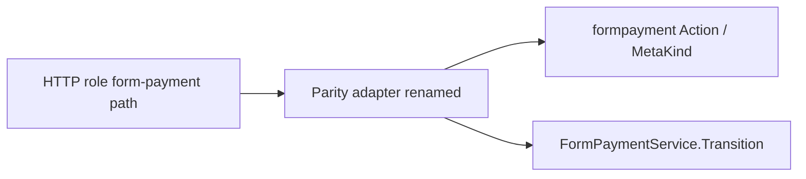

# Nest → parity rename (form-payment adapter)

## Сопоставление с `.cursor/rules`

**Обязательны:** `планирование-сверка-с-rules`, `базовые-правила-инструмента`, `правила-построения`, `чистая-архитектура`, `детали-как-плагины`, `screaming-architecture`, `use-cases`, `границы-и-контексты`, `интеграция-и-события`, `тесты-архитектуры`, `go-testing`, `go-architecture`, `честность-готовности`.

**Вне scope:** UI/`ux-*`, BDUI, ML, serverless, deploy/CD, `vdp-fe-docker-пересборка`, GitHub MCP auth, смена матрицы ролей/SM, Nest monolit migration.

**Gate/DoD:** unit по domain map + HTTP parity helpers; `go test` по затронутым пакетам; полный `cd vdp/core && go test ./...`; не утверждать «Nest parity 100%» — это только rename идентификаторов.

## Решение по scope (зафиксировано)

- **Делаем:** rename файлов и Go-символов адаптера legacy URL→domain в [`vdp/core`](vdp/core).
- **Не трогаем:** HTTP paths (`/api/v1/{role}/form-payment/...`), JSON DTO, статусы SM, FE, OpenAPI URL.
- **Docs:** массово не переписываем; в godoc адаптера одна фраза «legacy Nest URL contract → domain» допустима.
- **Исключение имён:** поле матрицы `NestPath` → `LegacyPath` (это *исходный* каталог legacy, не «parity path» рядом с `VDPPath`). Остальные `Nest*` → `Parity*`.



## Карта rename

### Файлы (`git mv`)

| Было | Станет |
|---|---|
| [`vdp/core/internal/service/form_payment_nest.go`](vdp/core/internal/service/form_payment_nest.go) | `form_payment_parity.go` |
| [`vdp/core/internal/domain/formpayment/nest_actions.go`](vdp/core/internal/domain/formpayment/nest_actions.go) | `parity_actions.go` |
| [`vdp/core/internal/domain/formpayment/nest_actions_test.go`](vdp/core/internal/domain/formpayment/nest_actions_test.go) | `parity_actions_test.go` |
| [`vdp/core/internal/transport/http/nest_form_routes.go`](vdp/core/internal/transport/http/nest_form_routes.go) | `parity_form_routes.go` |
| [`vdp/core/internal/transport/http/nest_xlsx_test.go`](vdp/core/internal/transport/http/nest_xlsx_test.go) | `parity_xlsx_test.go` |

### Domain (`formpayment`)

- `NestPathAction` → `ParityPathAction`
- `NestMetaPath` → `ParityMetaPath`
- `nestActionMap` → `parityActionMap`
- `nestMetaMap` → `parityMetaMap`
- тесты: `TestNestActionMapCoversStatusPaths` → `TestParityActionMapCoversStatusPaths`; `TestNestPathActionMap` → `TestParityPathActionMap`

### Service

- `TransitionByNestPath` → `TransitionByParityPath`
- `ApplyNestMeta` → `ApplyParityMeta`
- `NestPatchInput` → `ParityPatchInput`
- godoc: «resolves legacy Nest role+path…» → «resolves parity role+path (legacy Nest URL contract)…»

### HTTP transport

- `registerNestFormPaymentRoutes` → `registerParityFormPaymentRoutes` (вызов в [`extended.go`](vdp/core/internal/transport/http/extended.go))
- `nestRoleAllowed` → `parityRoleAllowed`; param `nestRole` → `rolePrefix`
- `handleNestForm*` / `handleNestPatch` / `handleNestImport` → `handleParityForm*` / `handleParityPatch` / `handleParityImport`
- callers в [`r5_multi_order_routes.go`](vdp/core/internal/transport/http/r5_multi_order_routes.go), [`r7_refund_routes.go`](vdp/core/internal/transport/http/r7_refund_routes.go)

### Endpoint matrix ([`endpoint_matrix_test.go`](vdp/core/internal/transport/http/endpoint_matrix_test.go) + consumers)

- `NestPath` → `LegacyPath`
- `nestEndpointParity` → `endpointParityMatrix`
- `TestNestEndpointParityMatrixInventory` → `TestEndpointParityMatrixInventory`
- обновить чтения `.NestPath` / `nestEndpointParity` в: `r2_auth_org_test.go`, `r4_docs_test.go`, `r5_multi_order_test.go`, `r6_rate_docs_test.go`, `r7_refund_test.go`, `r8_hub_test.go`, `r12_verification_test.go`

### Прочие тест-хелперы

- [`parity_test.go`](vdp/core/internal/transport/http/parity_test.go): `putNest` → `putParity`; `TestNestRoleFormActionAndParityEndpoints` → `TestParityRoleFormActionAndEndpoints`
- `TestNestFormXLSXIsRealOOXML` → `TestParityFormXLSXIsRealOOXML`

## Порядок работ

1. `git mv` пяти файлов.
2. Механический rename символов (один PR/коммит, без логики).
3. `rg '\bNest(Path|Patch|Meta)|ByNest|putNest|nestRole|registerNest|handleNest|nestEndpoint|nestAction|nestMeta|form_payment_nest|nest_form_routes|nest_actions'` в `vdp/core` — ожидаем 0 по Go-коду (кроме осознанных комментариев про legacy Nest product, если оставлены).
4. Прогон чеклиста тестов ниже.
5. Не менять `vdp/docs/**` и `.cursor/plans/**` в этой волне.

## Чеклист тестов (DoD)

Узкий прогон (после rename):

```sh
cd vdp/core && go test ./internal/domain/formpayment/ -count=1
cd vdp/core && go test ./internal/service/ -count=1 -run 'FormPayment|Parity|Nest'
cd vdp/core && go test ./internal/transport/http/ -count=1 \
  -run 'Parity|EndpointParity|R12|R1FormPayment|FormXLSX|RoleFormAction'
```

Обязательные имена после rename (должны существовать и быть зелёными):

- `TestParityPathActionMap`
- `TestParityActionMapCoversStatusPaths`
- `TestParityRoleFormActionAndEndpoints`
- `TestEndpointParityMatrixInventory`
- `TestR12MatrixInScopeComplete` (и смежные R12 в `r12_verification_test.go`)
- `TestR1FormPaymentParityGate` (если есть в пакете http — не ломать gate)
- `TestParityFormXLSXIsRealOOXML`

Полный gate пакета:

```sh
cd vdp/core && go test ./... -count=1
```

Опционально (не блокер rename, если unit зелёные): `make -C vdp test` — только если время/CI-паритет нужен в том же PR.

**Критерий закрытия:** compile + перечисленные тесты green; HTTP URL и поведение идентичны; в Go-идентификаторах адаптера нет префикса `Nest`/`nest_` (кроме текста «legacy Nest» в комментариях/docs вне scope).
