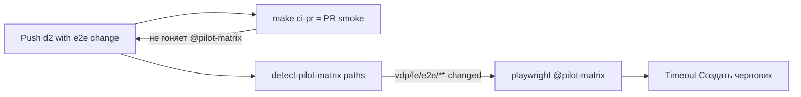

# Нормализация доставки: PR #32 + цикл QG

## Диагноз (что сломалось)

[PR #32](https://github.com/lionss888/viletech-platform/pull/32) на ветке `d2`: 9 checks green, **1 fail** — `playwright (pilot-matrix)` (~17 мин) на шаге Compose up + journeys.

**Прямая причина:** [`vdp/fe/e2e/pilot-matrix-postpay-rate.spec.ts`](vdp/fe/e2e/pilot-matrix-postpay-rate.spec.ts) на шаге «Условия» ждёт кнопку `/Создать черновик/` (стр. 76). В UI такой кнопки **нет**.

Фактические CTA на финальном шаге «Проверка» в [`forms-new-page.tsx`](vdp/fe/src/components/ved/pages/forms-new-page.tsx) (≈791–808):

- `data-testid="wizard-send-manager"` → «Отправить менеджеру»
- `data-testid="wizard-save-draft"` → «Сохранить черновик»

Канон уже есть в [`wave2-wizard.spec.ts`](vdp/fe/e2e/wave2-wizard.spec.ts): `Далее` → `wizard-review-step` → `wizard-save-draft`.

**Почему 17 минут:** `test.setTimeout(420_000)` + Playwright ждёт несуществующий locator до полного таймаута, затем Retry #1 — снова. Это не «медленный стек», а **дорогой stale-assert**.

**Почему локально «зелёно», а GitHub красный:**

- Path-filter в [`.github/workflows/vdp-ci.yml`](.github/workflows/vdp-ci.yml) (≈205–206) **корректно** включает pilot-matrix при изменении `vdp/fe/e2e/**`.
- Локальный `make ci-pr` **не** равен этому job; паритет = **`make ci-pr-pilot`**.
- Известный долг уже записан в планах как `TEST_STALE` ([`import_growth_series`](.cursor/plans/import_growth_series_f8b557b2.plan.md) / refine) — но не был закрыт до push.

**OCR Modal/Sheet не виновник текста кнопки.** Он в том же PR, но падение — рассинхрон wizard E2E ↔ UI после частичного rewrite spec в `e236b80c`.

**Связь с ориентиром скорости** ([`заметки/ориентир-скорости-2026-08-25.md`](заметки/ориентир-скорости-2026-08-25.md)): ~3.8 todo/ч и тысячи строк/ч — про **написание**. Здесь съедает время **петля обратной связи**: stale browser job × retry × 7–17 мин + повторный push. Темп поставки ломается не «медленным кодом», а **несовпадением локального DoD с required GitHub checks**.

## Слои (сразу, по rules)

| Слой | Действие |
|---|---|
| UI / домен / API | Не менять для фикса CI |
| E2E | Починить postpay pilot-matrix wizard bootstrap |
| Unit | Не требуется (нет новой политики) |
| Rules / процесс | Ужесточить: при касании `e2e`/`@pilot-matrix` — `ci-pr-pilot` |
| QG | DoD = зелёный `make ci-pr-pilot` до push/claim merge-ready |
| Docs/notify | Вне scope срочного фикса (кроме точечной правки rules) |

## Часть A — срочный фикс PR #32

1. В [`pilot-matrix-postpay-rate.spec.ts`](vdp/fe/e2e/pilot-matrix-postpay-rate.spec.ts) после заполнения amount на terms:
   - `Далее` → ждать `wizard-review-step`
   - клик `getByTestId("wizard-save-draft")` (не label «Создать черновик»)
2. По возможности вынести/переиспользовать helper из wave2 (`finishTermsAndReview` + save-draft), чтобы не плодить третий путь.
3. Локально из `vdp/`:
   - `make check-env-parity`
   - **`make ci-pr-pilot`** (обязательно — это то, что красное на GitHub)
4. Push на `d2` → дождаться green `playwright (pilot-matrix)` на PR #32.

## Часть B — радикальная нормализация цикла (чтобы «по дороге» не горело)

### B1. Gate = поверхность риска (правило, не пожелание)

Обновить [`vdp-ci-local-gate.mdc`](.cursor/rules/vdp-ci-local-gate.mdc) и указатель в [`планирование-сверка-с-rules`](.cursor/rules/планирование-сверка-с-rules.mdc):

- Изменены `vdp/fe/e2e/**` или `@pilot-matrix` / ActionPanel / rate-commission / formpayment domain → **до push обязателен `make ci-pr-pilot`**, одного `ci-pr` недостаточно.
- Утверждение «CI ок / merge-ready» при таких путях без зелёного `ci-pr-pilot` = нарушение `честность-готовности`.

### B2. Fail-fast вместо 7-минутного wait

В postpay (и позже в других длинных matrix-тестах):

- Перед кликом финального CTA: `expect(locator).toBeVisible({ timeout: 15_000 })` с ясным сообщением, либо явный assert на `wizard-review-step`.
- Не полагаться на полный `test.setTimeout(420_000)` как на «ожидание пропавшей кнопки».

Цель: красный за **секунды–десятки секунд**, не 17 минут.

### B3. Реестр stale / контракт копирайта CTA

- Один короткий список known-stale E2E (или комментарий `// STALE:` + grep в precommit/static) — нельзя мержить с открытым STALE на `@pilot-matrix`.
- Предпочитать `data-testid` над хрупкими русскими labels в ladder-тестах.

### B4. Дисциплина PR на `d2`

Наблюдение по истории ветки: `temp comit`, `osome fix`, смесь OCR + CI + docs + e2e в одном PR.

Радикальная норма:

- Один PR = одна поверхность риска (UI OCR **или** pilot-matrix rewrite **или** CI plumbing).
- Запрет merge/claim «готово» с temp-коммитами без зелёного gate, совпадающего с path-filter.

### B5. Операционный чеклист доставки (короткий)

Перед каждым push в PR с FE journey:

1. `git diff --name-only origin/main...HEAD` → попадает ли в pilot-matrix path-filter?
2. Если да → `make ci-pr-pilot`; если нет → `make ci-pr`.
3. Только потом push / «можно смотреть Checks».

## DoD

- Spec postpay использует review + `wizard-save-draft`.
- `make ci-pr-pilot` зелёный локально.
- PR #32: job `playwright (pilot-matrix)` green.
- Rule `vdp-ci-local-gate` явно требует `ci-pr-pilot` при e2e/ladder paths.
- Нет ложного «готово» без совпадения локального gate с GitHub required surface.

## Вне scope

- Переписывание всего pilot-matrix / release-gate на каждый коммит.
- Смена статусной машины / OCR product logic.
- `release-gate` как повседневный gate.

## Rules сверка

**Обязательны:** `vdp-ci-local-gate`, `честность-готовности`, `планирование-сверка-с-rules`, `тесты-архитектуры`, `playwright-e2e`, `правила-построения`.

**Вне scope:** ML, `vdp-fe-docker-пересборка` без спроса, полный rewrite wizard product UI.
