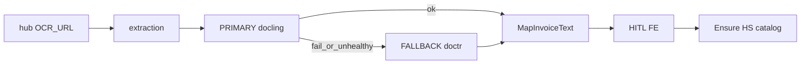

# OCR: Docling + docTR, HITL UX, HS ensure

## Цель

Демо-контур распознавания: **Docling PRIMARY**, **docTR FALLBACK**, без silent **fixture/yandex** в runtime; честный degraded при полном fail; UX мастера/карточки не врёт про pending; ТН ВЭД «нет в справочнике → создать и подставить». Статусы заявки и деньги не меняются OCR.

## Сверка с `.cursor/rules`

### Обязательны

- `планирование-сверка-с-rules`, `базовые-правила-инструмента`, `plan-закрытие-и-dod`, `честность-готовности` — слои+QG в DoD; закрытие = todos+DoD+status
- `машинное-обучение`, `serverless-и-faas` — OCR side-path; HITL; запрет auto-pay/auto-approve
- `чистая-архитектура`, `solid`, `детали-как-плагины`, `границы-и-контексты`, `интеграция-и-события`, `use-cases` — порт в extraction; SM в core; UI проекция
- `безопасность-ролей-и-данных` — AuthZ Start/Stop/Skip/confirm/HS ensure
- `устойчивость-и-наблюдаемость`, `go-resilience-security`, `go-architecture`, `go-testing` — бюджет таймаутов, fallback, unit, без ПДн в логах
- `ui-web-практики`, `ux-*`, `fe-interaction-contracts`, `playwright-e2e`, `ui-проблема-сразу-воспроизведи` — pending/Skip/Stop жестами; localhost repro UX
- `typescript-clean-code`, `тесты-архитектуры`, `правила-построения`
- `vdp-ci-local-gate` — имя gate в DoD; `vdp-fe-docker-пересборка` — спросить перед fe-refresh; `mgmt-tg-notify` при закрытии волны; `поддержка-и-обратная-связь` — копирайт self-service

### Вне scope

- NestJS rules; Paddle; async redesign outbox; полный классификатор ТН ВЭД; `release-gate`; удаление мёртвого кода Yandex из репо (достаточно убрать из runtime); analytics/assistant; GPU

### Gate (DoD)

1. `make check-env-parity`
2. Unit extraction + FE + core HS AuthZ
3. `extraction-docling-smoke` + `extraction-doctr-smoke`; Docling-down → doctr/degraded без fixture money
4. `make docs-format-check` при правках docs
5. UI journey: **`make ci-pr`**; HITL/wizard/extraction panel: **`make ci-pr-pilot`**
6. Закрытие плана + mgmt notify продуктовым языком

## Зафиксированные решения

| Тема | Решение |
|---|---|
| FALLBACK | **docTR** (не Paddle) |
| PRIMARY | Docling |
| fixture/yandex | Не в compose/`.env` demo; нет force-to-fixture; полный fail → `DegradedResult`, не FixturePrimary money |
| Бюджет sync inbox | Docling HTTP **≤90s** + unhealthy→сразу FALLBACK; docTR **≤70s**; сумма ≤ `GATEWAY_TIMEOUT`/`OCR_TIMEOUT_MS` (180) |
| HS AuthZ | **H1**: User на своей заявке может Ensure HS из OCR-draft (узкий upsert), затем подставить в поле |
| Skip | OCR **продолжается** в фоне; диалог «Заполнить вручную?» → manualOverride |
| Wizard HITL | Включить правку/подстановку в embedded panel (`canConfirm` / «Подставить в заявку»), не только просмотр |

## Архитектура

Ключевые точки кода сегодня:

- Fallback только `yandex|fixture`; force fixture: [`vdp/extraction/internal/service/service.go`](vdp/extraction/internal/service/service.go)
- Pending всё ещё показывает Start; Cancel только при draft: [`vdp/fe/src/components/ved/ExtractionReviewPanel.tsx`](vdp/fe/src/components/ved/ExtractionReviewPanel.tsx)
- Мастер: `canConfirm={false}` в [`vdp/fe/src/components/ved/pages/forms-new-page.tsx`](vdp/fe/src/components/ved/pages/forms-new-page.tsx)
- HS create только manager/root: [`CatalogService.CreateHsCode`](vdp/core/internal/service/extended_modules.go); UI warning в `CatalogPick`

## Волны

### Wave 0 — Runtime policy

- Compose / `.env.example` / staging/deploy: `EXTRACTION_PRIMARY=docling`, `EXTRACTION_FALLBACK=doctr`
- Defaults в `extraction/cmd/api/main.go`: не `fixture`
- Убрать silent force-to-fixture при missing URL → fail health / unavailable primary
- `Recognize`: primary+fallback fail → degraded schema only (не FixturePrimary)
- Docling client timeout → 90s; задел под doctr 70s

### Wave 1 — docTR sidecar + adapter

- Compose service `doctr` (CPU HTTP OCR; PDF → page render → text)
- Go `engine.NewDocTR` + unit httptest; `FALLBACK=doctr` в `New()`
- Общий `MapInvoiceText` (вынести из Docling mapper)
- `make extraction-doctr-smoke`; Docling-down repro

### Wave 2 — UX pending controls + HITL (скрины 17.55.10 / 17.56.26 / 17.54.33)

- `mode === "pending"`: Start **disabled**; кнопка **Остановить** → `cancelExtraction` **без** требования draft
- Та же матрица на карточке заявки
- Wizard embedded: разблокировать edit + apply/confirm в panel; сырой/лишний текст — collapsible «Текст документа» (muted), не orange wall
- Unit panel modes; E2E gesture Start disabled / Stop visible

### Wave 3 — Skip / manual / Далее (снимок 17.55.25)

- CTA **Пропустить распознавание** → confirm «Заполнить вручную?»
  - Да → `manualOverride`, поля открыты, OCR poll продолжается, баннер честный
  - Нет → не пускать «Далее» в голую validation на пустых полях; либо soft-wait, либо повторный Skip-prompt
- Матрица: pending+пустые+без override → Далее disabled или ведёт в Skip-диалог
- Unit + E2E skip→manual fill

### Wave 4 — HS ensure

- При OCR-коде вне `hsOptions`: normalize → Ensure (`POST` / узкий use case) → refresh options → select value
- AuthZ H1 + unit; CatalogPick без empty placeholder для этого кейса
- E2E/unit: код вне seed → выбран

### Wave 5 — Docs + gate + close

- [`vdp/docs/architecture/extraction.md`](vdp/docs/architecture/extraction.md), known-gaps, env examples
- `check-env-parity` → unit → docs-format → **`ci-pr-pilot`** (HITL/wizard)
- Plan todos+DoD+status; `notify-mgmt` продуктово

## Слои

| Слой | Файлы / фокус |
|---|---|
| UI | Модалка OCR, баннер, Skip-диалог, raw-text |
| FE | ExtractionReviewPanel, forms-new-page, CatalogPick, extraction.ts |
| Extraction | doctr engine, service New/Recognize, compose |
| Core | Ensure HS AuthZ H1 |
| Unit / E2E | Как в DoD |
| Docs | extraction + ops examples |

## DoD

- [ ] Runtime docling→doctr; нет fixture/yandex в demo path
- [ ] Pending: Start inactive; Stop есть (wizard + detail)
- [ ] Skip + manual; Далее не обесценивает OCR голой ошибкой
- [ ] HITL edit/apply; raw text collapsible
- [ ] HS missing → ensure + substitute
- [ ] Smokes + unit + docs-format
- [ ] `check-env-parity` + **`make ci-pr-pilot`**
- [ ] Plan closed (todos+DoD+status); mgmt notify
