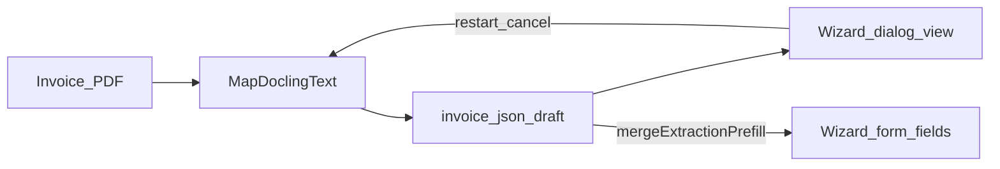

---
name: OCR feedback P0
overview: "Закрыть обратную связь по OCR: честный UX модалки в мастере (без обещания правок при canConfirm=false) и улучшить эвристики Docling (номер/компания/confidence), без смены PRIMARY и без auto-pay."
todos:
  - id: wizard-honesty-copy
    content: "ExtractionReviewPanel: честный banner/help при canConfirm=false; unit Dialog"
    status: completed
  - id: docling-regex-conf
    content: "docling_primary: regex Invoice#/company + confidence boost; Go table tests"
    status: completed
  - id: e2e-qg-notify
    content: ocr-wizard-path e2e; check-env-parity → ci-pr-pilot (+ ci-main); notify-mgmt
    status: completed
isProject: false---

# OCR: честность мастера + качество Docling

Источник: скрины OCR-модалки и ложный confidence. Не дублирует закрытый [ocr_resilience_ux_c791e9ab.plan.md](.cursor/plans/ocr_resilience_ux_c791e9ab.plan.md) (readiness/degraded/401 poll) — только wizard HITL-честность и mapping.

## Решения (зафиксировано)

1. В мастере оставить `canConfirm={false}` — confirm API и «золотая» запись не из create-flow.
2. Restart/cancel оставить (роль user + status `creating` через `canControlExtraction`).
3. Копирайт и help: при `!canConfirm` не обещать «исправить каждое поле до подтверждения»; баннер — «в мастере поля правятся в форме; здесь просмотр и перезапуск».
4. Docling: расширить regex номера/компании; confidence поднимать при любом коммерческом поле (amount|number|company|currency), не только amount|invoice#.
5. Не менять PRIMARY engine, статусную машину, auto-pay.

## Сверка с `.cursor/rules`

**Обязательны:** `планирование-сверка-с-rules`, `честность-готовности`, `машинное-обучение` (OCR side-path, HITL, не auto-pay), `ui-web-практики` / `ux-*` (ясный next step, без ложных обещаний), `typescript-clean-code`, `go-testing`, `тесты-архитектуры`, `playwright-e2e`, `vdp-ci-local-gate`, `mgmt-tg-notify` при закрытии волны.

**Вне scope:** полный `admin/account` для manager; persistence blobs; смена Docling API; `release-gate`; `compose-fe-refresh` без вопроса.

## Слои

- **UI:** баннер/help в `ExtractionReviewPanel` при `!canConfirm`; без Confirm CTA в мастере.
- **FE:** [`forms-new-page.tsx`](vdp/fe/src/components/ved/pages/forms-new-page.tsx) — оставить `canConfirm={false}`; [`ExtractionReviewPanel.tsx`](vdp/fe/src/components/ved/ExtractionReviewPanel.tsx) — ветка копирайта.
- **Домен:** без смены статусов.
- **API:** без новых endpoint’ов.
- **Unit FE:** [`ExtractionReviewDialog.test.tsx`](vdp/fe/src/components/ved/ExtractionReviewDialog.test.tsx) — `canConfirm=false`: нет «Подтвердить», поля disabled, честный баннер; при необходимости [`extraction.test.ts`](vdp/fe/src/lib/ved/extraction.test.ts).
- **Unit Go:** [`docling_primary_test.go`](vdp/extraction/internal/engine/docling_primary_test.go) — `Invoice-25918`, company без слабого `from`, conf при company|currency.
- **E2E:** расширить [`ocr-wizard-path.spec.ts`](vdp/fe/e2e/ocr-wizard-path.spec.ts) — открыть dialog после done → нет Confirm + честный copy (жест пользователя).
- **Compose/repro:** localhost мастер + sample PDF → prefill + dialog view-only.
- **Notify:** `notify-mgmt` kind=done продуктово после закрытия.

## Реализация

### A. Wizard honesty

В [`ExtractionReviewPanel.tsx`](vdp/fe/src/components/ved/ExtractionReviewPanel.tsx): ветка help/banner от `canConfirm`; не показывать текст про правку «до подтверждения», если confirm недоступен. Хост мастера не менять политику `canConfirm`.

### B. Docling mapping

В [`docling_primary.go`](vdp/extraction/internal/engine/docling_primary.go):

- `reInvoiceNo`: `Invoice[- No.#]*`, `№`, типичные EU-метки; не брать голое слово `Invoice` как номер.
- `reCompany`: убрать шумный bare `from` или ужесточить; seller/vendor/продавец/поставщик.
- Confidence: boost если заполнен любой из amount|number|company|currency; иначе низкий → FE degraded как сейчас.

Сначала красные table-driven Go-тесты на образцы со скринов, потом regex.

## DoD / QG

1. `make -C vdp check-env-parity`
2. FE unit (dialog + extraction) + `go test` extraction engine
3. Целевой gate: **`make -C vdp ci-pr-pilot`** (extraction / wizard OCR / panel paths). Правка `e2e/ocr-wizard-path.spec.ts` вне узкого PR-smoke → дополнительно **`make -C vdp ci-main`** перед merge-ready.
4. Локальный repro: dialog без Confirm; номер/компания на sample не мусор; confidence не 0.9 на пустых полях.
5. После закрытия: `notify-mgmt` kind=done (продуктовый язык, без plan id).
