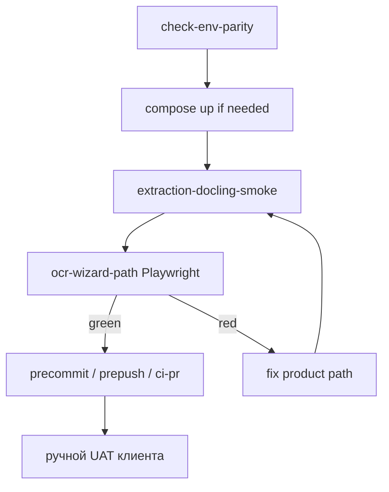

# Диагностика OCR path до ручного UAT

## Запрос заказчика (внутренний)

Команда не зовёт человека «проверить как клиент», пока машина не подтвердила: стек Docling жив и в мастере баннер уходит в done или честный fail (не вечный pending / молчаливый 502).

## Acceptance

1. В Local QG есть кнопка **«Путь распознавания»**; Run выполняет ровно `cd vdp && make ocr-path-gate` и пишет зелёный/красный простым языком.
2. `make ocr-path-gate` на поднятом compose: Docling health smoke + один Playwright journey (upload → баннер не остаётся pending дольше timeout → done **или** fail-баннер).
3. «Подскажи проверку» при diff мастера/extraction/`forms-new` рекомендует эту кнопку **раньше** лестницы и ручного UAT.
4. Первый прогон gate: если красный из‑за продукта (poll/CTA/502) — чиним путь в том же срезе до зелёного gate (не закрываем процессной кнопкой при красном продукте).

## Вне scope

- Pilot Robot Matrix / `@pilot-matrix` / смена path-filter лестницы
- Качество IE Docling, Yandex PRIMARY, alpha Deploy
- `release-gate`, полный rewrite OCR-плана продукта как отдельный документ

## Сверка с `.cursor/rules`

**Обязательны:** `планирование-сверка-с-rules`, `базовые-правила-инструмента`, `честность-готовности`, `vdp-ci-local-gate`, `ui-проблема-сразу-воспроизведи`, `fe-interaction-contracts` (upload через filechooser), `playwright-e2e`, `тесты-архитектуры` (fail-fast, E2E только journey), `машинное-обучение` (OCR side-path, HITL, не auto-pay), `ui-web-практики` / `ux-*` (ясный pending/fail), `mgmt-tg-notify` после закрытия волны.

**Вне scope правил:** смена статусной машины заявки, Provider ПДн, ML-ядро платежа.

**Gate-чеки:** `check-env-parity` → unit при правке FE → локально `make ocr-path-gate` → для merge-ready при новом e2e вне smoke: **`make ci-main`** (паритет полного Playwright на main). Не утверждать CI ok после только `ci-pr` / `ci-pr-pilot`.

## Слои

| Слой | Действие |
|---|---|
| UI / IA | Callout в Local QG: ручной UAT клиента только после зелёного «Путь распознавания» при касании OCR |
| FE | При красном gate — добить poll/fail UX в [`forms-new-page.tsx`](vdp/fe/src/components/ved/pages/forms-new-page.tsx) / баннер ([`create-review-copy.ts`](vdp/fe/src/lib/ved/create-review-copy.ts), [`ocr-progress.tsx`](vdp/fe/src/components/ved/ocr-progress.tsx)); upload только через существующий жест |
| Домен / API | Нет смены статусов; при красном — только сохранение ExtractionResult / не затирать (уже в product-плане) |
| Compose / smoke | Target вызывает существующий [`extraction-docling-smoke.sh`](vdp/scripts/extraction-docling-smoke.sh) |
| Unit | FE: при правке poll/timeout — тест helper; иначе без новых unit |
| E2E | Новый spec `vdp/fe/e2e/ocr-wizard-path.spec.ts`: gesture upload → ожидание done **или** fail-баннера за `OCR_POLL_TIMEOUT` (+ запас); fail-fast если pending слишком долго |
| Local QG | Промпт + кнопка в [`local-qg.canvas.tsx`](local-qg.canvas.tsx); правка `TRIAGE_PROMPT` |
| Docs / процесс | Пункт в [`заметки/шаблон-среза-запроса-заказчика.md`](заметки/шаблон-среза-запроса-заказчика.md): для OCR/extraction — ocr-path до Acceptance руками; короткая note в `vdp/docs/development/` (без rich ops markdown) |
| Notify | `notify-mgmt` kind=done: продуктово — «перед проверкой клиентом путь распознавания гоняется локально» |

## Порядок диагностики (канон)

Не: п.1–2 Local QG → «можно руками» → потом OCR.

## Реализация

1. **`make ocr-path-gate`** в [`vdp/Makefile`](vdp/Makefile): предполагает поднятый стек (если нет — fail с текстом «сначала compose-up»); шаги: `extraction-docling-smoke` → `playwright-e2e` с `PLAYWRIGHT_ARGS` только на новый OCR-spec. Не тянуть весь `@pilot-matrix`.

2. **E2E** `ocr-wizard-path.spec.ts`: login user → `/forms/new` → `waitForEvent('filechooser')` + клик по zone → файл → assert: за разумный timeout виден done **или** fail copy; запрет «только pending» после истечения. Без assert качества полей Docling (честность: видимость пути, не IE).

3. **Local QG**: секция/кнопка «Путь распознавания» (рядом с частичными или до alpha); `OCR_PATH_PROMPT` = Local QG RUN + ровно `make ocr-path-gate`. Callout: не звать человека до зелёного при OCR-диффе. `TRIAGE_PROMPT`: при касании extraction/wizard/forms-new → эта кнопка первой.

4. **Шаблон среза** + одна строка в DoD OCR-плана [`ocr_product_path_fix_e4c6696a.plan.md`](.cursor/plans/ocr_product_path_fix_e4c6696a.plan.md): перед Acceptance руками — `ocr-path-gate`.

5. **Первый прогон:** `check-env-parity` → `compose-up` при нужде → `ocr-path-gate`. Красный → фикс продукта (poll/fail при 502, CTA) до зелёного. Затем `ci-main` (новый e2e вне smoke). `notify-mgmt`.

## DoD / QG

1. `make -C vdp check-env-parity`
2. `make -C vdp ocr-path-gate` зелёный (smoke + OCR journey)
3. Unit только если правили poll helper
4. `make -C vdp ci-main` зелёный перед «CI ok / merge-ready» (из‑за e2e вне PR-smoke)
5. Acceptance: агент/кнопка ловит регресс **до** приглашения человека
6. `notify-mgmt` после закрытия

## Срез дня

День 1: Makefile + Local QG + triage + шаблон.  
День 2: E2E + первый `ocr-path-gate`; при red — product fix; `ci-main` + notify.