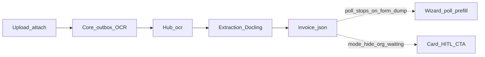

# Починка продукта: распознавание в мастере и на карточке

## Проблема (аудит)

Движок жив: `EXTRACTION_PRIMARY=docling`, `POST /recognize` возвращает `engine_id=docling`. Продуктовый путь сломан.

Корневые дефекты:

1. Поллинг в [`vdp/fe/src/components/ved/pages/forms-new-page.tsx`](vdp/fe/src/components/ved/pages/forms-new-page.tsx): при любом непустом `invoice_json` вызывается prefill и **снимается interval**. При create Postgres пишет dump формы в `invoice_json` ([`stringOr(f.InvoiceJSON, string(raw))`](vdp/core/internal/repository/postgres/store.go)) → первый poll останавливается, `ocrReady` не ставится → баннер «Идёт распознавание…» вечно.
2. На карточке [`extractionPanelMode`](vdp/fe/src/lib/ved/extraction.ts) при статусе `organization_waiting_verification` без parseable draft → `hide` → нет CTA в блоке «Документы».
3. UX: placeholder `1250000` / `INV-2026-0001` читаются как stub OCR; прогресс-бар локальный до 90% усиливает обман.
4. Риск затирания: [`AttachHsCodes`](vdp/core/internal/service/extended_modules.go) мержит в top-level `invoice_json` (приемлемо для schema v1); dump формы и OCR делят одно поле — при пустом InvoiceJSON снова dump.

## Решение (зафиксировано)

- Поллинг ждёт **только** `parseExtractionResult` (schema v1 / nested `extraction`), иначе продолжает poll до timeout.
- Timeout: честный fail-state баннера (не вечный pending).
- CTA на карточке: при `hasDocuments` для user/manager/root показывать `idle`/`review` и на ранних post-submit статусах (включая org-waiting), не `hide`.
- Storage: OCR callback по-прежнему пишет ExtractionResult в `invoice_json`; `AttachHsCodes` сохраняет существующий extraction-объект (merge `hs_codes` без сброса `meta`). Не вводим второе хранилище в этой волне.
- Placeholder’ы заменить на нейтральные («сумма», «номер»), без похожих на реальные данные значений.

## Сверка с `.cursor/rules`

**Обязательны:** `планирование-сверка-с-rules`, `базовые-правила-инструмента`, `честность-готовности`, `машинное-обучение` (OCR side-path, HITL, не auto-pay), `ui-web-практики` / `ux-*` (ясный статус, guided next step), `fe-interaction-contracts` (если трогаем upload — не ломать жест), `playwright-e2e`, `тесты-архитектуры`, `vdp-ci-local-gate`, `mgmt-tg-notify` после закрытия.

**Вне scope:** смена PRIMARY/Docling API, analytics, GPU, alpha Deploy, смена статусной машины заявки, коммерческий IE.

## Слои

| Слой | Работа |
|---|---|
| UI / IA | Баннер pending/done/timeout; нейтральные placeholder; CTA «Просмотр данных» / «Статус распознавания» в документах |
| FE | Fix poll; `extractionPanelMode`; copy; unit |
| Домен | Без смены статусов; OCR side-path |
| API / core | Защита merge HS от порчи extraction; при необходимости не перезаписывать schema v1 dump’ом при Save |
| Unit | FE: poll helper + panel mode; Go: AttachHsCodes preserves engine_id |
| E2E | Без нового Playwright вне PR-smoke, если хватает unit + local repro; иначе `ci-main` |
| Compose / repro | localhost: upload → дождаться done → поля/CTA |
| Docs | Минимум: known-gaps / development note про poll+CTA (без rich markdown ops) |

## Реализация

1. **Общий helper** в [`vdp/fe/src/lib/ved/extraction.ts`](vdp/fe/src/lib/ved/extraction.ts): `isExtractionDraft(invoiceJson)` (= `parseExtractionResult != null` с ужесточением: требовать `schema_version === "v1"` или `meta.engine_id`, чтобы dump формы не проходил).

2. **Мастер** [`forms-new-page.tsx`](vdp/fe/src/components/ved/pages/forms-new-page.tsx):
   - poll: clear interval / `ocrReady` только если `isExtractionDraft`;
   - timeout (~90–120s): `ocrFailed`, баннер «Не удалось распознать — заполните вручную» + скрытие фейкового прогресса;
   - placeholder: нейтральные строки;
   - короткий текст: «Применять не нужно — поля подставятся сами, когда распознавание закончится».

3. **Карточка** [`extraction.ts` + `form-detail-page.tsx`](vdp/fe/src/components/ved/pages/form-detail-page.tsx):
   - `extractionPanelMode`: если `hasDocuments` и роль не provider → `review` при draft, иначе `idle` (запуск/статус) для статусов до финала платежа / включая `organization_waiting_*`; `hide` только provider или финальные/без документов;
   - label уже есть: «Просмотр данных» / «Статус распознавания» (это и есть «посмотреть данные распознавания»).

4. **Core** [`extended_modules.go`](vdp/core/internal/service/extended_modules.go) + unit: AttachHsCodes при schema v1 не затирает `meta`/`header`; при dump формы — как сейчас. Проверить SaveForm: не подставлять form dump поверх непустого InvoiceJSON (уже `stringOr` — добавить тест «extraction переживает Save с тем же InvoiceJSON»).

5. **Тесты:** FE unit (`extraction.test.ts`, новый тест логики poll/timeout helper); Go `AttachHsCodes` + ParseFromInvoiceJSON после merge. Local repro: create with PDF/txt → баннер done → поля или честный timeout → на карточке CTA открывает HITL с `docling`.

## DoD / QG

1. `make -C vdp check-env-parity`
2. FE unit + Go unit по затронутому
3. `make -C vdp ocr-path-gate` (Local QG «Путь распознавания») — Docling smoke + wizard journey; **до** Acceptance руками клиента
4. Local repro на localhost при нужде (CTA на карточке) — только после зелёного ocr-path-gate
5. `make -C vdp ci-pr` если без нового e2e вне smoke; при e2e/ocr-wizard-path или другом e2e вне login/submit/provider/reject → `make ci-main`
6. Не утверждать «OCR 100% / паритет IE» — только: сквозной путь prefill+HITL снова наблюдаем
7. `notify-mgmt` после закрытия: продуктово — «распознавание снова видно в мастере и на карточке»

## Честность

Docling по-прежнему эвристики + HITL. План чинит доставку и видимость результата, не качество IE.