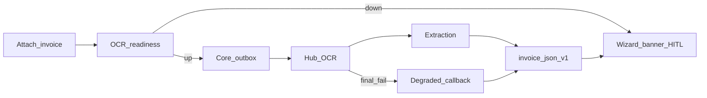

# OCR: результат всегда, честный статус, ранняя недоступность

## Контекст (repro)

- Клиентский мастер с `ES251182.pdf`: баннер «Идёт распознавание…», поля пустые; Docling рестарт/`connection refused` → hub timeout → **нет callback** → `invoice_json` без schema v1.
- Скрин: тот же pending + **401 на `/api/v1/auth/login`**; poll в [`forms-new-page.tsx`](vdp/fe/src/components/ved/pages/forms-new-page.tsx) глотает ошибки в пустом `catch` → UI врёт «идёт распознавание» при мёртвой сессии.
- Когда Docling жив: PDF ~40 с, эвристики слабые; fixture/`fixture_error` сегодня выглядит как успех.

## Решения (зафиксировано)

1. **Всегда результат:** при финальном сбое hub OCR всё равно `ocr_recognized` с schema **v1** ExtractionResult: пустой/частичный header, `meta.engine_id` = `unavailable` | `timeout` | `fixture_error`, `warnings` с причиной. Не подставлять «успешные» деньги из fixture без degraded-метки.
2. **Честный UX:** состояния баннера `unavailable` | `pending` | `done` | `degraded` | `failed` | `auth_lost`. Done только при нормальном engine (docling/…); fixture/fallback/пустой header → `degraded`. HITL CTA в мастере после `formId`.
3. **Сразу недоступность:** user-scoped `GET /api/v1/ocr/readiness` (не admin platform-health): core дергает extraction `/health` (+ короткий probe docling через extraction health или флаг). После attach / при старте poll — если down → баннер unavailable, без ложного pending.
4. **401:** poll останавливается; копирайт «сессия истекла» + уход на login; не крутить pending до 120 с.

Статусная машина заявки / auto-pay / качество IE / alpha deploy — **не трогаем**.

## Сверка с `.cursor/rules`

**Обязательны:** `планирование-сверка-с-rules`, `базовые-правила-инструмента`, `честность-готовности`, `машинное-обучение` (OCR side-path, HITL, fallback, не auto-pay), `устойчивость-и-наблюдаемость` (timeouts, деградация, correlation id заявки), `интеграция-и-события` (callback/идемпотентность), `безопасность-ролей-и-данных` (AuthZ readiness для user, не утечка admin), `ui-web-практики` / `ux-*` (ясный статус, guided next step), `тесты-архитектуры`, `go-testing`, `typescript-clean-code`, `vdp-ci-local-gate`, `mgmt-tg-notify` при закрытии.

**Вне scope:** смена PRIMARY/Docling API, GPU, analytics, e2e вне smoke (если не понадобится один CTA-spec), `compose-fe-refresh` без вопроса, `release-gate`.

## Слои

| Слой | Работа |
|---|---|
| UI / IA | Баннер 6 состояний; CTA «Просмотр данных» / «Статус…» в мастере; копирайт unavailable/degraded/auth |
| FE | Poll + readiness; различать 401; mount `ExtractionReviewDialog` в wizard |
| Домен | Без смены статусов; `recognize_complete` как сейчас при записи draft |
| API | `GET /api/v1/ocr/readiness` (user JWT); hub always-callback degraded |
| Unit | FE: poll/auth/banner helpers; Go: hub fail→callback fields; core ApplyOCRRecognized accepts degraded; readiness AuthZ |
| E2E | Без нового Playwright вне smoke, если хватает unit + local repro; иначе узкий spec → `ci-main` |
| Compose / repro | localhost: Docling stop → immediate unavailable; PDF attach → done/degraded; revoke token → auth_lost |
| Docs / notify | `notify-mgmt` kind=done продуктово после закрытия |

## Реализация

### A. Hub: всегда callback

[`vdp/hub/internal/adapters/ocr/ocr.go`](vdp/hub/internal/adapters/ocr/ocr.go): после исчерпания retries — не только `return err`; собрать `HubFields(DegradedResult(reason))` и `PostCoreCallback` `ocr_recognized` (идемпотентно). Unit: HTTP OCR fail → callback вызван с `engine_id=unavailable|timeout`.

### B. Extraction: честный degraded, не «тихий успех»

[`vdp/extraction/internal/service/service.go`](vdp/extraction/internal/service/service.go) + shared extraction: при fallback/fixture_error писать `warnings` + `meta` так, чтобы FE отличил degraded от docling-success. `/health` при необходимости дополнить `docling_reachable` (короткий GET), чтобы readiness был точнее.

### C. Core: readiness endpoint

Новый `GET /api/v1/ocr/readiness` для любой аутентифицированной роли кабинета (не только root): `{ ok, extraction, docling?, reason }`. Reuse probe pattern из [`platform_health_routes.go`](vdp/core/internal/transport/http/platform_health_routes.go), без admin-only. Unit: user 200, anonymous 401.

### D. FE мастер

[`forms-new-page.tsx`](vdp/fe/src/components/ved/pages/forms-new-page.tsx), [`ocr-progress.tsx`](vdp/fe/src/components/ved/ocr-progress.tsx), [`create-review-copy.ts`](vdp/fe/src/lib/ved/create-review-copy.ts), [`extraction.ts`](vdp/fe/src/lib/ved/extraction.ts):

- после `formId`: `ocr/readiness`; down → `unavailable`;
- poll: 401/auth → `auth_lost` + stop; ExtractionResult → `done` или `degraded` по `engine_id`/warnings; timeout → `failed`;
- mount [`ExtractionReviewDialog`](vdp/fe/src/components/ved/ExtractionReviewDialog.tsx) + trigger label как на карточке;
- не обещать «поля подставятся сами» в unavailable/failed/degraded.

### E. Карточка

Без ломки текущего CTA; degraded draft → `review` / «Просмотр данных» как сейчас при `hasDraft`.

## DoD / QG

1. `make -C vdp check-env-parity`
2. Unit FE + Go по затронутому
3. Local repro: (1) Docling down → unavailable без 120 с pending; (2) PDF → done или degraded с CTA; (3) 401 в poll → auth_lost, не pending
4. Целевой gate: **`make -C vdp ci-pr-pilot`** (formpayment / OCR cabinet path). Новый e2e вне smoke → тогда `ci-main`
5. Не утверждать «OCR 100% / паритет IE» — только: всегда наблюдаемый исход + честный статус + ранняя недоступность
6. `notify-mgmt` после закрытия: продуктово про устойчивость распознавания в мастере

## Честность

Docling остаётся эвристикой + HITL. Волна чинит **доставку исхода и коммуникацию**, не точность полей инвойса.