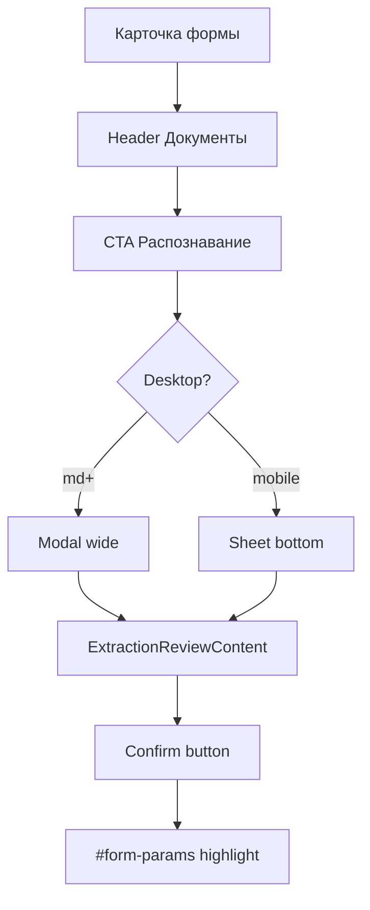

# OCR Review: Modal/Sheet вместо инлайн-панели

## Цель

Блок распознанных данных (`ExtractionReviewPanel`) сейчас отображается инлайн над секцией «Документы». Нужно:
- Убрать инлайн-панель с карточки формы
- Добавить CTA рядом с «Загрузить документы» для открытия диалога
- Desktop: `Modal` (`Dialog`)
- Mobile: `Sheet` с `side="bottom"`
- Контент панели без изменений логики

## Слои изменений

### UI / IA

**Точка входа:** header секции «Документы» (строка 314–319 в [`form-detail-page.tsx`](vdp/fe/src/components/ved/pages/form-detail-page.tsx)), слева от кнопки «Загрузить документы».

**Копирайт CTA** по `extractionPanelMode`:
- `idle` → «Статус распознавания» или «Распознавание»
- `pending` → «Распознавание…» (можно с индикатором)
- `review` → «Просмотр данных» или «Распознанные данные»

**Контейнер:**
- Desktop (`md+`): `Modal` с `wide` (как [`FormParamsEditDialog`](vdp/fe/src/components/ved/FormParamsEditDialog.tsx) → `sm:max-w-2xl`)
- Mobile: `Sheet` `side="bottom"` с max-height + scroll (паттерн из [`file-pick-button.tsx`](vdp/fe/src/components/ved/file-pick-button.tsx) строки 110–147)

### Компонент / FE

**Новый файл:** `vdp/fe/src/components/ved/ExtractionReviewDialog.tsx`

```tsx
export function ExtractionReviewDialog({
  open: boolean;
  onOpenChange: (open: boolean) => void;
  formId: string;
  invoiceJson?: string;
  role: string;
  status?: string;
  noDocuments?: boolean;
  hasDocuments?: boolean;
  canConfirm?: boolean;
})
```

Структура:
- `useIsMobileViewport()` из `file-pick-button` (или shared hook)
- Десктоп: `<Modal wide title={...}>` с контентом `ExtractionReviewPanel`
- Мобайл: `<Sheet side="bottom">` с `SheetHeader` + контент
- `ExtractionReviewPanel` экспортирует чистый контент без обёртки `<section>` (разделить на `ExtractionReviewContent` и `ExtractionReviewPanel`)

**Изменить:** [`form-detail-page.tsx`](vdp/fe/src/components/ved/pages/form-detail-page.tsx)
- Убрать инлайн `<ExtractionReviewPanel>` (строки 278–290)
- Добавить в строку 314–319: кнопку рядом с `canUploadDocs` label
- State: `const [extractionDialogOpen, setExtractionDialogOpen] = useState(false)`
- Видимость кнопки: `extractionPanelMode({ role, hasDraft: Boolean(parsed), status, noDocuments, hasDocuments }) !== "hide"`

### Домен / use cases

**Без изменений.** Статусная машина не меняется; `confirmExtraction` остаётся side-effect без смены статуса формы. AuthZ через `canConfirm` и `canControlExtraction` как сейчас.

### API / адаптеры

**Без изменений.** Существующие endpoint'ы:
- `POST /api/v1/forms/:id/extraction/start`
- `POST /api/v1/forms/:id/extraction/confirm`
- `POST /api/v1/forms/:id/extraction/cancel`

### Unit

**Новый файл:** `vdp/fe/src/components/ved/ExtractionReviewDialog.test.tsx`

Тесты:
- Открытие/закрытие диалога
- Рендер контента при разных `mode` (`idle`, `pending`, `review`)
- Видимость controls по `canControlExtraction`
- Mock `useIsMobileViewport` → проверить, что рендерится `Modal` vs `Sheet`

**Обновить:** [`extraction.test.ts`](vdp/fe/src/lib/ved/extraction.test.ts)
- Без изменений (логика `extractionPanelMode` остаётся)

### E2E / journey

**Обновить:** [`form-ux-deadends.spec.ts`](vdp/fe/e2e/form-ux-deadends.spec.ts) (строка 60)

Было:
```ts
await expect(page.getByTestId("extraction-controls")).toBeVisible();
```

Станет:
```ts
// Клик по CTA открытия диалога
await page.getByTestId("extraction-dialog-trigger").click();
// Ждём открытия диалога (desktop или mobile)
await expect(page.getByRole("dialog").or(page.getByRole("dialog", { name: /распознавание/i }))).toBeVisible();
await expect(page.getByTestId("extraction-controls")).toBeVisible();
```

**Обновить:** [`pilot-form-flow.spec.ts`](vdp/fe/e2e/pilot-form-flow.spec.ts) (строка 199) — аналогично.

**Новый сценарий:** gesture-тест на клик CTA → диалог → controls → confirm (реальный жест пользователя, не только `setInputFiles`).

### Compose / локальный repro

**Проверка перед DoD:**
1. `cd vdp && make compose-up` (или `compose-e2e` если стек уже поднят)
2. Залогиниться `user@vdp.local` / demo `user@demo.vdp.local`
3. Открыть черновик с документами (или создать через wizard)
4. В header «Документы»: кликнуть CTA «Распознавание» → диалог открывается
5. Desktop (resize окна `>md`): Modal wide
6. Mobile (resize `<md`): bottom sheet
7. Controls видны, confirm работает → параметры обновлены → highlight `#form-params`

### Docs / notify

**Вне scope.** Это internal UI-refactor без смены API или product-копирайта ops-docs.

`mgmt-tg-notify` при закрытии волны (не для промежуточного коммита).

## QG / DoD

### Целевой gate

**`make ci-pr`** (PR-паритет с узким Playwright).

### Лестница проверок

1. **`make check-env-parity`** — первым перед любыми тестами
2. **Unit:** `cd vdp/fe && npm test` (новый `ExtractionReviewDialog.test.tsx` + существующие не сломаны)
3. **`make precommit-gate`** (или хук `.githooks`) — env-parity + docs-format + unit + TG
4. **E2E:** `make ci-pr` (compose-e2e + Playwright PR-smoke на обновлённых specs)
5. **Локальный repro** (выше) перед «готово»

**Не требуется:** `ci-pr-pilot` (не трогаем ActionPanel / status-matrix), `release-gate` (не handover).

### Ожидаемые результаты

- Unit green: новый dialog test + существующие `extraction.test.ts` / `forms-rate-commission.test.ts`
- E2E green: `form-ux-deadends` / `pilot-form-flow` с кликом по trigger → диалог
- Локальный repro: диалог открывается, controls видны, confirm работает
- CI `vdp-ci.yml` green (PR required checks)

## Rules сверка

**Обязательны:**
- `планирование-сверка-с-rules` — этот план с слоями + QG
- `ui-web-практики` — паттерны modal/sheet, точка входа CTA
- `ux-взаимодействие-и-скорость` — feedback confirm, анимация открытия диалога
- `fe-interaction-contracts` — gesture E2E на клик trigger
- `playwright-e2e` — real user behavior, не bypass
- `тесты-архитектуры` — unit + узкий E2E journey
- `честность-готовности` — DoD выполнен = зелёный `ci-pr`
- `vdp-ci-local-gate` — лестница gate, `ci-pr` перед push
- `use-cases` — confirm ≠ submit, side-effect параметров
- `безопасность-ролей-и-данных` — AuthZ через `canConfirm` / `canControlExtraction`; Provider hide (уже в `extractionPanelMode`)

**Вне scope:**
- Смена статусной машины
- ML/OCR engine
- `release-gate` / handover
- `vdp-fe-docker-пересборка` (если понадобится — спросить)
- Полный `ci-pr-pilot` (не ActionPanel)

## Файлы изменений

### Новые
- `vdp/fe/src/components/ved/ExtractionReviewDialog.tsx`
- `vdp/fe/src/components/ved/ExtractionReviewDialog.test.tsx`

### Изменённые
- [`vdp/fe/src/components/ved/pages/form-detail-page.tsx`](vdp/fe/src/components/ved/pages/form-detail-page.tsx) — убрать инлайн-панель, добавить CTA + dialog
- [`vdp/fe/src/components/ved/ExtractionReviewPanel.tsx`](vdp/fe/src/components/ved/ExtractionReviewPanel.tsx) — опционально: выделить `ExtractionReviewContent` без `<section>` wrapper
- [`vdp/fe/e2e/form-ux-deadends.spec.ts`](vdp/fe/e2e/form-ux-deadends.spec.ts) — клик trigger → ждать диалог
- [`vdp/fe/e2e/pilot-form-flow.spec.ts`](vdp/fe/e2e/pilot-form-flow.spec.ts) — аналогично

## Анти-паттерны (избегать)

- Вёрстка диалога без unit/E2E
- DoD без `ci-pr`
- E2E bypass жеста (только `setInputFiles` без клика)
- Утверждение «готово» до зелёного gate

## Диаграмма потока


