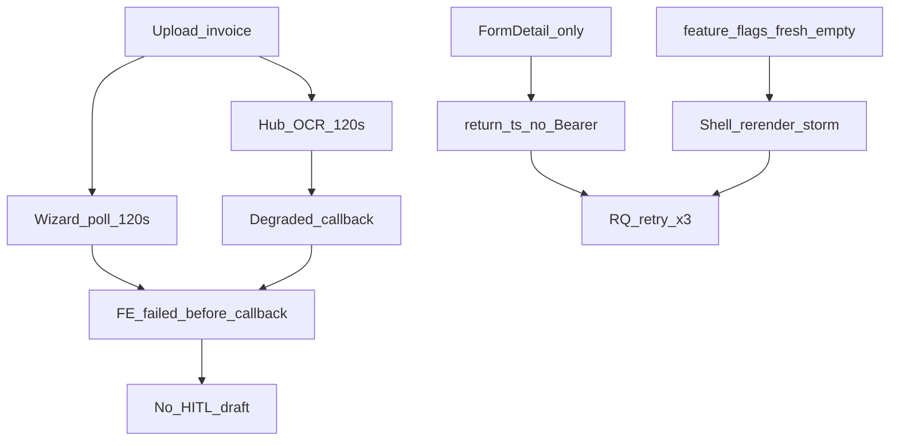

# OCR: приемлемый результат в мастере (UAT unblock)

## Диагноз (уточнено разведкой)

Три слоя (не путать):

1. **OCR / HITL:** хаб уже пишет `DegradedResult` + callback ([ocr.go](vdp/hub/internal/adapters/ocr/ocr.go), [schema.go](vdp/shared/extraction/schema.go)). Пустой HITL на скринах чаще из **гонки**: FE poll и hub оба **120s** → мастер ставит `failed` до прихода degraded `invoice_json`. Docling client **110s**, hub **120s**, FE **120s** — нет запаса. Cold/down Docling усиливает. Разведка: [Explore OCR timeout](e74318ff-b4c9-4be0-ab39-680cbb6eb673).
2. **401 spam:** только карточка ([form-detail-page.tsx](vdp/fe/src/components/ved/pages/form-detail-page.tsx)), не мастер. [return.ts](vdp/fe/src/lib/api/return.ts) без Bearer; core `withAuth`. RQ retry ≈3; лавину даёт связка с п.3. Разведка: [Explore return auth](e417188c-d87e-4fc4-b433-2a1b269c10ac).
3. **React loop:** [feature-flags.ts](vdp/fe/src/lib/ved/feature-flags.ts) `getServerSnapshot: () => ({})` — новый объект каждый вызов; shell на **каждой** app-странице (включая мастер).

Приёмлемо = Docling healthy + не пустой terminal без race: `done` с полями **или** `degraded` с открываемым HITL (schema v1, даже с пустым header) **или** честный `unavailable`. `ocr_timeout` без draft в FE = красный UAT.

## Сверка с rules

Обязательны: `планирование-сверка-с-rules`, `честность-готовности`, `fe-interaction-contracts`, `playwright-e2e`, `машинное-обучение` / `serverless-и-faas`, `устойчивость-и-наблюдаемость`, `безопасность-ролей-и-данных`, `vdp-ci-local-gate`, `ui-проблема-сразу-воспроизведи`.

Вне scope: статусная машина; own-model; compose postgres flake; Go 1.25; идеальная точность всех полей.

## Слои

- UI: без смены шагов; баннеры уже есть
- FE: return `apiFetch`; EMPTY_FLAGS; poll headroom + late draft; e2e HITL assert
- Домен / API: без смены контракта episode; core уже 200 `{active:false}` (ветка 404 в FE мёртвая)
- Unit: return auth, feature-flags snapshot, poll timeout
- E2E: `e2e/ocr-wizard-path.spec.ts` — вне узкого smoke → **ci-main**
- Compose / repro: healthy docling → smoke → ocr-path-gate → AGMS
- Docs: выровнять таймауты в architecture/extraction.md при смене чисел

## Работы

### 1. FE: auth return API

Все методы [return.ts](vdp/fe/src/lib/api/return.ts) → [apiFetch](vdp/fe/src/lib/api/client.ts). GET episode: ожидать 200 (в т.ч. `active:false`); 404→null оставить только как защиту, не как норму.

[form-detail-page.tsx](vdp/fe/src/components/ved/pages/form-detail-page.tsx): `retry: false` на return-episode.

Unit: 200, 401→ApiError.

### 2. FE: стабильный getServerSnapshot

Константа `EMPTY_FLAGS` в [feature-flags.ts](vdp/fe/src/lib/ved/feature-flags.ts). Unit: одна и та же ссылка.

### 3. FE: запас poll vs hub (закрыть race)

Поднятие [OCR_POLL_TIMEOUT_MS](vdp/fe/src/lib/ved/extraction.ts) до **150–180s** (hub остаётся 120s). В [forms-new-page.tsx](vdp/fe/src/components/ved/pages/forms-new-page.tsx): после срабатывания poll-timeout один финальный `getForm`; если уже есть ExtractionResult — применить prefill/`degraded`, не оставлять голый `failed` без draft.

Не поднимать `OCR_TIMEOUT_MS` хаба без зелёного smoke на тяжёлом PDF.

### 4. Repro ops

1. `make check-env-parity`
2. `docling` healthy (start_period до 90s)
3. `make extraction-docling-smoke`
4. `make ocr-path-gate`
5. Ручной AGMS: Network — schema v1 / HITL

Smoke красный → ops first (PRIMARY, URL, cold). Smoke зелёный + мастер `failed` без draft → п.3.

### 5. E2E HITL

В `ocr-wizard-path.spec.ts`: при `degraded` — открыть просмотр данных / наличие draft; не только уход из pending. Это e2e вне PR-smoke → DoD **`make ci-main`**.

### 6. QG

1. check-env-parity
2. FE unit
3. extraction-docling-smoke + ocr-path-gate
4. AGMS repro
5. Без e2e → `ci-pr`; с e2e OCR → **`ci-main`**
6. UAT клиенту только после зелёного ocr-path-gate
7. notify-mgmt при закрытии

## Анти-паттерны

- Считать 401 причиной пустого OCR на мастере
- Поднимать hub timeout без smoke
- Обещать autofill всех полей
- DoD на ci-pr-pilot после правки OCR e2e
