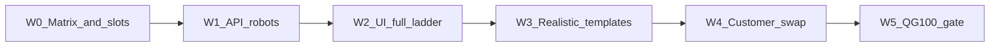

# Pilot Robot Matrix QG 100%

## Канон QG 100% (зафиксировано)

**QG 100%** = 100% строк **закрытой Pilot Robot Matrix** зелёные на трёх слоях + `make release-gate` green. Не означает Nest-паритет, закрытие всех `known-gaps`, ICO/ECO как UI-актёры или combinatorial «все роли × все статусы» ([`честность-готовности`](.cursor/rules/честность-готовности.mdc)).

Process policy по умолчанию ([`role_config.go`](vdp/core/internal/domain/formpayment/role_config.go)):
- **Участники процесса:** User, Manager, Provider (mandatory); ICO/ECO **off** → continuity через manager.
- **Root:** не слот процесса; каталоги + `root_cancel`.
- Цель: заявка отрабатывает **целиком и по матрице ролей/статусов**.

## Сверка с `.cursor/rules` (MUST)

**Обязательны:** `планирование-сверка-с-rules`, `базовые-правила-инструмента`, `правила-построения`, `честность-готовности`, `тесты-архитектуры`, `playwright-e2e`, `go-testing`, `use-cases`, `безопасность-ролей-и-данных`, `интеграция-и-события`, `устойчивость-и-наблюдаемость`, `развертывание-и-доставка`, `devops-культура`, `ui-web-практики` (CTA/next-step как проекция), `mgmt-tg-notify`, `vdp-fe-docker-пересборка` (fe refresh только после «да»).

**Вне scope:** ML-ядро статуса, serverless FaaS как носитель статуса, Nest rename/parity 100%, включение ICO/ECO UI в default spine, prod vendor UAT руками как gate.

**Gate/DoD-чеки из rules:** unit на AuthZ/переходы; API journeys; узкий browser на матрицу (не «мороженое»); Provider без ПДн; идемпотентность денег; correlation/id заявки; после закрытия — `notify-mgmt` kind `done`/`gate`.

---

## Закрытая матрица (источник истины)

Расширить/закрепить в [`e2e-coverage-matrix.md`](vdp/docs/development/e2e-coverage-matrix.md) секцию **Pilot Robot Matrix** со строками = ID из [`scenarioverify/catalog.go`](vdp/core/internal/scenarioverify/catalog.go) + явные **виды сделки** (минимум):

| ID / ветка | Смысл |
|------------|--------|
| `happy_path_to_completed` | полный путь до completed (advance и postpay/shipment — отдельные строки, если ветки SM разные) |
| `continuity_manager_form_approve` | ICO/ECO off, manager закрывает слоты |
| `manager_reject_to_corrections` + `user_resubmit_after_reject` | reject → fix → resubmit |
| `manager_payment_assign_provider` | payment + assign |
| `provider_payment_no_pii` | ACL провайдера |
| `root_cancel` | суперадмин |
| `doc_preview_visible` + `extraction_confirm_updates_amount` | документы/OCR side-path |
| `manager_hides_drafts` | очередь менеджера |
| spot: `refund_smoke`, `bank_channel_badge` | только если уже в каталоге и в DoD матрицы |

Каждая строка: **API covered** | **UI full-ladder covered** | **fixture pack** (template → customer). Пробел = не 100%.

---

## W0 — Контракт матрицы и слотов фикстур

- Файл-манифест фикстур (новый): `vdp/testdata/robot-fixtures/manifest.yaml` (или json): слоты `org`, `counterparty`, `provider`, `invoice_pdf`, `deal_fields` (сумма/валюта/HS/направление), `deal_kind` (`advance` \| `shipment`).
- Пути: `…/packs/template/` (до данных заказчика) и `…/packs/customer/` (после указки). Роботы читают **активный pack** через env `VDP_ROBOT_FIXTURE_PACK=template|customer`.
- Запрет Shenzhen/Anadolu/Emirates и прочих demo-mock имён в robot pack (уже частично в pilot-flow).
- Обновить матрицу: список строк + команды gate.

## W1 — Робот логики (API) = слой 1

- Все строки матрицы зелёные в `make compose-e2e` и/или Root `POST /api/v1/admin/scenario-runs` ([`scenario_verify_routes.go`](vdp/core/internal/transport/http/scenario_verify_routes.go)).
- Continuity при ICO/ECO off — через [`e2e-continuity.sh`](vdp/scripts/lib/e2e-continuity.sh); без голого ECO.
- Unit: допустимый переход + запрет чужой роли на затронутых действиях.
- CI: PR держит integration + узкий Playwright; полный матричный API — на main/`release-gate` (уже близко к [`ci_foundation_green_deploy`](.cursor/plans/ci_foundation_green_deploy_4c1b38d3.plan.md)).

## W2 — Полный UI-ladder (слой 2, вариант 2)

- Новый/расширенный Playwright: `@pilot-matrix` — для строк spine **без API-seed середины payment-ladder** (сейчас честный пробел в [`e2e-coverage-matrix.md`](vdp/docs/development/e2e-coverage-matrix.md) строка S-Pilot-E2E).
- Опора: [`pilot-form-flow.spec.ts`](vdp/fe/e2e/pilot-form-flow.spec.ts), helpers [`e2e/helpers/api.ts`](vdp/fe/e2e/helpers/api.ts) — seed только до точки входа UI первой роли; дальше клики CTA по статусам до `completed`.
- Assert: `data-status` на StatusBadge; Provider без ПДн; Root cancel spot.
- Цель Makefile: `make playwright-pilot-matrix` (grep `@pilot-matrix`) + полный `make playwright-e2e` в release-gate.

## W3 — Реалистичные шаблоны (interim, не «фейк-демо»)

- Заполнить `packs/template/` доменными полями и PDF **формата сделки** (не Lovable mock names). Честно в матрице: `fixture=template`.
- Роботы W1/W2 переключить на чтение манифеста (суммы/файлы из pack).
- Пока нет customer pack — QG не называют «на данных заказчика»; называют «на template pack».

## W4 — Этап реальных данных (слой 3)

Триггер: вы указываете путь/архив заказчика.

1. Импорт в `packs/customer/` (org/CP/provider/docs/deal fields); ПДн минимизировать; в логах/трейсах — без лишних ПДн.
2. `VDP_ROBOT_FIXTURE_PACK=customer`; прогон W1+W2 на том же ID матрицы.
3. Отчёт расхождений: fail → баг логики/UI; out-of-matrix → новая строка матрицы (осознанное расширение), не тихий skip.
4. После зелёного прогона: в матрице `fixture=customer`; template остаётся fallback для CI без секретов заказчика (customer pack **не** в публичный git, если чувствителен — `.gitignore` + CI secret/artifact).

## W5 — QG 100% закрытие

Проверяемые критерии (все must):

- [ ] Каждая строка Pilot Robot Matrix: API=green, UI-ladder=green, fixture=customer (или явный waiver с подписью scope — иначе не 100%)
- [ ] `make compose-e2e` green
- [ ] `make playwright-pilot-matrix` green
- [ ] `make release-gate` green
- [ ] Images←CI на main (уже в CI plan) — артефакт не едет при красном
- [ ] Матрица обновлена без ложного «полный паритет продукта»
- [ ] `make -C vdp notify-mgmt KIND=gate` (текст без IDE/путей планов)

**Конечный результат:** одно командой воспроизводимое доказательство, что при настройке процесса клиент/менеджер/провайдер (+ root admin) заявка всех зафиксированных типов/веток матрицы отрабатывает целиком на **реальных фикстурах заказчика**.

---

## Порядок исполнения

| Волна | Результат |
|-------|-----------|
| W0 | Матрица + слоты pack |
| W1 | API-роботы = логика 100% матрицы |
| W2 | UI-ladder 100% spine-строк |
| W3 | Template pack подключен |
| W4 | Customer swap + повторный прогон |
| W5 | QG 100% + notify |

Параллелить W1/W2 после W0 можно; W4 блокируется вашими данными; W5 только после W4 для заявления «на реальных данных».

## Анти-паттерны

- Ручной UAT как единственный gate.
- «Все варианты» без строки в матрице.
- Mock CP в robot pack.
- Утверждение QG 100% при template, если DoD требует customer.
- Расширение scope ICO/ECO UI под видом QG.
