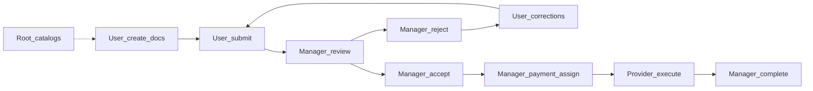

# Автотесты UX/UI: pilot-флоу заявки (участники по умолчанию)

## Сверка с `.cursor/rules` (MUST)

**Обязательны для этой работы:**
- `планирование-сверка-с-rules`, `базовые-правила-инструмента`, `правила-построения`
- `тесты-архитектуры` — пирамида: много unit, узкий browser E2E на journeys; не «мороженое»
- `playwright-e2e` — role locators / `getByTestId`, fixtures, без hardcoded timeout-хаков
- `use-cases`, `безопасность-ролей-и-данных` — assert роли и зоны (Provider без ПДн)
- `честность-готовности` — не писать «полный паритет UI»; матрица covered / partial / not
- `интеграция-и-события` — UI проекция статуса; сид через API, не через UI-оркестрацию всего ladder
- `ui-web-практики` + `ux-*` — проверяем CTA / empty / next step / порядок timeline, не пиксели
- `go-testing` / vitest — unit на mapper, CTA continuity, AuthZ где меняем контракт
- `mgmt-tg-notify` — после закрытия gate волны
- `vdp-fe-docker-пересборка` — `compose-fe-refresh` только после явного «да» пользователя

**Вне scope:**
- ICO/ECO как отдельные UI-актёры (в pilot `enabled=false` — [`role_config.go`](vdp/core/internal/domain/formpayment/role_config.go))
- ML/OCR как ядро статуса; ML-правила; Nest rename; CI foundation plan
- Combinatorial browser: все роли × все статусы
- Публичные smoke `admin/test`

**Gate/DoD-чеки из rules:**
- Unit: допустимый переход + запрет чужой роли (где трогаем политику)
- Playwright: критичные journeys, не дубль всей матрицы
- Обновить [`e2e-coverage-matrix.md`](vdp/docs/development/e2e-coverage-matrix.md) честно
- Команда: `cd vdp && make playwright-e2e` (+ `npm test` / Go unit по затронутым)
- После DoD: `make -C vdp notify-mgmt KIND=done`

---

## Кто «участник по умолчанию»

Зафиксировано по process policy (U/M/P spine) + запрос суперадмина:

| Актёр | Seed | В process config | Роль в прогоне |
|-------|------|------------------|----------------|
| **Клиент (User)** | `user@vdp.local` | mandatory | create → docs/OCR → submit → corrections |
| **Менеджер** | `manager@vdp.local` | mandatory + continuity ICO/ECO | review/reject/accept → payment → assign |
| **Провайдер** | `provider@vdp.local` | mandatory | исполнение; **без ПДн клиента** |
| **Root** | `root@vdp.local` | не в process | каталоги CRUD, Bank API copy, admin cancel (API/UI spot) |

**Не в default-прогоне UI:** `ico@` / `eco@` (слоты off; их шаги делает manager). Bank — только spot badge, не spine.

Зависимость продукта: assert’ы dead-ends (upload, org change, OCR controls, SubjectReview) требуют закрытия [`form_ux_dead-ends`](.cursor/plans/form_ux_dead-ends_f04c6e56.plan.md). Каркас уже в [`form-ux-deadends.spec.ts`](vdp/fe/e2e/form-ux-deadends.spec.ts) — этот план **не дублирует продукт**, а собирает **единый прогон + сценарии по актёрам** и дыры матрицы.



---

## 1. План работ (волны)

### W0 — Контракт прогона
- Тег Playwright `@pilot-flow` (или `describe` + `grep` в [`compose-playwright.sh`](vdp/scripts/compose-playwright.sh) / Makefile target `playwright-pilot`).
- Один файл-оркестратор [`vdp/fe/e2e/pilot-form-flow.spec.ts`](vdp/fe/e2e/pilot-form-flow.spec.ts): handoff ролей на **одной** заявке (API-сид до точки входа UI, затем клики только на CTA этапа).
- Документ сценариев: обновить строки в [`e2e-coverage-matrix.md`](vdp/docs/development/e2e-coverage-matrix.md) секцией «Pilot UI journeys» (не новый markdown без нужды — правка матрицы = источник истины).

### W1 — Клиент (User) UI
Опереться на существующие + добить gaps:
- [`form-ux-deadends.spec.ts`](vdp/fe/e2e/form-ux-deadends.spec.ts) — CP honesty, draft upload/OCR/edit, corrections upload, timeline
- [`api-core-ux.spec.ts`](vdp/fe/e2e/api-core-ux.spec.ts) — persist amount/HS/CP
- [`reject-path.spec.ts`](vdp/fe/e2e/reject-path.spec.ts) — banner + resubmit
- **Добавить в pilot-flow:** UI create wizard (не только API draft) happy-path до submit; registry docs preview/delete если DoD dead-ends закрыт

### W2 — Менеджер UI
- [`happy-path.spec.ts`](vdp/fe/e2e/happy-path.spec.ts), [`api-core-ux`](vdp/fe/e2e/api-core-ux.spec.ts) manager CTA, [`manager-payment`](vdp/fe/e2e/manager-payment.spec.ts), [`manager-hides-drafts`](vdp/fe/e2e/manager-hides-drafts.spec.ts), SubjectReview из deadends
- **Добавить в pilot-flow:** take → reject **или** take → accept на той же заявке после user handoff; PDF iframe spot

### W3 — Провайдер UI
- Уже: [`provider-acl.spec.ts`](vdp/fe/e2e/provider-acl.spec.ts) (PR smoke)
- **Добавить:** в pilot-flow после `createProviderProcessingForm` / manager assign — login provider → видит заявку → CTA исполнения без ФИО/паспорта клиента; assert отсутствие ПДн-паттернов

### W4 — Root UI
- Уже: catalog CRUD + Bank API copy в `api-core-ux`
- **Добавить spot:** `root_cancel` в Playwright (карточка → отмена) **или** честно оставить API-only в матрице и в pilot-flow не включать — **решение плана:** spot UI cancel на API-seeded submitted form (закрывает дыру «UI Playwright: not covered» в матрице)

### W5 — Gate
- `make playwright-e2e` полный suite green
- `make playwright-pilot` (grep `@pilot-flow`) как быстрый handoff-check
- Vitest: `cta-continuity-contract`, mappers timeline — без регресса
- Обновить матрицу; `notify-mgmt` kind `done`

Паттерн каждого UI-шага (правило `тесты-архитектуры` + `интеграция-и-события`):

```
API seed → status N
loginAs(role)
goto /forms/{id}
expect StatusBadge / next-step CTA
click primary action
expect status N+1 or success feedback
```

---

## 2. Сценарии прогона по актёрам

Формат: **Given / When / Then**. ID стыкуются с `scenarioverify` где возможно.

### S-User-01 — Честный старт (справочник + мастер)
- **Given** app mode, purge mock CP (`purgeDemoMockCounterparties`)
- **When** client открывает `/counterparties` и `/forms/new` шаг «Стороны»
- **Then** нет Shenzhen/Anadolu/Emirates; есть «Добавить» / путь создать CP; empty не тупик
- **Слой:** Playwright ([`form-ux-deadends`](vdp/fe/e2e/form-ux-deadends.spec.ts))
- **Catalog:** UI-only (honesty)

### S-User-02 — Черновик: стороны, docs, OCR, edit
- **Given** API `createPersistedDraftForm` + CP
- **When** client на карточке
- **Then** «Сменить организацию», «Редактировать заявку», upload, OCR start/restart/cancel видны
- **Слой:** Playwright deadends + unit extractionPanelMode
- **Catalog:** related `extraction_confirm_*` (API), UI controls — UI

### S-User-03 — Submit
- **Given** draft ready
- **When** «Отправить на проверку»
- **Then** статус ожидания проверки; timeline: новое событие **выше** старого
- **Слой:** Playwright; unit `mapComplianceHistory`
- **Catalog:** prefix `continuity_manager_form_approve` / happy_path

### S-User-04 — Corrections после reject
- **Given** `createRejectedForm` / `eco_reject_resubmit` (manager fallback)
- **When** client на карточке
- **Then** красный guidance + **Загрузить документы** + путь «Отправить исправления»
- **Слой:** Playwright deadends + reject-path
- **Catalog:** `eco_reject_resubmit`, `user_resubmit_after_reject`

### S-Mgr-01 — Очередь и continuity review
- **Given** `createSubmittedForm`
- **When** manager открывает карточку
- **Then** label «Новая заявка» / take CTA; после take — accept + «Вернуть на доработку»; SubjectReview **не** read-only guidance ВКО/КО
- **Слой:** Playwright api-core-ux + deadends + happy-path
- **Catalog:** `continuity_manager_form_approve`, `manager_reject_to_corrections`

### S-Mgr-02 — Скрыть чужие draft
- **Given** user draft exists
- **When** manager `/forms`
- **Then** draft клиента не в очереди
- **Слой:** Playwright `manager-hides-drafts`
- **Catalog:** `manager_hides_drafts`

### S-Mgr-03 — Payment + assign provider
- **Given** seed `manager_payment_assign_provider`
- **When** manager на payment gate
- **Then** CTA назначить провайдера до start payment
- **Слой:** Playwright `manager-payment`
- **Catalog:** `manager_payment_assign_provider`

### S-Mgr-04 — PDF preview
- **Given** submitted + `uploadAndAttachInvoice`
- **When** «Посмотреть»
- **Then** iframe; нет demo-заглушки
- **Слой:** Playwright api-core-ux
- **Catalog:** `doc_preview_visible` (сейчас UI partial → закрыть)

### S-Prov-01 — ACL без ПДн
- **Given** form in provider queue / processing
- **When** provider registry + card
- **Then** нет клиентских ПДн; видны реквизиты/сумма/id
- **Слой:** Playwright `provider-acl` (smoke) + шаг в pilot-flow
- **Catalog:** `provider_payment_no_pii`

### S-Prov-02 — Исполнение (UI spot)
- **Given** `createProviderProcessingForm`
- **When** provider primary payment CTA
- **Then** переход к ожидаемому payment status (или явный success feedback)
- **Слой:** Playwright pilot-flow (сейчас дыра относительно полного browser happy path)
- **Catalog:** часть `happy_path_to_completed`

### S-Root-01 — Каталоги
- **Given** root login
- **When** `/counterparties`, `/providers`, `/organizations`
- **Then** «Добавить»; Bank API copy про канал интеграции
- **Слой:** Playwright api-core-ux
- **Catalog:** UI-only

### S-Root-02 — Cancel заявки
- **Given** submitted form
- **When** root отменяет с карточки
- **Then** статус canceled / badge; матрица `root_cancel` → UI covered
- **Слой:** Playwright pilot или `root-cancel.spec.ts`
- **Catalog:** `root_cancel`

### S-Pilot-E2E — Сквозной handoff (главный прогон)
Одна заявка, смена логинов:

1. User: (API draft + upload) → UI submit  
2. Manager: take → reject  
3. User: upload visible → resubmit  
4. Manager: take → accept → … API seed до payment_processing **или** UI assign  
5. Provider: open → no PII → execute spot  
6. Manager: completed badge (можно API close + UI assert как `completed-journey`)

Не гонять весь ladder кликами — только **точки смены актёра и тупиковые CTA** (правило journeys).

---

## 3. Артефакты и команды

| Артефакт | Назначение |
|----------|------------|
| [`auth.fixture.ts`](vdp/fe/e2e/fixtures/auth.fixture.ts) | `loginAs` |
| [`helpers/api.ts`](vdp/fe/e2e/helpers/api.ts) | seed статусов |
| `pilot-form-flow.spec.ts` | новый сквозной |
| существующие `*-path` / deadends / api-core-ux | точечные S-* |
| [`e2e-coverage-matrix.md`](vdp/docs/development/e2e-coverage-matrix.md) | честная карта |

```sh
cd vdp && make playwright-e2e          # полный Docker suite
cd vdp && make playwright-pilot        # NEW: grep @pilot-flow
cd vdp/fe && npm test                  # vitest mappers/CTA
cd vdp/core && go test ./internal/...  # при правках AuthZ/seed
```

---

## 4. DoD волны

- Все S-User / S-Mgr / S-Prov / S-Root выше имеют зелёный Playwright или явную пометку «API-only» в матрице (не молчание)
- `S-Pilot-E2E` green на compose
- Нет ложного «100% browser coverage»
- Product dead-ends не блокируют assert (или тесты `test.skip` с причиной до закрытия form_ux_dead-ends — предпочтение: **сначала продукт, потом unskip**)
- `notify-mgmt` после gate
