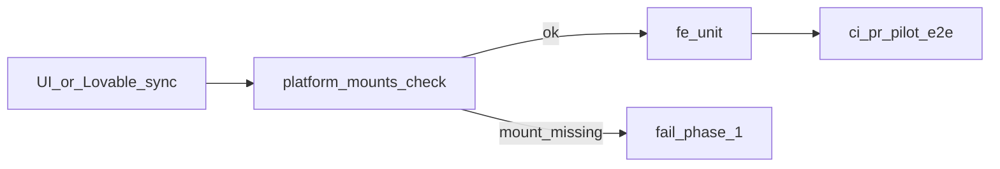

# Вернуть подсказку и закрыть orphan-mount

## Инцидент (фиксируем как ошибку процесса)

Коммит `7e8b3ed0` снял из [vdp/fe/src/components/ved/pages/form-detail-page.tsx](vdp/fe/src/components/ved/pages/form-detail-page.tsx) import и `<ManagerRouteHintPanel role={role} />`. Файлы панели и unit остались. [vdp/fe/AGENTS.md](vdp/fe/AGENTS.md) оформил это как норму: «kept on disk… re-wire if needed». `ci-pr-pilot` упал на [vdp/fe/e2e/manager-route-hint.spec.ts](vdp/fe/e2e/manager-route-hint.spec.ts) (`getByTestId('manager-route-hint')` не найден). Unit зелёный, потому что не проверяет mount.

Класс: **orphan platform widget** — код жив, экран мёртв, дешёвый gate молчит, ловит только длинный Playwright.

Запрет после этой волны: для видимых platform-only фич soft-defer («файл есть, вставим потом») запрещён. Sync может менять layout, но обязан сохранить обязательные mounts.

## Сверка с rules

Обязательны: `планирование-сверка-с-rules`, `честность-готовности`, `ui-web-практики`, `поддержка-и-обратная-связь` (подсказка в контексте карточки), `playwright-e2e`, `vdp-ci-local-gate`, `use-cases` (UI — проекция), `devops-культура` (blameless, action item в пайплайн).

Вне scope: BPM, process-roles менеджеру, ActionPanel / статусная машина, `release-gate`, `notify-mgmt`, `compose-fe-refresh`, коммит/push без явной просьбы, правки `vdp/docs/**` (чтобы не задеть format-конвенцию).

## Слои

- UI: вставить `ManagerRouteHintPanel` сразу после блока «Жизненный цикл» / `StageStepper` (как до `7e8b3ed0`).
- FE: import + JSX в `form-detail-page.tsx`. Видимость по-прежнему внутри панели через `shouldShowManagerRouteHint` (`manager` / `root`).
- Unit: существующий [vdp/fe/src/lib/ved/manager-route-hint.test.ts](vdp/fe/src/lib/ved/manager-route-hint.test.ts) не дублировать.
- E2E: spec не ослаблять и не переписывать.
- Статический gate: новый скрипт по образцу [vdp/scripts/check-pilot-matrix-stale.sh](vdp/scripts/check-pilot-matrix-stale.sh).
- Домен / API: не трогать.

## Шаги

1. **Re-wire.** В `form-detail-page.tsx` вернуть:
   - `import { ManagerRouteHintPanel } from "@/components/ved/ManagerRouteHintPanel";`
   - `<ManagerRouteHintPanel role={role} />` после панели «Жизненный цикл» (сейчас строки ~290–295), до баннера возврата.

2. **Реестр + скрипт** `vdp/scripts/check-platform-mounts.sh` (bash, без нового формата/YAML). Одна запись сейчас:
   - host: `fe/src/components/ved/pages/form-detail-page.tsx` содержит `ManagerRouteHintPanel`
   - компонент: `fe/src/components/ved/ManagerRouteHintPanel.tsx` содержит `data-testid="manager-route-hint"`
   - fail, если в `fe/AGENTS.md` осталась фраза `re-wire into form-detail-page if needed`
   - Make-цель `platform-mounts-check` рядом с `lovable-seed-check` в [vdp/Makefile](vdp/Makefile).

3. **Врезка в CI.** В [vdp/scripts/ci-pr-static.sh](vdp/scripts/ci-pr-static.sh) `run_bg` рядом с `pilot-matrix-stale`. В [vdp/scripts/test-cd-scripts.sh](vdp/scripts/test-cd-scripts.sh): `bash -n`, прогон скрипта, `grep` что `ci-pr-static.sh` его вызывает.

4. **Контракт для следующих работ.**
   - [vdp/fe/AGENTS.md](vdp/fe/AGENTS.md): заменить soft-строки про hint на MUST: mounts из реестра обязательны в live host; «файл на диске без вставки» = красный check.
   - Короткое alwaysApply-правило `.cursor/rules/fe-platform-mounts.mdc`: класс orphan-mount; после sync / правок `form-detail-page` не оставлять soft-TODO; перед «готово» по UI journey — `platform-mounts-check`, а публикация — только после зелёного `ci-pr-pilot`.
   - Короткая запись инцидента в `заметки/конструктор-сценариев/` (plain text, без нового процесса): симптом, коммит, класс, что теперь ловит скрипт.

5. **Gate.** Из `vdp`: сначала `make check-env-parity`, затем `make ci-pr-pilot`. Не утверждать готовность к публикации, пока Pilot красный. `release-gate` не гонять.

## DoD

- Менеджер снова видит блок на карточке; user/provider по-прежнему нет (логика панели не меняется).
- `make platform-mounts-check` красный, если вставку снова снять (проверка на текущем дереве — зелёная).
- Check входит в фазу 1 `ci-pr-static` и в `test-cd-scripts`.
- `make ci-pr-pilot` зелёный, включая `manager-route-hint.spec.ts`.
- AGENTS больше не разрешает «re-wire if needed».
