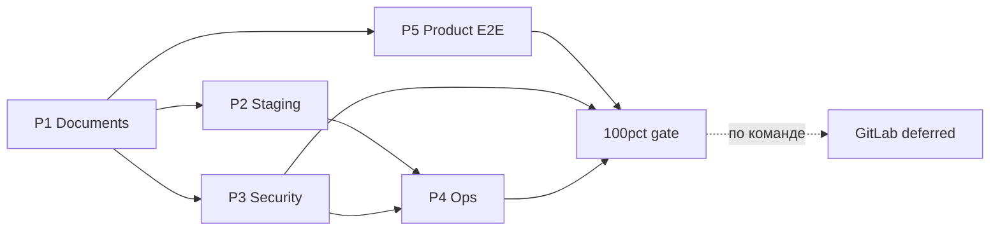

# Post-R12 — master index (P1–P5)

## Контекст

R0–R12 закрыли API/state machine (331/331, Must/Should/§9 — `ParityDone`). Остаток — **продуктовая глубина** и **prod/staging readiness**, см. [vdp/docs/pilot/known-gaps.md](vdp/docs/pilot/known-gaps.md).

**Ориентир скорости:** [заметки/ориентир-скорости-2026-08-25.md](заметки/ориентир-скорости-2026-08-25.md) — ~3.8 todo/ч, R10–R12 тяжелее. Суммарно P1–P5: **~24–28 todos → ~7–10 ч** чистой разработки (+ время на шаблоны PDF и доступы вендоров вне кода).

## Карта этапов

| Этап | Plan file | Gap IDs | Оценка |
|------|-----------|---------|--------|
| **P1** | `p1_documents_prod.plan.md` | G-DOC-PDF, G-DOC-TPL-PA, G-DOC-XLSX | ~3–4 ч |
| **P2** | `p2_staging_integrations.plan.md` | G-STG-DOCS, MAIL, BANK-WH; Diadoc/OCR optional | ~2 ч + vendor |
| **P3** | `p3_security_hardening.plan.md` | G-SEC-SECRETS, G-SEC-REVIEW | ~1.5–2 ч |
| **P4** | `p4_ops_observability.plan.md` | G-OPS-ALERTS, G-OPS-OBS, backup checklist | ~1–1.5 ч |
| **P5** | `p5_product_e2e_gaps.plan.md` | G-RATING-UI, G-ADV-SHIP-E2E, G-OCR policy | ~2–3 ч |
| **GitLab** | *не создавать до 100%* | CI mirror | по команде |

## Rules gate (все P*)

**Обязательны:** `чистая-архитектура`, `use-cases`, `интеграция-и-события`, `безопасность-ролей-и-данных`, `устойчивость-и-наблюдаемость`, `тесты-архитектуры`, `честность-готовности`, `правила-построения`, `развертывание-и-доставка` (immutable artifacts, secrets снаружи).

**Вне scope всех P*:** Nest data migration; logistics/analytics/assistant; combinatorial browser matrix; **GitLab CI** до закрытия P1–P5.

## Глобальный DoD (100%)

- [ ] Нет `stub.pdf` / `xlsx-placeholder` на acceptance path **или** явно задокументирован disable + подпись заказчика
- [ ] Staging smoke: DOCS + MAIL с реальными URL (скрипт/checklist)
- [ ] Prod compose/profile без dev secrets
- [ ] Security checklist подписан (ACL, Provider PII, files)
- [ ] Semantic alerts + runbook в repo
- [ ] `make release-gate` green; [known-gaps.md](vdp/docs/pilot/known-gaps.md) и [readiness-and-limits.md](vdp/docs/pilot/readiness-and-limits.md) обновлены
- [ ] **Напоминание агенту:** предложить GitLab только после чеклиста выше; исполнять **только по команде пользователя**

## Out of scope (оговорки, не gap)

- Полный паритет Nest product depth
- Load testing (отдельная задача по запросу)
- Diadoc prod — optional если пилот на manual signing
