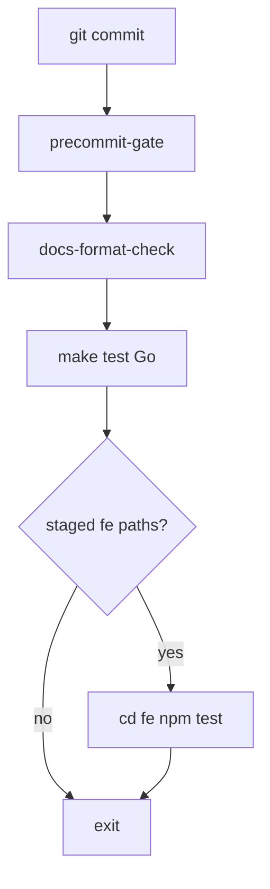

---
name: Precommit FE unit
overview: Добавить в pre-commit path-aware `cd fe && npm test`, когда в staged есть `vdp/fe/**`, чтобы FE unit ловился до коммита, не удлинняя docs/Go-only коммиты.
todos:
  - id: precommit-fe-path
    content: "precommit-mgmt-notify: path-aware fe npm test after make test"
    status: completed
  - id: contract-docs-rules
    content: test-cd-scripts + makefile-reference + vdp-ci-local-gate line
    status: completed
  - id: repro-precommit
    content: check-env-parity + test-cd-scripts + manual staged fe vs docs repro
    status: completed
  - id: commit-push-gate
    content: One commit; make ci-pr-fast; push
    status: completed
isProject: false---

# Pre-commit: FE unit по path

## Зачем

Сейчас [precommit-mgmt-notify.sh](vdp/scripts/precommit-mgmt-notify.sh) гоняет только `docs-format-check` + `make test` (Go). `fe-npm-test` живёт в `ci-pr-fast` → pre-push. FE-регрессии узнаются поздно. Правило пользователя: раньше сигнал, без смешения с product OCR.

**Зависит от:** желательно после [ship_ocr_uat_clean](ship_ocr_uat_clean_a5051c51.plan.md) (clean tree), но **не** делит файлы с OCR product — можно параллельно по смыслу после ship.

**Не включает:** dirty-tree guard (план 3), OCR product, compose retry.

## Сверка с `.cursor/rules`

**Обязательны:** `планирование-сверка-с-rules`, `vdp-ci-local-gate`, `честность-готовности`, `правила-построения`, `devops-культура` (быстрый feedback).

**Вне scope:** смена лестницы `ci-pr` / `ci-main`; `SKIP_PREPUSH_GATE`; Playwright в pre-commit; `mgmt-tg-notify` текст на green (по-прежнему только fail).

## Слои

| Слой | Scope |
|---|---|
| Hooks / scripts | [precommit-mgmt-notify.sh](vdp/scripts/precommit-mgmt-notify.sh), при необходимости тонкий helper `scripts/precommit-fe-unit.sh` |
| Contract | [test-cd-scripts.sh](vdp/scripts/test-cd-scripts.sh) |
| Rules | [.cursor/rules/vdp-ci-local-gate.mdc](.cursor/rules/vdp-ci-local-gate.mdc) — строка: FE staged → npm test в pre-commit |
| Docs | одна фраза в [makefile-reference.md](vdp/docs/development/makefile-reference.md) у `precommit-gate` |
| Product FE/Go/e2e | вне scope |

## Решение (конкретно)

1. После `make test` в `precommit-mgmt-notify.sh`: если `git diff --cached --name-only` (repo root) матчит `^(vdp/)?fe/` — выполнить `cd "$ROOT/fe" && npm test`; иначе skip.
2. Fail pre-commit при ненулевом npm test; notify body при fail упоминает «юнит FE», не только Go.
3. Docs-only / Go-only / `.cursor/plans` без staged `fe/` — поведение как сейчас (без npm test).
4. Не гонять полный `ci-pr` в pre-commit.
5. `test-cd-scripts`: assert path-check + `npm test` присутствует в precommit script; `bash -n`.
6. Не ослаблять env-parity / docs-format порядок.

## Рядом не сломать

- [.githooks/pre-commit](.githooks/pre-commit) по-прежнему только `make precommit-gate`.
- Pre-push / path escalate / compose-up-with-retry — без изменений.
- GitHub Desktop с `core.hooksPath=.githooks` получит FE check автоматически.
- Длительность: npm test только когда FE в индексе.

## DoD / QG

- [ ] `make check-env-parity`
- [ ] `make test-cd-scripts`
- [ ] `make docs-format-check`
- [ ] Ручной repro: staged только `vdp/docs/**` → precommit без npm; staged `vdp/fe/**/*.ts` → npm test вызывается
- [ ] Один коммит только hook/CD/docs/rules; gate **`make ci-pr-fast`** (затронуты scripts/Makefile surface, без e2e)
- [ ] Push без `SKIP_PREPUSH_GATE`
