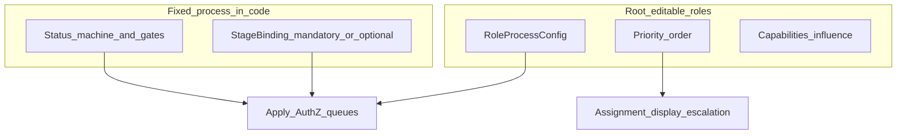

# Role participation in a fixed process (не смена методологии)

## Важное уточнение (итерация)

**Нельзя** менять методологию бизнеса и то, что противоречит логике процесса / законодательству.

Речь **только о ролях в процессе**:

- включить роль в процесс;
- указать **приоритет** и переставить роли местами (порядок ролей, не этапов процесса);
- отключить или удалить роль из участия.

**Сам процесс не меняется** — статусы, обязательные gates (комплаенс, деньги, договор и т.д.), допустимые переходы остаются в домене/коде.

Пример: клиента привёл **сейлз** → роль участвует в заявке (атрибуция / сопровождение / приоритет в очереди), далее заявка идёт **тем же** методологическим путём. Сейлз **не** вставляется как перестановка «вместо ECO» и **не** ломает обязательный compliance.

## Что снято с плана (было лишним)

- Reorder / swap **этапов процесса** (ICO↔ECO как смена методологии).
- Insert stage template «между менеджером и платежом» как изменение пайплайна статусов.
- Любой BPM / редактор последовательности бизнес-шагов через админку.

## Что остаётся в scope

| Действие root | Да / нет |
|---|---|
| Enable / disable / remove **роли** из участия | да (с оговоркой mandatory) |
| Приоритет роли (sort order среди ролей) | да |
| Capabilities + influence (`actor` / `observer` / `none`) | да |
| Менять порядок/наличие обязательных этапов процесса | **нет** |
| Выключить законодательно/методологически обязательную роль-актор этапа | **нет** (400 + причина); только через релиз кода, меняющий `StageBinding.mandatory` |

## Модель

1. **Fixed process** — существующий lifecycle [`formpayment`](vdp/core/internal/domain/formpayment/); `StageBinding` в коде: какая роль *по умолчанию* actor на этапе, `mandatory: true|false`.
2. **RoleProcessConfig (БД):** `role`, `enabled`, `priority` (int), `influence`, `capabilities[]`, `removable` (derived: optional roles only).
3. **Priority** — порядок среди ролей для UI очередей, эскалации, «кто первый смотрит», атрибуции (сейлз выше/ниже manager в списке участников) — **не** порядок статусов заявки.
4. **Optional role** (напр. `sales` / `viewer`): можно включить, выставить priority, дать `form.view` + поля атрибуции; disable/remove без изменения gates.
5. **Mandatory actor** (напр. compliance на этапе, если `StageBinding.mandatory`): disable запрещён конфигом; процесс как сейчас.

Seed: текущие роли + приоритеты, отражающие сегодняшний порядок участия (user → ico → eco → manager → provider…), без смены TargetStatus.

Сейлз (P0): завести в каталоге ролей `sales` как **optional**, default `enabled=false`, influence `observer` или ограниченный actor без status-changing actions; поле/связь «привёл клиента» на org/form (минимально: `referred_by_account_id` или использование существующего manager/agent поля — выбрать одно при реализации, без ломки платежей).

## Решения (зафиксированы)

- Каталог capabilities — в коде.
- Конфиг ролей + priority — в БД, root only, version + audit.
- Process methodology — только код/релиз.
- Disable optional → CTA/очереди роли исчезают; mandatory stages работают как сейчас.
- «Удалить роль» = soft: `enabled=false` + скрыть из process UI; не drop из IdP accounts без отдельного admin accounts API.
- In-flight: version stamp на форме; смена priority/optional ролей не мигрирует статусы.
- Погрешность ~15%: полный sweep всех HTTP `RequireRoles` → capability — P1; sales attribution UI минимальный.

## Сверка с `.cursor/rules`

**Обязательны:** `планирование-сверка-с-rules`, `базовые-правила-инструмента`, `правила-построения`, `use-cases`, `чистая-архитектура`, `solid`, `безопасность-ролей-и-данных`, `интеграция-и-события` (UI/конфиг не источник истины статуса), `тесты-архитектуры`, `go-testing`, `честность-готовности`, `ui-web-практики`.

**Вне scope:** смена статусной методологии админкой, BPM, ML, fe docker refresh.

**Gate/DoD:** priority reorder работает; optional role on/off; попытка disable mandatory → 403/400; default seed ≡ текущий process path; без утверждения «процесс стал конфигурируемым».

## Декомпозиция

### W1 — Catalog + StageBinding (код)

- Capabilities + DefaultRoleConfigs (паритет [`RolesForAction`](vdp/core/internal/domain/formpayment/actions.go))
- `StageBinding`: stage → default actors, `Mandatory bool`
- Роль `sales` в [`role.go`](vdp/core/internal/domain/role.go) + ParseRole; optional binding ни к одному mandatory stage

### W2 — RoleProcessConfig в AuthZ / queues

- Snapshot: roles sorted by priority
- `RoleMayPerformWithConfig` для transitions
- Priority влияет на list/sort участников и admin UI, не на `TargetStatus` graph
- Mandatory check при Upsert

### W3 — Persist

`015_role_process_config.sql`: `process_policy_meta`, `role_process_configs(role, enabled, priority, influence, capabilities jsonb)`, seed, `form_payments.process_policy_version`

### W4 — HTTP

- `GET /api/v1/process-roles`
- `PUT /api/v1/admin/process-roles/{role}` — enabled, influence, capabilities
- `PUT /api/v1/admin/process-roles/priorities` — ordered role ids
- Reject disable/remove if role is mandatory actor per StageBinding

### W5 — FE root

- Экран «Роли процесса»: список по priority, up/down, toggle optional, capabilities, influence
- Явная подпись: «порядок ролей ≠ изменение этапов заявки»
- `actionsFor` фильтр по enabled + capabilities + influence
- Минимально: показать sales в участниках / referred_by если включён

### W6 — Verify

- Unit/service/http + vitest
- Disable sales ok; disable ICO if mandatory → fail
- Priority swap не меняет submit→status path
- DoD: «управление ролями в фиксированном процессе»

## Вне плана

- Админский редактор статусов / перестановка compliance↔payment
- Полный CRM sales-кабинет
- Clone произвольных role id без кода (P1)

## Порядок

W1 → W2 → W3 → W4 → W5 → W6.
