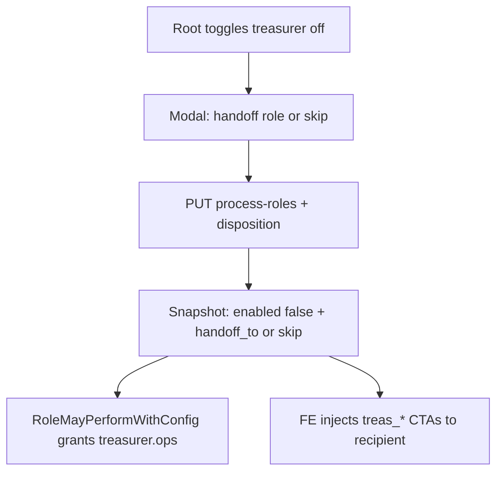
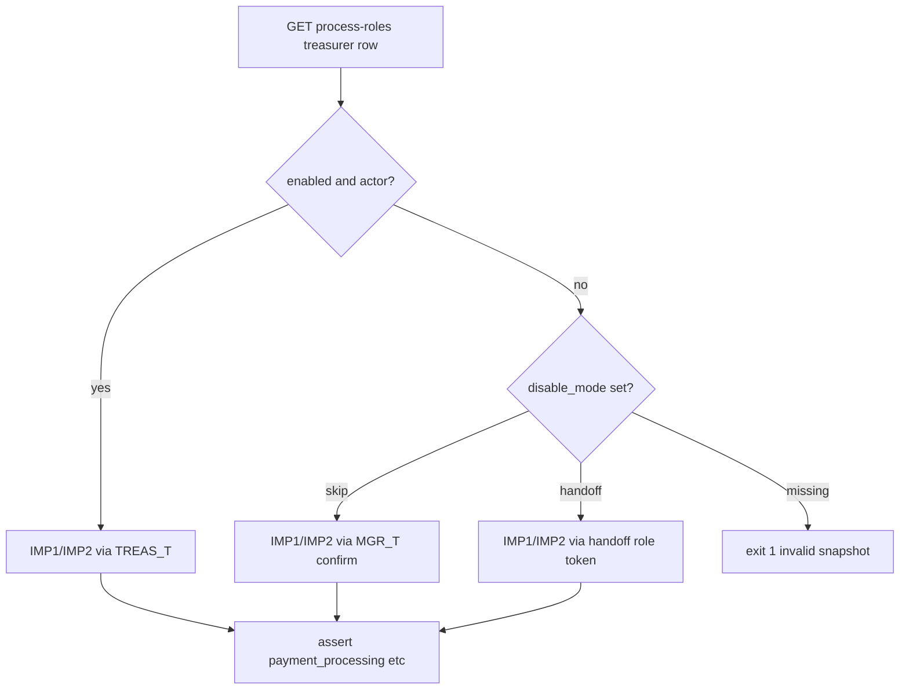

# Process-roles treasurer handoff/skip + admin soft-delete

## Решения (зафиксированы)

- **1B:** при выключении казначея — диалог: переложить на роль **или** skip (шаги `treasurer.*` выполняет менеджер по тем же переходам статусов; граф не режется).
- **2C:** только казначей; silent continuity ICO/ECO не меняем.
- Удаление пользователей: **soft-delete** (`active=false` + revoke refresh + скрытие в admin list), не hard DELETE из БД. Запрет: себя и последнего root.
- **Gate honesty:** product skip ≠ test skip. Локальный/`ci-pr-pilot` gate обязан исполнять IMP1/IMP2 и pilot-ladder при disposition skip/handoff через recipient-актёра; `soft_skip` как зелёный путь при штатном «казначей выключен» — запрещён.

## Сверка с `.cursor/rules`

**Обязательны:** `планирование-сверка-с-rules`, `use-cases`, `безопасность-ролей-и-данных`, `чистая-архитектура` / `детали-как-плагины`, `интеграция-и-события` (статусная машина в домене), `ui-web-практики` + `ux-когнитивная-нагрузка` (диалог confirm), `тесты-архитектуры`, `go-testing`, `nestjs-testing` N/A (Go/FE), `playwright-e2e`, `vdp-ci-local-gate`, `честность-готовности`, `plan-закрытие-и-dod`, `fe-platform-mounts` (не снимать `ManagerRouteHintPanel`).

**Вне scope:** BPM-редактор графа статусов; миграция ICO/ECO continuity; hard wipe аккаунтов; ML/FaaS; смена payment method матрицы; `release-gate`; `mgmt-tg-notify` (нет закрытия продуктовой волны для менеджмента, пока не попросят).

**Gate DoD:** `make check-env-parity` → unit (Go + FE) → **`make ci-pr-pilot`** на **двух** конфигурациях слота (ниже). Один зелёный при красном другом = не ready (`честность-готовности`).

## Поток disable казначея

- **Handoff:** выбранная enabled actor-роль получает право на `CapTreasurerOps` действия, пока treasurer `enabled=false`.
- **Skip:** `handoff_to=manager` по политике skip (копирайт «продолжить без казначея»); менеджер с `manager.ops` исполняет те же `treasurer_confirm` / signing / complete. Root по-прежнему union.
- Без записи disposition в snapshot — **запретить** disable (не silent).

## Gate honesty (MUST) — supersede soft_skip adapt

Контекст: план [`treasurer_gate_adapt_00e1691c`](treasurer_gate_adapt_00e1691c.plan.md) вшил в [`compose-e2e.sh`](vdp/scripts/compose-e2e.sh) ветку `TREAS_IN_PROCESS=no` → **soft_skip IMP1/IMP2**, а [`test-cd-scripts.sh`](vdp/scripts/test-cd-scripts.sh) это **требует** (`soft_skip … treasurer_slot_off`). Для disposition skip/handoff это **fake-pass**: suite зелёный без проверки новой логики.

**Запрещено в DoD этой волны:**

- `soft_skip` / `test.skip` / `|| true` / ослабление ассёртов как «успех» при treasurer off + валидном disposition
- force-enable treasurer ради зелёного gate (`PUT …/process-roles/treasurer` в compose)
- зелёный `ci-pr*` / `ci-pr-pilot`, если IMP1/IMP2 или export ladder не исполнены на skip-конфиге

**Обязательно:**

1. **compose-e2e** — читать `enabled`, `influence`, `disable_mode`, `handoff_role`:
   - enabled+actor → текущий путь `TREAS_T`
   - disabled + skip → тот же сценарий IMP1/IMP2, confirm через **manager** (тот же Nest/treasurer confirm endpoint с `MGR_T`, если AuthZ так разрешит; иначе manager action-bridge эквивалент — assert статуса идентичен)
   - disabled + handoff → токен handoff-роли
   - disabled без disposition → **fail** (negative), не soft_skip
2. **test-cd-scripts** — снять требование `soft_skip … treasurer_slot_off`; добавить контракт: compose ветвит по disposition и **исполняет** IMP1/IMP2; запрет force-enable оставить.
3. **@pilot-matrix** ([`pilot-matrix-full-ladder.spec.ts`](vdp/fe/e2e/pilot-matrix-full-ladder.spec.ts), [`pilot-matrix-export.spec.ts`](vdp/fe/e2e/pilot-matrix-export.spec.ts)) — actor по snapshot (on → `loginAs("treasurer")`; skip → manager + treas CTA / тот же переход статуса). Не оставлять слепой `loginAs("treasurer")` при off.
4. **Два режима в DoD gate (оба обязательны до «готово»):**
   - **A:** default seed treasurer on — регресс текущего ladder
   - **B:** snapshot treasurer off + skip — manager-путь до тех же статусов (compose IMP1/IMP2 + затронутый pilot)
5. Unit/HTTP: явные кейсы skip/handoff AuthZ + reject disable without disposition; ICO continuity без регресса.

## Слои

### Домен / API (core)

- Расширить [`RoleProcessConfig`](vdp/core/internal/domain/formpayment/role_config.go): `disable_mode` (`handoff`|`skip`) + `handoff_role` (nullable). Валидация: treasurer only в этой волне; skip ⇒ handoff_role=manager; handoff ⇒ роль process-eligible, enabled, actor.
- `RoleMayPerformWithConfig`: если slot treasurer disabled и action → `CapTreasurerOps`, разрешить `handoff_role` (или manager при skip). **Не** расширять `slotActorForCapability` для ICO/ECO.
- Миграция Postgres: колонки в `role_process_configs` (+ memory store).
- [`ProcessRoleService.UpdateRole`](vdp/core/internal/service/process_roles.go): принять disposition; при `enabled=true` очищать handoff/skip.
- HTTP: [`process_roles_routes.go`](vdp/core/internal/transport/http/process_roles_routes.go) — отразить поля в GET/PUT.
- Soft-delete: `AccountService.SoftDelete(ctx, principal, id)` — `accounts.manage`; reject self; reject if target is last active root; `Active=false`, `Blocked=true`, clear refresh; list admin исключает soft-deleted.
- Route: `DELETE /api/v1/admin/account/{id}` → soft-delete.

### FE

- [`process-roles-page.tsx`](vdp/fe/src/components/ved/pages/process-roles-page.tsx): при toggle off для `treasurer` — Modal (выбор роли / «Пропустить шаги — менеджер»). Остальные роли: прежний toggle без нового disposition (ICO/ECO).
- API types [`process-roles.ts`](vdp/fe/src/lib/api/process-roles.ts).
- [`process-role-filter.ts`](vdp/fe/src/lib/ved/process-role-filter.ts) + [`actions.ts`](vdp/fe/src/lib/ved/actions.ts): inject `treas_*` для recipient при treasurer disabled+disposition; **не** менять `canContinuityAdvance` ICO/ECO.
- Admin [`demo/admin.tsx`](vdp/fe/src/routes/demo/admin.tsx) / [`platform-store.ts`](vdp/fe/src/lib/ved/platform-store.ts): включить «Удалить» в app; `deleteAdminAccount` → DELETE; скрыть/disable на своей строке; confirm modal уже есть.

### Unit / E2E / CD

- Go: `role_config_test` — treasurer skip/handoff AuthZ; reject disable without disposition; ICO continuity regression green.
- Go: account soft-delete — self 403, last root 403, other ok + not listed.
- FE unit: process-role-filter / actions inject treas CTA for manager on skip; continuity ICO tests unchanged.
- FE: catalog-mutations + admin delete path.
- Compose + CD + pilot: см. **Gate honesty** (todo `gate-honesty-compose-pilot`).
- Доп. app smoke: root soft-delete чужого user; process-roles dialog. Правки `e2e/**` вне узкого PR-smoke → учёт `ci-main` по `vdp-ci-local-gate` при заявлении merge-ready на main-паритет; минимум для этой волны — зелёный **`ci-pr-pilot`** с dual-config.

### Compose / repro

- `compose-up` / login `root@` → `/process-roles` disable treasurer → skip → manager cabinet CTA + полный IMP-путь в compose; `/admin` delete non-self.
- Повтор gate с treasurer on (seed default) без регресса.

## DoD

- [ ] Disable treasurer без disposition → API validation error
- [ ] Skip: manager может `treasurer_confirm` (unit + FE CTA); treasurer сам — нет
- [ ] Handoff на выбранную роль работает; ICO/ECO behavior без регресса
- [ ] Soft-delete: не себя, не последнего root; UI app delete работает
- [ ] `ManagerRouteHintPanel` на process-roles на месте
- [ ] compose-e2e: treasurer on → IMP via TREAS; treasurer off+skip → IMP via manager (assert статусов); off без disposition → fail; **нет** soft_skip как успеха
- [ ] `test-cd-scripts` больше не требует `soft_skip … treasurer_slot_off`; контракт disposition-run
- [ ] `@pilot-matrix` advance/export учитывают snapshot actor
- [ ] `make check-env-parity` + unit + **`make ci-pr-pilot`** зелёные на режимах **A (on)** и **B (off+skip)**
- [ ] Plan todos/DoD закрыты по `plan-закрытие-и-dod`
