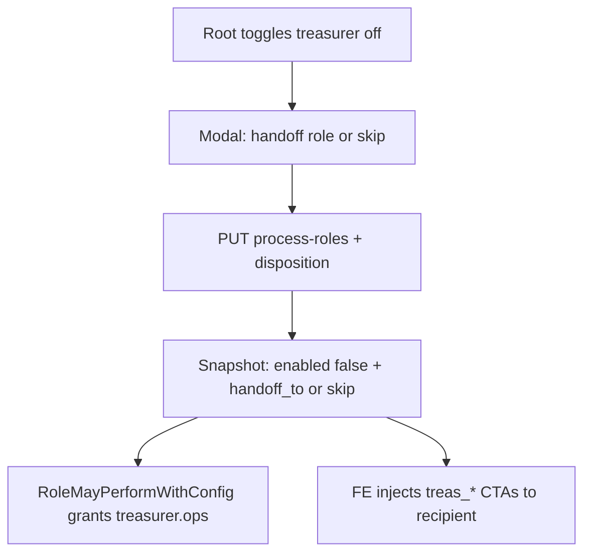

# Process-roles treasurer handoff/skip + admin soft-delete

## Решения (зафиксированы)

- **1B:** при выключении казначея — диалог: переложить на роль **или** skip (шаги `treasurer.*` выполняет менеджер по тем же переходам статусов; граф не режется).
- **2C:** только казначей; silent continuity ICO/ECO не меняем.
- Удаление пользователей: **soft-delete** (`active=false` + revoke refresh + скрытие в admin list), не hard DELETE из БД. Запрет: себя и последнего root.

## Сверка с `.cursor/rules`

**Обязательны:** `планирование-сверка-с-rules`, `use-cases`, `безопасность-ролей-и-данных`, `чистая-архитектура` / `детали-как-плагины`, `интеграция-и-события` (статусная машина в домене), `ui-web-практики` + `ux-когнитивная-нагрузка` (диалог confirm), `тесты-архитектуры`, `go-testing`, `nestjs-testing` N/A (Go/FE), `playwright-e2e`, `vdp-ci-local-gate`, `честность-готовности`, `plan-закрытие-и-dod`, `fe-platform-mounts` (не снимать `ManagerRouteHintPanel`).

**Вне scope:** BPM-редактор графа статусов; миграция ICO/ECO continuity; hard wipe аккаунтов; ML/FaaS; смена payment method матрицы; `release-gate`; `mgmt-tg-notify` (нет закрытия продуктовой волны для менеджмента, пока не попросят).

**Gate DoD:** `make check-env-parity` → unit (Go + FE) → **`make ci-pr-pilot`** (process-roles / ActionPanel / treasurer CTA).

## Поток disable казначея

- **Handoff:** выбранная enabled actor-роль получает право на `CapTreasurerOps` действия, пока treasurer `enabled=false`.
- **Skip:** `handoff_to=manager` по политике skip (копирайт «продолжить без казначея»); менеджер с `manager.ops` исполняет те же `treasurer_confirm` / signing / complete. Root по-прежнему union.
- Без записи disposition в snapshot — **запретить** disable (не silent).

## Слои

### Домен / API (core)

- Расширить [`RoleProcessConfig`](vdp/core/internal/domain/formpayment/role_config.go): поля disposition при disable, напр. `disable_mode` (`handoff`|`skip`) + `handoff_role` (nullable). Валидация: treasurer only в этой волне; skip ⇒ handoff_role=manager; handoff ⇒ роль process-eligible, enabled, actor.
- `RoleMayPerformWithConfig`: если slot treasurer disabled и action → `CapTreasurerOps`, разрешить `handoff_role` (или manager при skip). **Не** расширять `slotActorForCapability` для ICO/ECO.
- Миграция Postgres: колонки в `role_process_configs` (+ memory store).
- [`ProcessRoleService.UpdateRole`](vdp/core/internal/service/process_roles.go): принять disposition; при `enabled=true` очищать handoff/skip.
- HTTP: [`process_roles_routes.go`](vdp/core/internal/transport/http/process_roles_routes.go) — отразить поля в GET/PUT.
- Soft-delete: `AccountService.SoftDelete(ctx, principal, id)` — `accounts.manage`; reject self; reject if target is last active root; `Active=false`, `Blocked=true`, clear refresh; list admin исключает soft-deleted (или флаг `include_deleted` не в этой волне).
- Route: `DELETE /api/v1/admin/account/{id}` → soft-delete.

### FE

- [`process-roles-page.tsx`](vdp/fe/src/components/ved/pages/process-roles-page.tsx): при toggle off для `treasurer` — Modal (выбор роли / «Пропустить шаги — менеджер»). Остальные роли: прежний toggle без нового disposition (ICO/ECO).
- API types [`process-roles.ts`](vdp/fe/src/lib/api/process-roles.ts).
- [`process-role-filter.ts`](vdp/fe/src/lib/ved/process-role-filter.ts) + [`actions.ts`](vdp/fe/src/lib/ved/actions.ts): inject `treas_*` для recipient при treasurer disabled+disposition; **не** менять `canContinuityAdvance` ICO/ECO.
- Admin [`demo/admin.tsx`](vdp/fe/src/routes/demo/admin.tsx) / [`platform-store.ts`](vdp/fe/src/lib/ved/platform-store.ts): включить «Удалить» в app; `deleteAdminAccount` → DELETE; скрыть/disable на своей строке; confirm modal уже есть.

### Unit / E2E

- Go: `role_config_test` — treasurer skip/handoff AuthZ; reject disable without disposition; ICO continuity regression green.
- Go: account soft-delete — self 403, last root 403, other ok + not listed.
- FE unit: process-role-filter / actions inject treas CTA for manager on skip; continuity ICO tests unchanged.
- FE: catalog-mutations + admin delete path.
- E2E: узкий app smoke — root soft-delete чужого user; process-roles disable treasurer + skip → manager видит confirm на fixture status (или HTTP+unit если browser тяжёлый — при правке e2e вне smoke → учитывать в gate). Минимум один Playwright на admin delete confirm **или** process-roles dialog; при затрагивании `@pilot-matrix` / ActionPanel — полный **`ci-pr-pilot`**.

### Compose / repro

- `compose-up` / login `root@` → `/process-roles` disable treasurer → skip → manager cabinet CTA; `/admin` delete non-self.

## DoD

- [ ] Disable treasurer без disposition → API validation error
- [ ] Skip: manager может `treasurer_confirm` (unit + FE CTA); treasurer сам — нет
- [ ] Handoff на выбранную роль работает; ICO/ECO behavior без регресса
- [ ] Soft-delete: не себя, не последнего root; UI app delete работает
- [ ] `ManagerRouteHintPanel` на process-roles на месте
- [ ] `make check-env-parity` + unit + **`make ci-pr-pilot`** зелёные
- [ ] Plan todos/DoD закрыты по `plan-закрытие-и-dod`
